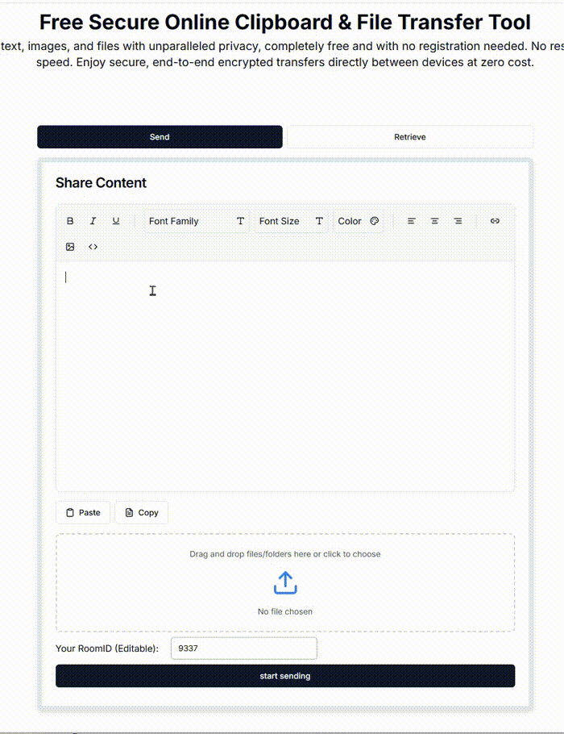

<div align="center">
  
</div>

# PrivyDrop - A Privacy-Focused, WebRTC-Based File Sharing Tool

[简体中文](./README.zh-CN.md)

[](./LICENSE)

PrivyDrop(formerly SecureShare) is an open-source, peer-to-peer (P2P) file and text sharing tool built on WebRTC. It requires no server-side data relay; all data is transmitted directly between browsers, ensuring end-to-end encryption for maximum privacy and security.

We believe everyone should have control over their own data. PrivyDrop was created to fulfill this vision: a simple, fast, and private sharing solution.

[**Try it Live »**](https://www.privydrop.app/) | [**GitHub Repository »**](https://github.com/david-bai00/PrivyDrop)

---



## ✨ Key Features

- 🔒 **End-to-End Encryption**: Leverages P2P direct connections via WebRTC. All files and text are transferred directly between browsers without passing through any central server.
- 📂 **File & Folder Transfer**: Supports transferring multiple files and entire folders.
- ⏸️ **Resume Transfer**: Resume file transfer from the point of interruption. Simply set the save directory to enable this feature, ensuring your large files are delivered safely even with unstable networks. If interrupted, you currently need to refresh both the sender and receiver web pages to restart the transfer.
- ⚡ **Real-time & Efficient**: Displays real-time transfer progress and automatically calculates transfer speed.
- 📝 **Rich Text Clipboard**: Supports editing and sending formatted text, not just files.
- 🔗 **Convenient Sharing**: Easily share a room and establish a connection via a link or QR code.
- 📱 **Multi-Device Support**: Responsive design supports both desktop and mobile browsers.
- 🌐 **Internationalization**: Supports multiple languages, including English and Chinese.

## 🛠️ Tech Stack

- **Frontend**: Next.js 14, React 18, TypeScript, Tailwind CSS, shadcn/ui
- **Backend**: Node.js, Express.js, TypeScript
- **Real-time Communication**: WebRTC, Socket.IO
- **Data Storage**: Redis
- **Deployment**: PM2, Nginx, Docker

## 🐳 Docker One-Click Deployment (Recommended)

Deploy in minutes with zero manual configuration. Supports private/public networks and auto HTTPS (Let’s Encrypt).

```bash
# Private LAN (no domain/public IP)
bash ./deploy.sh --mode lan-http

# Private LAN + TURN (for complex NAT/LAN)
bash ./deploy.sh --mode lan-http --with-turn

# LAN HTTPS (self-signed; dev/managed env; explicitly enable 8443)
bash ./deploy.sh --mode lan-tls --enable-web-https --with-nginx

# Public IP without domain (with TURN; recommended with Nginx for same-origin)
bash ./deploy.sh --mode public --with-turn --with-nginx

# Public domain (HTTPS + Nginx + TURN + SNI 443, auto-issue/renew)
bash ./deploy.sh --mode full --domain your-domain.com --with-nginx --with-turn --le-email you@domain.com
```

See [Docker Deployment Guide](./docs/DEPLOYMENT_docker.md) (Modes Overview, LAN TLS limitations, Let’s Encrypt auto-issue/renew)

Heads-up (LAN TLS, self-signed)

- Import the CA certificate into your browser (or system trust store) on first use: `docker/ssl/ca-cert.pem`. Otherwise the browser shows “certificate not valid/untrusted”.
- Access endpoints (by default):
  - Nginx: `http://localhost`
  - HTTPS: `https://localhost:8443`, `https://<your LAN IP>:8443`
  - Frontend dev ports (optional): `http://localhost:3002`, `http://<your LAN IP>:3002`
  - When `--with-nginx` is enabled, the frontend and API are same-origin (`/api`, `/socket.io`) for stability; direct ports `:3002/:3001` are for debugging only and may cause CORS or 404.
  - With `--enable-web-https` and the CA trusted, same-origin HTTPS (8443) avoids CORS; common dev origins (`localhost`, `:3002`) are allowed by default.

## 🚀 Quick Start (Full-Stack Local Development)

Before you begin, ensure your development environment has [Node.js](https://nodejs.org/) (v18+), [npm](https://www.npmjs.com/), and a running [Redis](https://redis.io/) instance installed.

1.  **Clone the Project & install redis**

    ```bash
    git clone https://github.com/david-bai00/PrivyDrop.git
    cd PrivyDrop
    sudo apt-get install -y redis-server
    ```

2.  **Configure and Start the Backend Service**

    ```bash
    cd backend
    npm install

    # Copy the development environment file, then modify .env.development as needed
    cp .env_development_example .env.development

    npm run dev # Starts by default at http://localhost:3001
    ```

3.  **Configure and Start the Frontend App** (in a new terminal window)

    ```bash
    cd frontend
    pnpm install

    # Copy the development environment file, then modify .env.development as needed, Remove optional items
    cp .env_development_example .env.development

    pnpm dev # Starts by default at http://localhost:3002
    ```

4.  **Start Sharing**
    Open `http://localhost:3002` in your browser to access the application.

## 🗺️ Roadmap

We have a public roadmap that outlines our vision for the future and our current priorities. It's a great place to see what we're working on or to find areas where you can contribute.

➡️ **[Check out the Project Roadmap](./ROADMAP.md)**

## 📚 Documentation

We provide detailed documentation to help you dive deeper into the project's design and deployment details:

- [**Overall Project Architecture**](./docs/ARCHITECTURE.md): Understand how all components of the PrivyDrop system work together.
- [**Frontend Architecture Deep Dive**](./docs/FRONTEND_ARCHITECTURE.md): Explore the frontend's modern, layered architecture, state management with Zustand, and the decoupled service-based approach to WebRTC.
- [**Backend Architecture Deep Dive**](./docs/BACKEND_ARCHITECTURE.md): Dive into the backend's code structure, signaling flow, and Redis design.
- [**Deployment Guide**](./docs/DEPLOYMENT.md): Learn how to deploy the complete PrivyDrop application in a production environment.

## 🤝 Contributing

We warmly welcome contributions of all forms! Whether it's reporting a bug, suggesting a feature, submitting code or adding a star, your help is invaluable to PrivyDrop's growth. Please read our [**Contribution Guidelines**](./.github/CONTRIBUTING.md) to start your journey.

We have a [**Code of Conduct**](./.github/CODE_OF_CONDUCT.md) that all contributors are expected to follow. Please be sure to review it before participating.

## 📄 License

This project is licensed under the MIT License - see the [LICENSE](./LICENSE) file for details.
