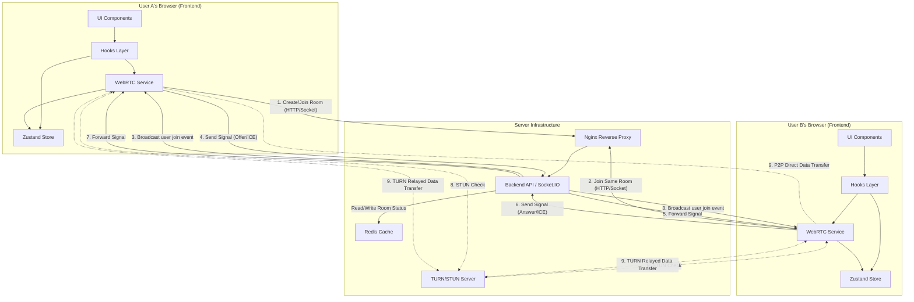

# PrivyDrop - System Architecture Overview

This document provides a high-level overview of the PrivyDrop project's overall architecture, helping developers understand how the various technical components work together.

## 1. Core Components

The PrivyDrop system is primarily composed of the following core parts:

1.  **Frontend**: A Single Page Application (SPA) built with Next.js. It's the interface users interact with, responsible for handling file selection and UI presentation. It features a modern, layered architecture with a clear separation between the UI (React Components), centralized state management (Zustand), and the core WebRTC business logic, which is encapsulated in a framework-agnostic service layer.
2.  **Backend**: A server built with Node.js and Express. It does not handle any file data. Its core responsibilities are:
    - **Signaling Service**: Implemented with Socket.IO, it relays signaling messages (like SDP and ICE Candidates) for the "handshake" process before a WebRTC connection is established.
    - **Room Management**: Handles the creation, joining, and status checking of rooms.
    - **API Service**: Provides auxiliary HTTP endpoints.
3.  **Redis**: An in-memory database used by the backend to store temporary data, such as room information and lists of participants, utilizing its TTL feature for automatic cleanup of expired rooms.
4.  **TURN/STUN Server (Optional)**: Used to assist WebRTC with NAT traversal, ensuring a higher success rate for P2P connections in complex network environments. STUN is used to discover public IP addresses, while TURN serves as a fallback relay server.

## 2. Data Flow and Interaction Diagram

The following diagram illustrates the main flow for users establishing a connection and transferring files:

**Flow Description:**

1.  **Room Creation/Joining**: User A's frontend service layer requests the backend to create a unique room ID. The backend records this room in Redis.
2.  **Sharing & Joining**: User A shares the room ID with User B. User B's frontend service layer uses this ID to request joining the room.
3.  **Signaling Exchange**:
    - Once there are two or more users in a room, their respective `WebRTC Service` instances begin exchanging signaling messages through the backend's Socket.IO service.
    - This process includes exchanging network information (ICE candidates) and session descriptions (SDP offers/answers). The backend server acts merely as a "postman" for these messages.
4.  **NAT Traversal**: The browsers use the network information obtained from the signals, along with STUN/TURN servers, to attempt and establish a direct P2P connection.
5.  **P2P Connection Established**: Once the connection is successfully established—which in most cases is a direct peer-to-peer link—all file and text data are transferred directly between User A's and User B's browsers via their `WebRTC Service` instances, without passing through any server. In the rare case of highly restrictive networks where a direct connection cannot be established, data will be relayed through a TURN server. Even in this relayed mode, the data remains end-to-end encrypted by WebRTC and is not visible to the TURN server.

## 3. Design Philosophy

- **Privacy First**: Core file data is never uploaded to the server. The server only acts as an "introducer" or "matchmaker."
- **Frontend-Backend Separation**: Responsibilities are clearly separated. The frontend handles all user interaction and the complex logic of WebRTC; the backend provides lightweight, efficient signaling and room management services.
- **Horizontal Scalability**: The backend is stateless (with state managed in Redis), which theoretically allows it to be scaled horizontally by adding more Node.js instances to handle a large volume of concurrent signaling requests.

## 4. Runtime Session Model (Frontend)

- **SPA In-App Navigation Persistence**: The frontend is an SPA (App Router). Within the same browser tab, in-app navigation does not tear down the singleton app state (Zustand) nor the WebRTC connection service (webrtcService). Ongoing transfers continue, and selected/received content remains available.
- **Boundary**: Page refresh, closing the tab, or opening in a new tab are not covered. If changing layout/SSR strategy, avoid cleaning the connection during layout unmount.
