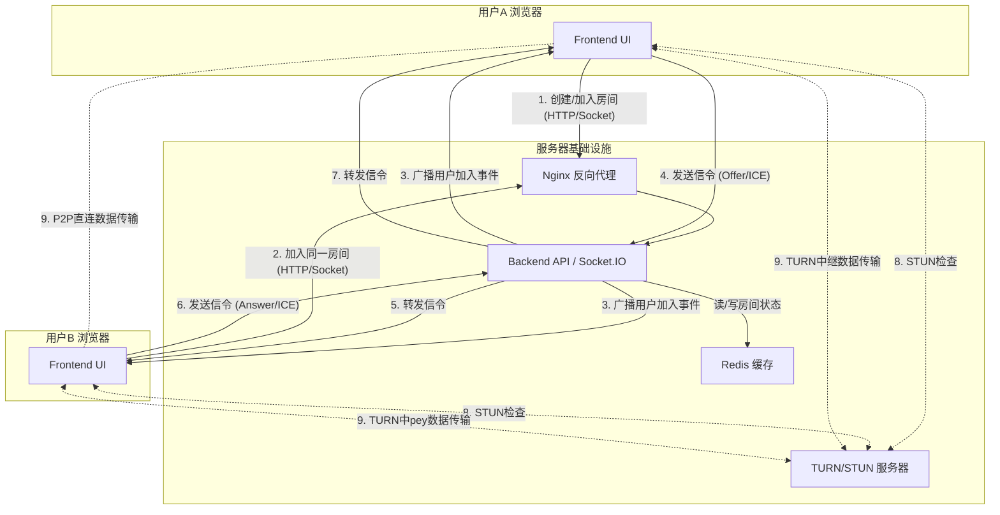

# PrivyDrop - 系统架构总览

本文档旨在提供一个关于 PrivyDrop 项目整体架构的高层次概览，帮助开发者理解各个技术组件是如何协同工作的。

## 一、核心组件

PrivyDrop 系统主要由以下几个核心部分组成：

1.  **前端 (Frontend)**: 一个使用 Next.js 构建的单页应用 (SPA)。它是用户直接交互的界面，负责处理文件选择、UI 展示、发起 WebRTC 连接等所有客户端逻辑。
2.  **后端 (Backend)**: 一个使用 Node.js 和 Express 构建的服务器。它不处理任何文件数据，其核心职责是：
    - **信令服务 (Signaling)**: 通过 Socket.IO 实现，为 WebRTC 连接建立前的“握手”过程传递信令消息 (如 SDP 和 ICE Candidates)。
    - **房间管理 (Room Management)**: 处理房间的创建、加入和状态检查。
    - **API 服务**: 提供一些辅助性的 HTTP 接口。
3.  **Redis**: 一个内存数据库，用于后端存储临时数据，如房间信息、房间内的用户列表等，并利用其 TTL 特性自动清理过期房间。
4.  **TURN/STUN 服务器【可选】**: 用于辅助 WebRTC 进行 NAT 穿透，确保在复杂网络环境下的 P2P 连接成功率。STUN 用于发现公网地址，TURN 则作为最后的备选方案，当中继服务器使用（目前没有使用这个特性）。

## 二、数据流与交互图

下图展示了用户建立连接和传输文件的主要流程：

**流程说明:**

1.  **房间创建/加入**: 用户 A（发送方）通过前端请求后端创建一个唯一的房间 ID。后端在 Redis 中记录该房间。
2.  **分享与加入**: 用户 A 通过链接或二维码将房间 ID 分享给用户 B。用户 B 使用此 ID 请求加入房间。
3.  **信令交换**:
    - 一旦房间内有两位或更多用户，他们便开始通过后端的 Socket.IO 服务交换 WebRTC 信令。
    - 这个过程包括交换网络信息 (ICE candidates) 和会话描述 (SDP offers/answers)。后端服务器仅作为这些信令消息的“邮差”，进行转发，不理解其内容。
4.  **NAT 穿透**: 浏览器利用从信令中获取的网络信息，并借助 STUN/TURN 服务器来尝试建立直接的 P2P 连接。
5.  **P2P 连接建立**: 一旦连接建立成功，所有文件和文本数据都将直接在用户 A 和用户 B 的浏览器之间传输，不再经过任何服务器。如果直连失败，数据将通过 TURN 服务器进行中继。

## 三、设计哲学

- **隐私优先**: 核心文件数据永不上传到服务器。服务器只承担“介绍人”的角色。
- **前后端分离**: 前后端职责清晰。前端负责所有与用户交互和 WebRTC 的复杂逻辑；后端则提供轻量、高效的信令和房间管理服务。
- **水平扩展**: 后端是无状态的（状态存储在 Redis 中），理论上可以通过增加 Node.js 实例来水平扩展，以应对大量并发信令请求。
