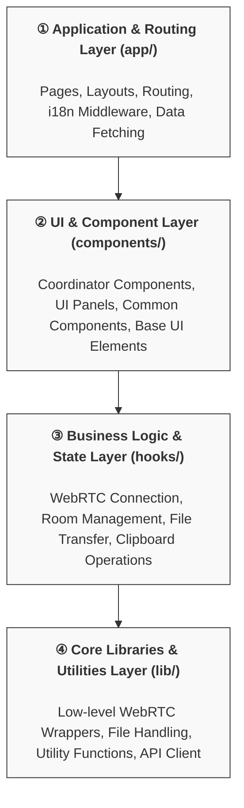

# PrivyDrop Frontend Architecture Documentation

## 1. Architecture Overview

### 1.1 Project Vision

PrivyDrop is a P2P file/text sharing tool based on WebRTC, designed to provide a secure, private, and efficient online sharing solution. The core objective of the frontend architecture is to build a high-performance, maintainable, and scalable modern web application, adhering to Next.js best practices.

### 1.2 Design Philosophy

In a recent refactor, we established a design philosophy centered on "**Separation of Concerns**" and "**Logical Cohesion**":

- **UI and Logic Separation**: Views (Components) should remain as "pure" as possible, responsible only for rendering the UI and responding to user interactions. All complex business logic, state management, and side effects should be extracted from components.
- **Hooks as the Core of Business Logic**: Custom React Hooks are first-class citizens for organizing our business logic and state. Each Hook encapsulates a distinct, cohesive functional module (e.g., WebRTC connection, room management), making the logic unit reusable, testable, and significantly simplifying the component tree.
- **Layered Architecture**: The codebase follows a clear, layered structure, ensuring that each layer has a single responsibility, reducing coupling between modules.

### 1.3 Core Tech Stack

- **Framework**: Next.js 14 (App Router)
- **Language**: TypeScript
- **UI**: React 18, Tailwind CSS, shadcn/ui (based on Radix UI)
- **State Management**: Modular state management centered on custom React Hooks
- **WebRTC Signaling**: Socket.IO Client
- **Data Fetching**: React Server Components (RSC), Fetch API
- **Internationalization**: `next/server` middleware + dynamic JSON dictionaries
- **Content**: MDX (for blog and static content pages)

### 1.4 High-Level Layered Model

The frontend architecture can be broadly divided into four layers:

- **① Application & Routing Layer**: Managed by the Next.js App Router, responsible for page rendering, route control, internationalization, and initial data fetching.
- **② UI & Component Layer**: Responsible for displaying the entire user interface. It consumes state and methods from the layer below (Hooks) and propagates user interaction events upward.
- **③ Business Logic & State Layer**: **This is the "brain" of the application**. It encapsulates all core functional business logic and state through a series of custom Hooks.
- **④ Core Libraries & Utilities Layer**: Provides the lowest-level, framework-agnostic, pure functions, such as low-level WebRTC wrappers and API requests.

---

## 2. Core Feature Implementation: P2P File/Text Transfer

This section details how the application's most critical P2P transfer feature is implemented through the collaboration of different architectural layers.

### 2.1 Overall Flow

1.  **User Action (`components`)**: The user performs an action in `SendTabPanel` or `RetrieveTabPanel` (e.g., selecting a file, entering a room code).
2.  **Logic Processing (`hooks`)**: Hooks like `useFileTransferHandler` and `useRoomManager` capture these actions, manage related state (e.g., the list of files to be sent), and invoke connection methods provided by the `useWebRTCConnection` Hook.
3.  **Connection Establishment (`hooks` -> `lib`)**: `useWebRTCConnection` calls low-level functions in `lib/webrtc_*.ts` to negotiate with the peer via the Socket.IO signaling server and establish an `RTCPeerConnection`.
4.  **Data Transfer (`lib`)**: Once the connection is established, `lib/fileSender.ts` and `lib/fileReceiver.ts` are responsible for chunking, serializing, and transferring the file over the `RTCDataChannel`.
5.  **State Updates & Callbacks (`lib` -> `hooks` -> `components`)**: During the transfer, the `lib` layer notifies the `hooks` layer of state changes (e.g., progress updates) via callbacks. These state changes in the `hooks` layer ultimately trigger a re-render of the `components` layer's UI.

### 2.2 Module Deep Dive

- **Low-Level WebRTC Wrappers (`lib/`)**:

  - `webrtc_base.ts`: Encapsulates interactions with the Socket.IO signaling server, generic management of `RTCPeerConnection` (ICE, connection state), and the creation of `RTCDataChannel`. It is the foundation for all WebRTC operations.
  - `fileSender.ts` / `fileReceiver.ts`: Handle the logic for sending and receiving files/text, including metadata exchange, file chunking, progress calculation, data reassembly, and file saving.

- **WebRTC Business Logic Wrappers (`hooks/`)**:

  - `useWebRTCConnection.ts`: **The connection's "central hub"**. It initializes and manages `sender` and `receiver` instances, handles the connection lifecycle, and provides a clean API (e.g., `broadcastDataToAllPeers`) and state (e.g., `peerCount`, `sendProgress`) to the upper layers.
  - `useRoomManager.ts`: **The room's "state machine"**. It's responsible for the creation, validation (with debouncing), and joining logic for room IDs, and manages UI state text related to the room.
  - `useFileTransferHandler.ts`: **The transfer's "data center"**. It manages the text and files to be sent or received, handles user actions like adding/removing/downloading files, and provides callbacks to `useWebRTCConnection` for processing received data.

- **UI Coordination & Display (`components/`)**:
  - `ClipboardApp.tsx`: **The core application's "main coordinator"**. It contains no business logic itself. Its sole responsibility is to integrate all the core Hooks mentioned above and then distribute the state and callbacks obtained from these Hooks as props to specific UI sub-components. Furthermore, it is responsible for listening to global drag-and-drop events and rendering a full-screen drop zone when the user drags files anywhere into the window, significantly improving the file upload experience.
  - `SendTabPanel.tsx` / `RetrieveTabPanel.tsx`: Purely presentational components responsible for rendering the send and receive panels and responding to user input.
  - `FileListDisplay.tsx`: Used to display the file list and transfer status.
  - `FullScreenDropZone.tsx`: A simple UI component that displays a full-screen, semi-transparent overlay when files are being dragged globally, providing clear visual feedback to the user.

## 3. Application Layer Detailed Architecture

### 3.1 Directory Structure & Responsibilities

- **`frontend/app/`**: Core application routes and pages.

  - `[lang]/`: Implements multi-language dynamic routing.
    - `layout.tsx`: Global layout, provides Providers (Theme, i18n).
    - `page.tsx`: Main page entry point, renders `HomeClient`.
    - `HomeClient.tsx`: (Client Component) Hosts the core `ClipboardApp` and other marketing/display components.
  - `config/`: Application configuration.
    - `api.ts`: Centralizes interaction with the backend API.
    - `environment.ts`: Manages environment variables and runtime configurations (like ICE servers).

- **`frontend/components/`**: UI component library.

  - `ClipboardApp/`: All UI sub-components broken down from `ClipboardApp`. **Implements separation of concerns**.
  - `common/`: Reusable components that can be used across the project (e.g., `YouTubePlayer`).
  - `ui/`: (from shadcn/ui) Base atomic components.
  - `web/`: Large, page-level static components for the website (e.g., `Header`, `Footer`).
  - `Editor/`: Custom rich text editor.

- **`frontend/hooks/`**: **The core of business logic and state management**. Detailed above.

- **`frontend/lib/`**: Core libraries and utility functions.

  - `webrtc_*.ts`, `fileSender.ts`, `fileReceiver.ts`: WebRTC core.
  - `dictionary.ts`: Internationalization dictionary loading.
  - `utils.ts`, `fileUtils.ts`: General utility functions. `fileUtils.ts` contains core logic for handling files and directories, such as `traverseFileTree`.

- **`frontend/types/`**: Global TypeScript type definitions.

- **`frontend/constants/`**: Application-wide constants, mainly for i18n configuration and message files.

### 3.2 State Management Strategy

The project uses **custom React Hooks as the core for modular state management**. We deliberately avoided introducing global state management libraries (like Redux or Zustand) for the following reasons:

- **Reduce Complexity**: For the current scale of the application, a global state would introduce unnecessary complexity.
- **Promote Cohesion**: Encapsulating related state and logic within the same Hook makes the code easier to understand and maintain.
- **Leverage React's Native Capabilities**: Passing state managed by Hooks through Context and Props is sufficient for all current needs.

### 3.3 Internationalization (i18n)

- **Route-Driven**: Language switching is implemented via the URL path (`/[lang]/`).
- **Automatic Detection**: `middleware.ts` intercepts requests and automatically redirects to the appropriate language path based on the `Accept-Language` header or a cookie.
- **Dynamic Loading**: The `getDictionary` function in `lib/dictionary.ts` asynchronously loads the corresponding `messages/*.json` file based on the `lang` parameter, enabling code splitting.

## 4. Summary and Outlook

The current frontend architecture successfully deconstructs a complex WebRTC application into a series of clean, maintainable modules through layered design and Hook-centric logic encapsulation. The boundaries between UI, business logic, and underlying libraries are clear, laying a solid foundation for future feature expansion and maintenance.

Future areas for optimization include:

- **Adding Unit/Integration Tests**: Writing test cases for core Hooks (`useWebRTCConnection`, etc.) and utility classes in `lib`.
- **Bundle Analysis**: Regularly analyzing the bundle size with `@next/bundle-analyzer` to identify optimization opportunities.
- **Component Library Enhancement**: Continuously refining and polishing the common components in `components/common`.
