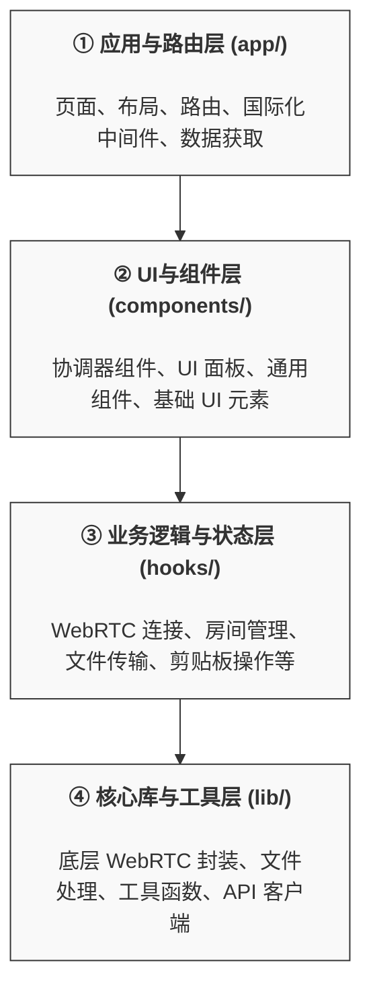

# Privydrop 前端架构文档

## 一、 架构总览

### 1.1 项目愿景

Privydrop 是一个基于 WebRTC 的 P2P 文件/文本分享工具，旨在提供一个安全、私密、高效的在线分享解决方案。前端架构的核心目标是构建一个高性能、易于维护、可扩展的现代化 Web 应用，并遵循 Next.js 的最佳实践。

### 1.2 设计理念

在最近的重构中，我们确立了以"**关注点分离**"和"**逻辑内聚**"为核心的设计理念：

- **UI 与逻辑分离**: 视图（Components）应尽可能保持"纯粹"，仅负责渲染 UI 和响应用户交互。所有复杂的业务逻辑、状态管理和副作用都应从组件中剥离。
- **Hooks 作为业务逻辑核心**: 自定义 React Hooks 是我们组织业务逻辑和状态的第一公民。每个 Hook 封装一个独立的、高内聚的功能模块（如 WebRTC 连接、房间管理），使得逻辑单元可复用、可测试，并极大地简化了组件树。
- **分层架构**: 代码库遵循清晰的分层结构，确保不同层次的职责单一，降低模块间的耦合度。

### 1.3 核心技术栈

- **框架**: Next.js 14 (App Router)
- **语言**: TypeScript
- **UI**: React 18, Tailwind CSS, shadcn/ui (基于 Radix UI)
- **状态管理**: Zustand + 自定义 React Hooks（模块化业务逻辑与全局共享状态结合）
- **WebRTC 信令**: Socket.IO Client
- **数据获取**: React Server Components (RSC), Fetch API
- **国际化**: `next/server` 中间件 + 动态 JSON 字典
- **内容**: MDX (用于博客和静态内容页面)

### 1.4 高阶分层模型

应用的前端架构可大致分为四个层次：

- **① 应用与路由层**: 由 Next.js App Router 管理，负责页面渲染、路由控制、国际化和初始数据获取。
- **② UI 与组件层**: 负责所有用户界面的展示。它消费来自下一层 (Hooks) 的状态和方法，并将用户交互事件向上传递。
- **③ 业务逻辑与状态层**: **这是应用的"大脑"**。通过一系列自定义 Hooks，封装了所有核心功能的业务逻辑和状态。
- **④ 核心库与工具层**: 提供最底层的、与框架无关的纯粹功能，如 WebRTC 的底层封装、API 请求等。

---

## 二、 核心功能实现：P2P 文件/文本传输

本节将详细阐述应用最核心的 P2P 传输功能是如何通过不同架构层次协同实现的。

### 2.1 整体流程

1.  **用户操作 (`components`)**: 用户在 `SendTabPanel` 或 `RetrieveTabPanel` 中进行操作（如选择文件、输入房间号）。
2.  **逻辑处理 (`hooks`)**: `useFileTransferHandler` 和 `useRoomManager` 等 Hooks 捕捉这些操作，管理相关状态（如待发送文件列表），并调用 `useWebRTCConnection` Hook 提供的连接方法。
3.  **连接建立 (`hooks` -> `lib`)**: `useWebRTCConnection` 调用 `lib/webrtc_*.ts` 中的底层方法，通过 Socket.IO 信令服务器与对端协商，建立 `RTCPeerConnection`。
4.  **数据传输 (`lib`)**: 连接建立后，`lib/fileSender.ts` 和 `lib/fileReceiver.ts` 负责将文件分片、序列化，并通过 `RTCDataChannel` 进行传输。
5.  **状态更新与回调 (`lib` -> `hooks` -> `components`)**: 传输过程中，`lib` 层通过回调函数（如进度更新）通知 `hooks` 层更新状态，`hooks` 层的状态变化最终驱动 `components` 层的 UI 重新渲染。

### 2.2 模块详解

- **WebRTC 底层封装 (`lib/`)**:

  - `webrtc_base.ts`: 封装了与 Socket.IO 信令服务器的交互、`RTCPeerConnection` 的通用管理（ICE、连接状态）和 `RTCDataChannel` 的创建，是所有 WebRTC 操作的基石。
  - `fileSender.ts` / `fileReceiver.ts`: 负责文件/文本的发送和接收逻辑，包括元数据交换、文件分块、进度计算、数据拼接和文件保存等。

- **WebRTC 业务逻辑封装 (`hooks/`)**:

  - `useWebRTCConnection.ts`: **连接的"中枢管理员"**。它初始化和管理 `sender` 和 `receiver` 实例，处理连接生命周期，并向上层提供一个简洁的 API（如 `broadcastDataToAllPeers`）和状态（如 `peerCount`, `sendProgress`）。
  - `useRoomManager.ts`: **房间的"状态机"**。负责房间 ID 的创建、验证（带防抖）、加入逻辑，并管理房间相关的 UI 状态文本。
  - `useFileTransferHandler.ts`: **传输内容的"数据中心"**。管理待发送/已接收的文本和文件，处理文件添加/移除/下载等用户操作，并为 `useWebRTCConnection` 提供处理接收数据的回调函数。

- **UI 协调与展示 (`components/`)**:
  - `ClipboardApp.tsx`: **核心应用的"总协调员"**。它不包含任何业务逻辑，其唯一职责是集成上述所有核心 Hooks，然后将从 Hooks 中获取的状态和回调函数作为 props 分发给具体的 UI 子组件。此外，它还负责监听全局的拖放（Drag and Drop）事件，并在用户拖动文件至窗口任意位置时，渲染一个全屏的拖放区域，极大地提升了文件上传的体验。
  - `SendTabPanel.tsx` / `RetrieveTabPanel.tsx`: 纯粹的 UI 展示组件，负责渲染发送和接收面板，并响应用户的输入。
  - `FileListDisplay.tsx`: 用于展示文件列表和传输状态。
  - `FullScreenDropZone.tsx`: 一个简单的 UI 组件，用于在全局拖拽文件时显示一个全屏的、半透明的覆盖层，为用户提供清晰的视觉反馈。

## 三、 应用层详细架构

### 3.1 目录结构与职责

- **`frontend/app/`**: 应用核心路由和页面。

  - `[lang]/`: 实现多语言动态路由。
    - `layout.tsx`: 全局布局，提供 Provider (Theme, i18n)。
    - `page.tsx`: 主页入口，渲染 `HomeClient`。
    - `HomeClient.tsx`: (客户端组件) 承载核心应用 `ClipboardApp` 和其他营销展示组件。
  - `config/`: 应用配置。
    - `api.ts`: 统一封装与后端 API 的交互。
    - `environment.ts`: 管理环境变量和运行时配置（如 ICE 服务器）。

- **`frontend/components/`**: UI 组件库。

  - `ClipboardApp/`: `ClipboardApp` 拆分出的所有 UI 子组件。**实现了关注点分离**。
  - `common/`: 可在项目中多处复用的通用组件 (如 `YouTubePlayer`)。
  - `ui/`: (来自 shadcn/ui) 基础原子组件。
  - `web/`: 网站页面级别的大型静态组件 (如 `Header`, `Footer`)。
  - `Editor/`: 自定义富文本编辑器。

- **`frontend/hooks/`**: **业务逻辑和状态管理的核心**。上面已详述。

- **`frontend/lib/`**: 核心库与工具函数。

  - `webrtc_*.ts`, `fileSender.ts`, `fileReceiver.ts`: WebRTC 核心。
  - `dictionary.ts`: 国际化字典加载。
  - `utils.ts`, `fileUtils.ts`: 通用工具函数。其中 `fileUtils.ts` 包含了如 `traverseFileTree` 等用于处理文件和文件夹的核心逻辑。

- **`frontend/types/`**: 全局 TypeScript 类型定义。

- **`frontend/constants/`**: 应用范围内的常量，主要是 i18n 配置和消息文件。

### 3.2 状态管理策略

当前项目采用“Zustand + 自定义 Hooks”的组合策略：

- **Zustand（全局共享状态）**: 用于管理跨页面/跨组件的应用级状态，例如房间与连接状态、发送/接收进度、UI 活动 Tab 等。实现位于 `frontend/stores/fileTransferStore.ts`，API 简洁、零样板、类型友好。
- **自定义 Hooks（业务内聚）**: 复杂的业务流程（如 WebRTC 连接、房间管理、文件传输编排）仍以 Hooks 为边界进行封装，保持“逻辑内聚、可测试、可复用”。

这样做的收益：

- **边界清晰**: 全局可观察/可共享的数据进 Zustand，强业务内聚的瞬时/局部状态放在各自 Hook/模块内。
- **减样板与可维护**: Zustand 足够轻量，不引入冗长样板；同时保留 Hooks 的可组合性和可测试性。
- **更贴合现状**: 与代码实现保持一致，避免文档与实现脱节。

### 3.3 国际化 (i18n)

- **路由驱动**: 通过 URL 路径 (`/[lang]/`) 实现语言切换。
- **自动检测**: `middleware.ts` 拦截请求，根据 `Accept-Language` 头或 Cookie 自动重定向到合适的语言路径。
- **动态加载**: `lib/dictionary.ts` 中的 `getDictionary` 函数根据 `lang` 参数异步加载对应的 `messages/*.json` 文件，实现了代码分割。

### 3.4 状态与连接生命周期（站内导航保持）

- **单例 Store（Zustand）**：`frontend/stores/fileTransferStore.ts` 为模块级单例，跨路由保持内存状态（如分享内容、待发送文件、已接收文件/元信息、进度等）。
- **单例连接服务（webrtcService）**：`frontend/lib/webrtcService.ts` 单例持有 `RTCPeerConnection`/`RTCDataChannel` 与 FileSender/FileReceiver。App Router 的页面切换不会销毁该实例。
- **效果**：在同一标签页内的站内跳转（App Router 页面切换），进行中的传输不会中断，已选择/已接收的内容保持不丢失。
- **边界**：刷新/关闭标签页或新开标签页不在此保证范围内；SSR/布局层级调整时需确保不在布局卸载处做连接清理。
- **注意**：不要在路由切换副作用中调用 `webrtcService.leaveRoom()` 或重置全局 Store；离开房间应仅在用户显式操作时触发。

## 四、 总结与展望

当前的前端架构通过分层设计和以 Hooks 为中心的逻辑封装，成功地将一个复杂的 WebRTC 应用拆解为一系列清晰、可维护的模块。UI、业务逻辑和底层库之间的界限分明，为未来的功能扩展和维护奠定了坚实的基础。

未来可优化的方向包括：

- **增加单元/集成测试**: 为核心的 Hooks (`useWebRTCConnection` 等) 和 `lib` 中的工具类编写测试用例。
- **Bundle 分析**: 定期使用 `@next/bundle-analyzer` 分析打包体积，寻找优化点。
- **组件库完善**: 持续沉淀和打磨 `components/common` 中的通用组件。
