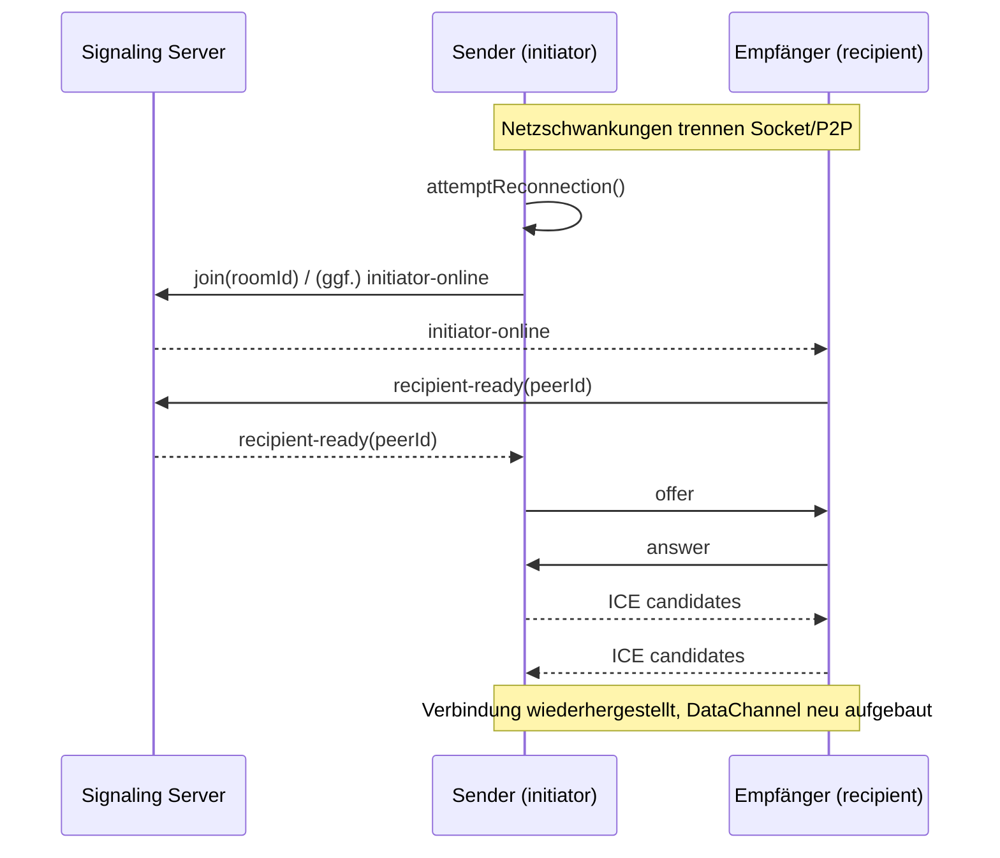

## Einleitung: Warum „Auto‑Join“ und „Wiederverbindung“ zählen

Neue PrivyDrop‑Nutzer stolpern häufig über zwei kleine Reibungen:

- Beim Wechsel von Senden zu Empfangen muss die Raum‑ID erneut eingefügt werden.
- In Café‑WLANs oder im Mobilfunk erzwingt ein kurzer Haker eine manuelle Wiederverbindung.

Klein – und doch im Alltag entscheidend dafür, ob sich etwas „mühelos“ anfühlt. Deshalb haben wir zwei Feinschliffe ausgeliefert, die den Fluss wirklich glattziehen:

- „Cached‑ID‑Auto‑Join“ für Empfänger: Wenn die Bedingungen passen, füllen wir automatisch aus und treten sofort bei.
- Durchgängige, robuste Wiederverbindung: Fällt Socket oder P2P, erholen sich Aushandlung und Verbindung selbsttätig.

Das alles ohne unsere Architektur‑Leitplanke zu verletzen: Backend nur für Signalisierung und Räume; Dateien bleiben E2E‑verschlüsselt und gehen Browser‑zu‑Browser direkt.

---

## Funktion 1: Auto‑Join mit zwischengespeicherter ID (Empfänger)

Beim Wechsel zum Empfangen füllen wir die letzte gespeicherte Raum‑ID automatisch ein und treten sofort bei, wenn:

- Sie sich im Empfangen‑Tab befinden und noch keinem Raum beigetreten sind;
- die URL keinen `roomId`‑Parameter enthält (URL hat Vorrang – kein Überschreiben);
- das Eingabefeld leer ist (kein Überschreiben der Nutzer‑Eingabe);
- eine gecachte ID in localStorage vorhanden ist.

Der Check läuft beim Tab‑Wechsel: Zuerst wird ausgefüllt, dann direkt die Beitrittslogik aufgerufen – ein Einfügen/Klick weniger.

- Code‑Anker:
  - Auto‑Join useEffect (Empfänger): https://github.com/david-bai00/PrivyDrop/blob/v1.1.1/frontend/components/ClipboardApp.tsx#L151
  - Cache‑Helfer (localStorage): https://github.com/david-bai00/PrivyDrop/blob/v1.1.1/frontend/lib/roomIdCache.ts#L1

Wann greift es nicht?

- Sie sind bereits in einem Raum;
- die URL trägt explizit `roomId` (z. B. geteilter Deep‑Link);
- das Eingabefeld enthält bereits Text in Bearbeitung;
- keine gecachte ID gefunden.

---

## Funktion 2: „ID speichern/verwenden“ auf Sender‑Seite (Doppelklick zum Aktualisieren)

Auf der Sender‑Seite bekommt das ID‑Feld einen smarten „Wiederverwenden“‑Button mit zwei Zuständen:

- ID speichern: Ab Eingabelänge ≥ 8 wird der Button aktiv; Klick speichert die aktuelle Eingabe als Cache‑ID.
- Gecachte ID verwenden: Existiert eine, schreibt ein Klick sie ins Feld und tritt sofort bei; Doppelklick schaltet ~3 s auf „ID speichern“, um den Cache zu erneuern.

Implementierungsnotizen:

- Einfach/Doppelklick via 400 ms‑Fenster und Timer, Cleanup beim Unmount;
- Nach „Gecachte ID verwenden“ tritt der Sender sofort dem Raum bei (kein zusätzlicher „Beitreten“‑Klick);
- IDs mit weniger als 8 Zeichen werden nicht gespeichert – Schutz vor versehentlichen Kurz‑IDs.

- Code‑Anker:
  - Einfach/Doppelklick inkl. Timer‑Cleanup: https://github.com/david-bai00/PrivyDrop/blob/v1.1.1/frontend/components/ClipboardApp/CachedIdActionButton.tsx#L112
  - Sofortiger Beitritt bei „Gecachte ID verwenden“ (Sender): https://github.com/david-bai00/PrivyDrop/blob/v1.1.1/frontend/components/ClipboardApp/SendTabPanel.tsx#L193

---

## Wiederverbindung: Von der Erkennung bis zur Erholung

Wir beobachten drei Einstiegspunkte und stoßen die Wiederverbindung an:

- Socket getrennt: Nach Reconnect und geändertem `socketId` erfolgt der automatische Raum‑Beitritt;
- P2P getrennt/fehlgeschlagen/geschlossen: Status markieren und Verbindung neu aufbauen;
- Proaktiver `socketId`‑Check: Bei Socket‑Recovery erneut validieren.

- Code‑Anker:
  - Auto‑Beitritt nach Socket‑Connect: https://github.com/david-bai00/PrivyDrop/blob/v1.1.1/frontend/lib/webrtc_base.ts#L121
  - Vereinheitlichter attemptReconnection‑Einstieg: https://github.com/david-bai00/PrivyDrop/blob/v1.1.1/frontend/lib/webrtc_base.ts#L185
  - `lastJoinedSocketId` verfolgen und bei Bedarf `initiator-online`: https://github.com/david-bai00/PrivyDrop/blob/v1.1.1/frontend/lib/webrtc_base.ts#L460
  - Sender verarbeitet `recipient-ready` und startet Neuverhandlung: https://github.com/david-bai00/PrivyDrop/blob/v1.1.1/frontend/lib/webrtc_Initiator.ts#L12
  - Empfänger antwortet auf `initiator-online` mit `recipient-ready`: https://github.com/david-bai00/PrivyDrop/blob/v1.1.1/frontend/lib/webrtc_Recipient.ts#L14
  - Backend‑Relais:
    - ready: https://github.com/david-bai00/PrivyDrop/blob/v1.1.1/backend/src/socket/handlers.ts#L63
    - initiator-online: https://github.com/david-bai00/PrivyDrop/blob/v1.1.1/backend/src/socket/handlers.ts#L102
    - recipient-ready: https://github.com/david-bai00/PrivyDrop/blob/v1.1.1/backend/src/socket/handlers.ts#L108
    - peer-disconnected: https://github.com/david-bai00/PrivyDrop/blob/v1.1.1/backend/src/socket/handlers.ts#L119

### Sequenz (Mermaid)

### Zuverlässigkeitsdetails

- ICE‑Kandidaten‑Queue: Ist die Remote‑Description nicht bereit oder die Verbindung im Schließen, werden Kandidaten gepuffert und später geflusht; siehe https://github.com/david-bai00/PrivyDrop/blob/v1.1.1/frontend/lib/webrtc_base.ts#L219-L256.
- DataChannel‑Backpressure & Chunking: Sender‑Schwelle `bufferedAmountLowThreshold=256KB` (https://github.com/david-bai00/PrivyDrop/blob/v1.1.1/frontend/lib/webrtc_Initiator.ts#L82); Netzsteuerung `maxBuffer≈3MB / lowThreshold≈512KB / 64KB‑Chunks` (https://github.com/david-bai00/PrivyDrop/blob/v1.1.1/frontend/lib/transfer/NetworkTransmitter.ts#L66-L111, https://github.com/david-bai00/PrivyDrop/blob/v1.1.1/frontend/lib/transfer/NetworkTransmitter.ts#L160-L210).
- Mobile Wake Lock: Beim Verbinden anfordern, bei Trennung/Fehler freigeben – reduziert Unterbrechungen im Hintergrund.
- Fehlerkapselung & Retries: seltene `sendData failed` werden gekapselt, angezeigt und erneut versucht (siehe `sendWithBackpressure`).

### Kurze vs. lange IDs: Wiederverwendungsstrategie

- Kurze IDs (4‑stellig) erhalten nach „leerem Raum + Trennung“ eine Gnaden‑TTL von 15 Min. (900 s) – schnelle Wiederverbindung im Fenster; siehe https://github.com/david-bai00/PrivyDrop/blob/v1.1.1/backend/src/socket/handlers.ts#L119-L125.
- Standard‑Ablaufzeit für Räume: 24 h; nur bei leerem Raum nach Trennung wird temporär auf 15 Min. umgestellt; siehe https://github.com/david-bai00/PrivyDrop/blob/v1.1.1/backend/src/services/redis.ts#L6.
- Lange IDs (UUID‑artig) eignen sich für Wiederverwendung über Sitzungen/Geräte hinweg – am besten mit dem Cache‑Button kombinieren.

---

## Ausprobieren (Hands‑on)

Schnelltest am Desktop:

1. Auf Sender‑Seite eine benutzerdefinierte ID (≥ 8 Zeichen) eingeben und „ID speichern“ klicken.
2. Zum Empfänger wechseln: Wenn die Bedingungen passen, wird automatisch ausgefüllt und beigetreten.
3. Ausfall simulieren (WLAN aus, Hotspot an, refresh & zurück) und die Auto‑Wiederverbindung beobachten.
4. Auf Sender‑Seite „Gecachte ID verwenden“ doppelklicken, kurzzeitig auf „ID speichern“ umschalten und auf eine neue lange ID aktualisieren.

Mobil/Problemnetze:

- Hintergrund → Vordergrund; Wechsel WLAN ↔ Mobilfunk.
- Prüfen, ob der Empfänger auto‑beitritt und die Übertragung nahtlos fortsetzt.

---

## Schluss & Aufruf

Je geschmeidiger die Verbindung, desto größer der P2P‑Wert. Cached‑ID‑Auto‑Join und robuste Wiederverbindung machen PrivyDrop im echten Netz noch verlässlicher.

Wenn Ihnen das gefällt, freuen wir uns über einen Stern auf GitHub (<u>https://github.com/david-bai00/PrivyDrop</u>). Das hilft, entdeckt zu werden – und treibt uns an, weiter zu feilen.

Jetzt online testen: <u>https://www.privydrop.app</u>. Feedback und Verbesserungsvorschläge gern als Issue – helfen Sie uns, das „glatte Gefühl“ weiter auszubauen.

Zusätzlich sorgt Cloudflare CDN für Beschleunigung über Regionen hinweg – schnellere, stabilere Zugriffe, weniger Ruckler.

Weiterführende Lektüre:

- [Warum ich PrivyDrop Open Source gestellt habe](/blog/privydrop-open-source)
- [Wie WebRTC Browser‑Direkttransfer ermöglicht](/blog/webRTC-file-transfer)
- [Resumable Transfers: Schluss mit der Großdatei‑Anxiety](/blog/resumable-transfers)

