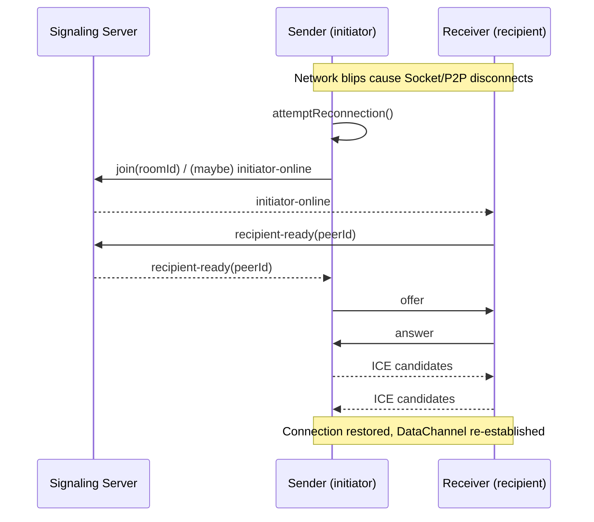

## Introduction: Why “Auto‑Join” and “Reconnect” Matter

New users of PrivyDrop often run into two tiny frictions:

- When switching from Sender to Receiver, you have to paste the room ID again.
- On café Wi‑Fi or mobile data, a brief blip means a manual reconnect.

Tiny? Yes. Frequent in real‑world networks? Absolutely. And they decide whether an app feels “effortless.” So we shipped two polish‑level upgrades that make the flow truly smooth:

- Receiver “Cached‑ID Auto‑Join”: when conditions match, we auto‑fill and join the room for you.
- End‑to‑end “Resilient Reconnect”: whether Socket or P2P drops, negotiation and connection recover on their own.

Most importantly, none of this changes our red‑line architecture: the backend only handles signaling and room management; files are always end‑to‑end encrypted and go directly browser‑to‑browser.

---

## Feature 1: Receiver Cached‑ID Auto‑Join

When you switch to the Receiver tab, if the following conditions are met, the last cached room ID will be auto‑filled and the app will immediately join the room:

- You’re on the Receiver tab and not already in a room;
- The URL has no explicit `roomId` param (URL wins — we don’t override);
- The input is currently empty (we don’t override your typing);
- A cached ID exists in localStorage.

This logic triggers on tab switch. If matched, we first fill the input, then immediately call the join routine—one less paste/click.

- Code anchors:
  - Receiver‑side auto‑join useEffect: [<u>**https://github.com/david-bai00/PrivyDrop/blob/v1.1.1/frontend/components/ClipboardApp.tsx#L151**</u>](https://github.com/david-bai00/PrivyDrop/blob/v1.1.1/frontend/components/ClipboardApp.tsx#L151)
  - Cache helper (localStorage): [<u>**https://github.com/david-bai00/PrivyDrop/blob/v1.1.1/frontend/lib/roomIdCache.ts#L1**</u>](https://github.com/david-bai00/PrivyDrop/blob/v1.1.1/frontend/lib/roomIdCache.ts#L1)

When will it not trigger?

- You’re already in a room;
- The URL explicitly carries a `roomId` (e.g., a shared deep link);
- There’s already text in the input that you’re editing;
- No cached ID is found.

---

## Feature 2: Sender “Save/Use Cached ID” (Double‑Tap to Update)

On the Sender side, the room ID field gets a smart “Reuse” button that toggles between two states:

- Save ID: when the input length is ≥ 8, the button becomes active; clicking saves the current input as the cached ID.
- Use Cached ID: if a cached ID exists, a single tap writes it into the input and joins immediately; a double‑tap flips the button to “Save ID” for about 3 seconds so you can refresh the cache.

Implementation notes:

- Single/double taps use a 400ms window with a timer that’s cleaned up on unmount;
- After “Use Cached ID” is clicked, the Sender joins the room immediately (no extra “Join” click);
- We don’t allow saving IDs shorter than 8 chars to avoid accidental short saves.

- Code anchors:
  - Single/double‑tap with timer cleanup: [<u>**https://github.com/david-bai00/PrivyDrop/blob/v1.1.1/frontend/components/ClipboardApp/CachedIdActionButton.tsx#L112**</u>](https://github.com/david-bai00/PrivyDrop/blob/v1.1.1/frontend/components/ClipboardApp/CachedIdActionButton.tsx#L112)
  - Auto‑join immediately on “Use Cached ID” (Sender): [<u>**https://github.com/david-bai00/PrivyDrop/blob/v1.1.1/frontend/components/ClipboardApp/SendTabPanel.tsx#L193**</u>](https://github.com/david-bai00/PrivyDrop/blob/v1.1.1/frontend/components/ClipboardApp/SendTabPanel.tsx#L193)

---

## Reconnect: From Detection to Full Recovery

We watch for disconnects from three entry points and trigger reconnection:

- Socket disconnected: after reconnecting, if `socketId` changes, we auto re‑join the room;
- P2P disconnected/failed/closed: we flag state and attempt to rebuild the connection;
- Proactive `socketId` change check: on socket recovery, we validate once more.

- Code anchors:
  - Auto re‑join after socket connects: [<u>**https://github.com/david-bai00/PrivyDrop/blob/v1.1.1/frontend/lib/webrtc_base.ts#L121**</u>](https://github.com/david-bai00/PrivyDrop/blob/v1.1.1/frontend/lib/webrtc_base.ts#L121)
  - Unified attemptReconnection entry: [<u>**https://github.com/david-bai00/PrivyDrop/blob/v1.1.1/frontend/lib/webrtc_base.ts#L185**</u>](https://github.com/david-bai00/PrivyDrop/blob/v1.1.1/frontend/lib/webrtc_base.ts#L185)
  - Track `lastJoinedSocketId` and trigger `initiator-online` when needed: [<u>**https://github.com/david-bai00/PrivyDrop/blob/v1.1.1/frontend/lib/webrtc_base.ts#L460**</u>](https://github.com/david-bai00/PrivyDrop/blob/v1.1.1/frontend/lib/webrtc_base.ts#L460)
  - Sender handles `recipient-ready` and restarts negotiation: [<u>**https://github.com/david-bai00/PrivyDrop/blob/v1.1.1/frontend/lib/webrtc_Initiator.ts#L12**</u>](https://github.com/david-bai00/PrivyDrop/blob/v1.1.1/frontend/lib/webrtc_Initiator.ts#L12)
  - Receiver responds to `initiator-online` with `recipient-ready`: [<u>**https://github.com/david-bai00/PrivyDrop/blob/v1.1.1/frontend/lib/webrtc_Recipient.ts#L14**</u>](https://github.com/david-bai00/PrivyDrop/blob/v1.1.1/frontend/lib/webrtc_Recipient.ts#L14)
  - Backend signaling relay:
    - ready: [<u>**https://github.com/david-bai00/PrivyDrop/blob/v1.1.1/backend/src/socket/handlers.ts#L63**</u>](https://github.com/david-bai00/PrivyDrop/blob/v1.1.1/backend/src/socket/handlers.ts#L63)
    - initiator-online: [<u>**https://github.com/david-bai00/PrivyDrop/blob/v1.1.1/backend/src/socket/handlers.ts#L102**</u>](https://github.com/david-bai00/PrivyDrop/blob/v1.1.1/backend/src/socket/handlers.ts#L102)
    - recipient-ready: [<u>**https://github.com/david-bai00/PrivyDrop/blob/v1.1.1/backend/src/socket/handlers.ts#L108**</u>](https://github.com/david-bai00/PrivyDrop/blob/v1.1.1/backend/src/socket/handlers.ts#L108)
    - peer-disconnected: [<u>**https://github.com/david-bai00/PrivyDrop/blob/v1.1.1/backend/src/socket/handlers.ts#L119**</u>](https://github.com/david-bai00/PrivyDrop/blob/v1.1.1/backend/src/socket/handlers.ts#L119)

### Sequence (Mermaid)

### Reliability Details

- ICE candidate queue: if the remote description isn’t ready or the connection is closing/closed, candidates are queued and flushed later; see [<u>**https://github.com/david-bai00/PrivyDrop/blob/v1.1.1/frontend/lib/webrtc_base.ts#L219-L256.**</u>](https://github.com/david-bai00/PrivyDrop/blob/v1.1.1/frontend/lib/webrtc_base.ts#L219-L256.)
- DataChannel backpressure & chunking: Sender threshold `bufferedAmountLowThreshold=256KB` ([<u>**https://github.com/david-bai00/PrivyDrop/blob/v1.1.1/frontend/lib/webrtc_Initiator.ts#L82**</u>](https://github.com/david-bai00/PrivyDrop/blob/v1.1.1/frontend/lib/webrtc_Initiator.ts#L82)); network control `maxBuffer≈3MB / lowThreshold≈512KB / 64KB chunks` ([<u>**https://github.com/david-bai00/PrivyDrop/blob/v1.1.1/frontend/lib/transfer/NetworkTransmitter.ts#L66-L111,**</u>](https://github.com/david-bai00/PrivyDrop/blob/v1.1.1/frontend/lib/transfer/NetworkTransmitter.ts#L66-L111,) [<u>**https://github.com/david-bai00/PrivyDrop/blob/v1.1.1/frontend/lib/transfer/NetworkTransmitter.ts#L160-L210**</u>](https://github.com/david-bai00/PrivyDrop/blob/v1.1.1/frontend/lib/transfer/NetworkTransmitter.ts#L160-L210)).
- Mobile wake lock: request Wake Lock when connected; release on disconnect/failure to reduce background interruptions.
- Error wrapping & retries: rare `sendData failed` paths are wrapped, surfaced, and retried (see `sendWithBackpressure`).

### Short vs Long IDs: Reuse Strategy

- Short IDs (4‑digit) get a 15‑minute (900s) grace TTL when a room becomes empty after a disconnect—allowing quick reconnection within the window; see [<u>**https://github.com/david-bai00/PrivyDrop/blob/v1.1.1/backend/src/socket/handlers.ts#L119-L125.**</u>](https://github.com/david-bai00/PrivyDrop/blob/v1.1.1/backend/src/socket/handlers.ts#L119-L125.)
- Default room expiry is 24 hours; only empty‑room disconnects switch to the temporary 15‑minute keepalive; see [<u>**https://github.com/david-bai00/PrivyDrop/blob/v1.1.1/backend/src/services/redis.ts#L6.**</u>](https://github.com/david-bai00/PrivyDrop/blob/v1.1.1/backend/src/services/redis.ts#L6.)
- Long IDs (UUID‑like) are better for cross‑session/cross‑device reuse; pair them with the cached‑ID button for best ergonomics.

---

## Try It (Hands‑On)

Desktop quick try:

1. On the Sender, enter a custom ID with ≥ 8 characters and click “Save ID”.
2. Switch to the Receiver: if conditions match, it auto‑fills and joins the room.
3. Simulate a dropout (turn Wi‑Fi off, switch to hotspot, refresh and return) and watch it reconnect automatically.
4. On the Sender, double‑tap “Use Cached ID” to temporarily switch to “Save ID” and update to a new long ID.

Mobile/poor network scenarios:

- Background → foreground; switch Wi‑Fi ↔ cellular.
- Observe whether the Receiver auto‑joins, and whether transfer resumes automatically.

---

## Wrap‑Up & Call to Action

Smoother connections amplify the value of P2P. Cached‑ID auto‑join on the receiver and resilient reconnect across the stack make PrivyDrop sturdier and more dependable in the real world.

If you find this useful, please star us on GitHub ([<u>**https://github.com/david-bai00/PrivyDrop**</u>](https://github.com/david-bai00/PrivyDrop)) so more people can discover it. Your star directly affects search and recommendation signals—and fuels our motivation to keep polishing.

Try it online: [<u>**https://www.privydrop.app**</u>](https://www.privydrop.app). We also welcome issues with your feedback and suggestions—help us make the “smooth experience” even smoother.

Additionally, our domain is accelerated via Cloudflare CDN (saintly cyber help), significantly improving cross‑region speed and stability so more users can open the site without hiccups.

Further Reading:

- [<u>**Why I Open‑Sourced PrivyDrop**</u>](/blog/privydrop-open-source)
- [<u>**How WebRTC Enables Browser‑Direct Transfer**</u>](/blog/webRTC-file-transfer)
- [<u>**Resumable Transfers: Say Goodbye to Big‑File Anxiety**</u>](/blog/resumable-transfers)

