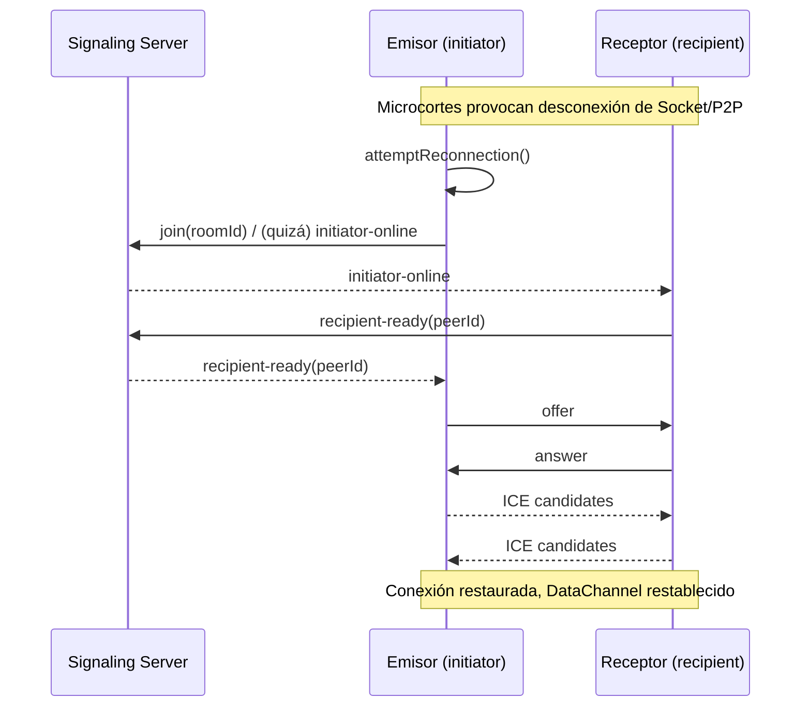

## Introducción: por qué importan el “auto‑join” y la “reconexión”

Quien prueba PrivyDrop por primera vez tropieza con dos fricciones pequeñas pero frecuentes:

- Al pasar de Enviar a Recibir, hay que pegar de nuevo el ID de sala.
- En Wi‑Fi de cafetería o datos móviles, un microcorte obliga a reconectar manualmente.

Pequeñeces, sí. Pero en red real aparecen mucho y deciden si algo se siente “sin esfuerzo”. Por eso lanzamos dos mejoras de acabado que pulen el flujo hasta hacerlo realmente suave:

- “Auto‑unión por ID en caché” en el receptor: si se cumplen las condiciones, rellenamos y entramos en la sala automáticamente.
- “Reconexion resiliente” de extremo a extremo: caiga Socket o P2P, la negociación y la conexión se recuperan solas.

Y lo más importante: no tocamos nuestra línea roja arquitectónica. El backend solo hace señalización y salas; los archivos siempre viajan de navegador a navegador con cifrado de extremo a extremo.

---

## Función 1: Auto‑unión del receptor con ID en caché

Al cambiar a la pestaña de Receptor, si se cumplen estas condiciones, rellenamos el último ID de sala guardado y entramos al instante:

- Estás en la pestaña de Recibir y aún no estás en una sala;
- La URL no incluye `roomId` (la URL manda; no sobrescribimos);
- El campo de entrada está vacío (no pisamos lo que escribes);
- Existe un ID en caché en localStorage.

La lógica se dispara al cambiar de pestaña: primero rellenamos, luego llamamos directamente a unirse—un pegado/clic menos.

- Anclas de código:
  - useEffect de auto‑entrada en el receptor: [<u>**https://github.com/david-bai00/PrivyDrop/blob/v1.1.1/frontend/components/ClipboardApp.tsx#L151**</u>](https://github.com/david-bai00/PrivyDrop/blob/v1.1.1/frontend/components/ClipboardApp.tsx#L151)
  - Utilidad de caché (localStorage): [<u>**https://github.com/david-bai00/PrivyDrop/blob/v1.1.1/frontend/lib/roomIdCache.ts#L1**</u>](https://github.com/david-bai00/PrivyDrop/blob/v1.1.1/frontend/lib/roomIdCache.ts#L1)

¿Cuándo no se activa?

- Ya estás dentro de una sala;
- La URL trae `roomId` explícito (por ejemplo, enlace compartido con parámetro);
- El campo de entrada ya contiene texto en edición;
- No hay ID en caché.

---

## Función 2: “Guardar/Usar ID en caché” en el emisor (doble toque para actualizar)

En el lado Emisor, el campo del ID incorpora un botón inteligente de “Reusar” con dos estados:

- Guardar ID: con longitud ≥ 8, el botón se habilita; al pulsar, guarda el texto actual como ID en caché.
- Usar ID en caché: si existe, un toque lo escribe en el campo y se une de inmediato; con doble toque, el botón pasa durante ~3 s a “Guardar ID” para que puedas actualizar la caché.

Notas de implementación:

- El simple/doble toque se decide en una ventana de 400 ms con temporizador, limpiado al desmontar;
- Tras “Usar ID en caché”, el emisor entra a la sala inmediatamente (sin pulsar “Unirse”);
- No permitimos guardar IDs de menos de 8 caracteres para evitar guardados accidentales.

- Anclas de código:
  - Simple/doble toque y limpieza del temporizador: [<u>**https://github.com/david-bai00/PrivyDrop/blob/v1.1.1/frontend/components/ClipboardApp/CachedIdActionButton.tsx#L112**</u>](https://github.com/david-bai00/PrivyDrop/blob/v1.1.1/frontend/components/ClipboardApp/CachedIdActionButton.tsx#L112)
  - Unión inmediata al “Usar ID en caché” (emisor): [<u>**https://github.com/david-bai00/PrivyDrop/blob/v1.1.1/frontend/components/ClipboardApp/SendTabPanel.tsx#L193**</u>](https://github.com/david-bai00/PrivyDrop/blob/v1.1.1/frontend/components/ClipboardApp/SendTabPanel.tsx#L193)

---

## Reconexión: de la detección a la recuperación completa

Observamos tres puntos para detectar cortes y disparar la reconexión:

- Socket desconectado: si al volver cambia el `socketId`, re‑entramos a la sala automáticamente;
- P2P desconectado/fallido/cerrado: marcamos estado e intentamos reconstruir la conexión;
- Comprobación proactiva de cambio de `socketId`: al recuperar el socket, validamos de nuevo.

- Anclas de código:
  - Re‑entrada automática tras reconectar el socket: [<u>**https://github.com/david-bai00/PrivyDrop/blob/v1.1.1/frontend/lib/webrtc_base.ts#L121**</u>](https://github.com/david-bai00/PrivyDrop/blob/v1.1.1/frontend/lib/webrtc_base.ts#L121)
  - Punto unificado de attemptReconnection: [<u>**https://github.com/david-bai00/PrivyDrop/blob/v1.1.1/frontend/lib/webrtc_base.ts#L185**</u>](https://github.com/david-bai00/PrivyDrop/blob/v1.1.1/frontend/lib/webrtc_base.ts#L185)
  - Registro de `lastJoinedSocketId` y envío de `initiator-online` si procede: [<u>**https://github.com/david-bai00/PrivyDrop/blob/v1.1.1/frontend/lib/webrtc_base.ts#L460**</u>](https://github.com/david-bai00/PrivyDrop/blob/v1.1.1/frontend/lib/webrtc_base.ts#L460)
  - El emisor recibe `recipient-ready` y reinicia la negociación: [<u>**https://github.com/david-bai00/PrivyDrop/blob/v1.1.1/frontend/lib/webrtc_Initiator.ts#L12**</u>](https://github.com/david-bai00/PrivyDrop/blob/v1.1.1/frontend/lib/webrtc_Initiator.ts#L12)
  - El receptor responde a `initiator-online` con `recipient-ready`: [<u>**https://github.com/david-bai00/PrivyDrop/blob/v1.1.1/frontend/lib/webrtc_Recipient.ts#L14**</u>](https://github.com/david-bai00/PrivyDrop/blob/v1.1.1/frontend/lib/webrtc_Recipient.ts#L14)
  - Relé de señalización en backend:
    - ready: [<u>**https://github.com/david-bai00/PrivyDrop/blob/v1.1.1/backend/src/socket/handlers.ts#L63**</u>](https://github.com/david-bai00/PrivyDrop/blob/v1.1.1/backend/src/socket/handlers.ts#L63)
    - initiator-online: [<u>**https://github.com/david-bai00/PrivyDrop/blob/v1.1.1/backend/src/socket/handlers.ts#L102**</u>](https://github.com/david-bai00/PrivyDrop/blob/v1.1.1/backend/src/socket/handlers.ts#L102)
    - recipient-ready: [<u>**https://github.com/david-bai00/PrivyDrop/blob/v1.1.1/backend/src/socket/handlers.ts#L108**</u>](https://github.com/david-bai00/PrivyDrop/blob/v1.1.1/backend/src/socket/handlers.ts#L108)
    - peer-disconnected: [<u>**https://github.com/david-bai00/PrivyDrop/blob/v1.1.1/backend/src/socket/handlers.ts#L119**</u>](https://github.com/david-bai00/PrivyDrop/blob/v1.1.1/backend/src/socket/handlers.ts#L119)

### Secuencia (Mermaid)

### Detalles de fiabilidad

- Cola de candidatos ICE: si la descripción remota no está lista o la conexión se cierra, los candidatos se encolan y se envían después; ver [<u>**https://github.com/david-bai00/PrivyDrop/blob/v1.1.1/frontend/lib/webrtc_base.ts#L219-L256.**</u>](https://github.com/david-bai00/PrivyDrop/blob/v1.1.1/frontend/lib/webrtc_base.ts#L219-L256.)
- Backpressure y troceado del DataChannel: umbral del emisor `bufferedAmountLowThreshold=256KB` ([<u>**https://github.com/david-bai00/PrivyDrop/blob/v1.1.1/frontend/lib/webrtc_Initiator.ts#L82**</u>](https://github.com/david-bai00/PrivyDrop/blob/v1.1.1/frontend/lib/webrtc_Initiator.ts#L82)); control de red `maxBuffer≈3MB / lowThreshold≈512KB / trozos de 64KB` ([<u>**https://github.com/david-bai00/PrivyDrop/blob/v1.1.1/frontend/lib/transfer/NetworkTransmitter.ts#L66-L111,**</u>](https://github.com/david-bai00/PrivyDrop/blob/v1.1.1/frontend/lib/transfer/NetworkTransmitter.ts#L66-L111,) [<u>**https://github.com/david-bai00/PrivyDrop/blob/v1.1.1/frontend/lib/transfer/NetworkTransmitter.ts#L160-L210**</u>](https://github.com/david-bai00/PrivyDrop/blob/v1.1.1/frontend/lib/transfer/NetworkTransmitter.ts#L160-L210)).
- Wake Lock móvil: se solicita al conectar y se libera al desconectar/fallar, para reducir interrupciones al pasar a segundo plano.
- Envoltorio de errores y reintentos: los raros `sendData failed` se capturan, se muestran y se reintentan (ver `sendWithBackpressure`).

### Estrategia de reutilización: IDs cortos vs largos

- IDs cortos (4 dígitos) reciben un TTL de 15 minutos (900s) cuando la sala queda vacía tras la desconexión; permite reconectar fácilmente en esa ventana; ver [<u>**https://github.com/david-bai00/PrivyDrop/blob/v1.1.1/backend/src/socket/handlers.ts#L119-L125.**</u>](https://github.com/david-bai00/PrivyDrop/blob/v1.1.1/backend/src/socket/handlers.ts#L119-L125.)
- La expiración por defecto de la sala es 24 horas; solo en “sala vacía + desconexión” pasamos a la retención temporal de 15 minutos; ver [<u>**https://github.com/david-bai00/PrivyDrop/blob/v1.1.1/backend/src/services/redis.ts#L6.**</u>](https://github.com/david-bai00/PrivyDrop/blob/v1.1.1/backend/src/services/redis.ts#L6.)
- IDs largos (tipo UUID) son mejores para reutilización entre sesiones/dispositivos; combínalos con el botón de caché para la mejor ergonomía.

---

## Cómo probarlo (hands‑on)

Prueba rápida en escritorio:

1. En el Emisor, escribe un ID personalizado de ≥ 8 caracteres y pulsa “Guardar ID”.
2. Cambia al Receptor: si se cumplen condiciones, se rellenará y entrará automáticamente.
3. Simula un corte (apaga el Wi‑Fi, cambia a hotspot, recarga y vuelve) y observa la reconexión automática.
4. En el Emisor, haz doble toque en “Usar ID en caché” para cambiar temporalmente a “Guardar ID” y actualizar a un ID largo nuevo.

Móvil/redes pobres:

- Segundo plano → primer plano; cambia entre Wi‑Fi ↔ datos.
- Observa si el receptor se auto‑une y si la transferencia se reanuda sola.

---

## Cierre y llamada a la acción

Cuanto más suave es la conexión, más crece el valor del P2P. El auto‑join por ID en caché y la reconexión resiliente hacen que PrivyDrop sea más robusto y confiable en redes reales.

Si te resulta útil, déjanos una estrella en GitHub ([<u>**https://github.com/david-bai00/PrivyDrop**</u>](https://github.com/david-bai00/PrivyDrop)) para que más personas nos encuentren. Tu estrella impacta en búsqueda y recomendaciones—y alimenta nuestras ganas de seguir puliendo.

Pruébalo online: [<u>**https://www.privydrop.app**</u>](https://www.privydrop.app). También te invitamos a abrir issues con comentarios y sugerencias para seguir afinando esa “experiencia sin fricción”.

Además, el dominio está acelerado con Cloudflare CDN, mejorando notablemente velocidad y estabilidad entre regiones para una apertura sin tirones.

Lecturas recomendadas:

- [<u>**Por qué hice PrivyDrop de código abierto**</u>](/blog/privydrop-open-source)
- [<u>**Cómo WebRTC permite la transferencia directa entre navegadores**</u>](/blog/webRTC-file-transfer)
- [<u>**Transferencias reanudables: adiós a la ansiedad por los archivos grandes**</u>](/blog/resumable-transfers)

