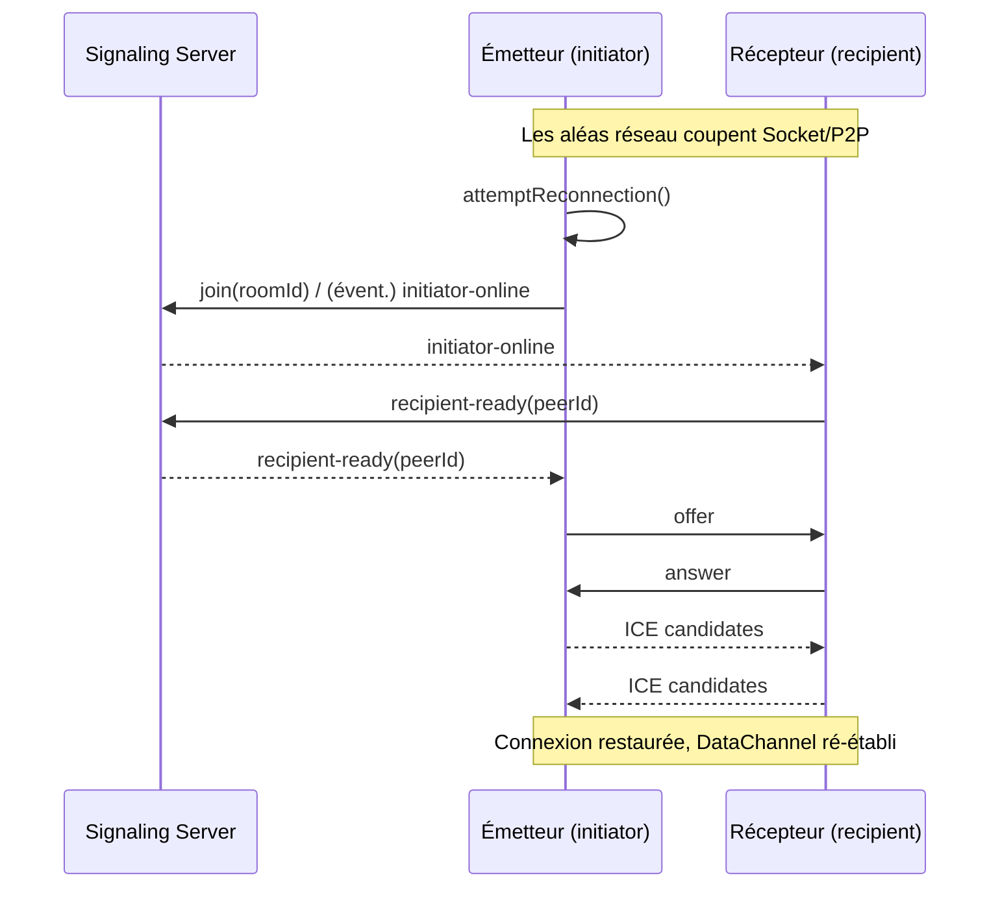

## Introduction : pourquoi « auto‑join » et « reconnexion »

Les nouveaux utilisateurs de PrivyDrop rencontrent souvent deux petites frictions :

- En passant d’Envoyer à Recevoir, il faut recoller l’ID de salle ;
- Sur un Wi‑Fi de café ou en 4G, une micro‑coupure impose une reconnexion manuelle.

Des détails ? Oui. Mais très fréquents dans le monde réel — ils font la différence entre « ça marche » et « c’est fluide ». Nous avons donc livré deux finitions qui rendent l’expérience vraiment soyeuse :

- « Auto‑join via ID en cache » côté récepteur : si les conditions sont réunies, on pré‑remplit et on rejoint la salle automatiquement ;
- « Reconnexion résiliente » de bout en bout : que Socket ou P2P tombe, la négociation et la connexion se rétablissent seules.

Le tout sans toucher à notre ligne rouge architecturale : le backend ne fait que la signalisation et la gestion de salle ; les fichiers restent chiffrés de bout en bout, directement de navigateur à navigateur.

---

## Fonction 1 : Auto‑join du récepteur avec ID en cache

Lorsque vous passez à l’onglet Récepteur, si les conditions suivantes sont réunies, le dernier ID de salle en cache est pré‑rempli et l’entrée est immédiate :

- Vous êtes sur l’onglet Récepteur et pas encore dans une salle ;
- L’URL ne contient pas `roomId` (l’URL l’emporte — pas d’écrasement) ;
- Le champ de saisie est vide (on ne remplace pas votre saisie) ;
- Un ID en cache existe dans le localStorage.

La logique se déclenche au changement d’onglet. Si c’est bon, on remplit d’abord, puis on appelle aussitôt la routine d’entrée — un collage/clic de moins.

- Repères de code :
  - useEffect d’auto‑entrée côté récepteur : https://github.com/david-bai00/PrivyDrop/blob/v1.1.1/frontend/components/ClipboardApp.tsx#L151
  - Utilitaire de cache (localStorage) : https://github.com/david-bai00/PrivyDrop/blob/v1.1.1/frontend/lib/roomIdCache.ts#L1

Quand cela ne s’applique‑t‑il pas ?

- Vous êtes déjà dans une salle ;
- L’URL porte explicitement `roomId` (lien de partage avec paramètre) ;
- Le champ contient déjà un texte en cours de saisie ;
- Aucun ID en cache n’est trouvé.

---

## Fonction 2 : « Enregistrer / Utiliser l’ID en cache » côté émetteur (double‑clic pour mettre à jour)

Sur l’émetteur, le champ d’ID accueille un bouton « Réutiliser » astucieux qui alterne entre deux états :

- Enregistrer l’ID : quand la longueur ≥ 8, le bouton s’active ; un clic enregistre la saisie courante comme ID en cache.
- Utiliser l’ID en cache : s’il existe, un clic l’insère et rejoint la salle immédiatement ; un double‑clic bascule ~3 s en « Enregistrer l’ID » pour actualiser le cache.

Notes d’implémentation :

- Simple/double‑clic via une fenêtre de 400 ms, timer nettoyé au démontage ;
- Après « Utiliser l’ID en cache », l’émetteur rejoint la salle immédiatement (pas de clic « Rejoindre » supplémentaire) ;
- Pas d’enregistrement d’ID de moins de 8 caractères pour éviter les « courts » accidentels.

- Repères de code :
  - Simple/double‑clic et nettoyage du timer : https://github.com/david-bai00/PrivyDrop/blob/v1.1.1/frontend/components/ClipboardApp/CachedIdActionButton.tsx#L112
  - Rejoindre immédiatement après « Utiliser l’ID en cache » (émetteur) : https://github.com/david-bai00/PrivyDrop/blob/v1.1.1/frontend/components/ClipboardApp/SendTabPanel.tsx#L193

---

## Reconnexion : de la détection au rétablissement complet

Nous surveillons trois points d’entrée et déclenchons la reconnexion :

- Socket déconnecté : après reconnexion, si le `socketId` change, on ré‑entre automatiquement ;
- P2P déconnecté/échec/fermé : on marque l’état et on tente de reconstruire la connexion ;
- Vérification proactive de changement de `socketId` : à la reprise du socket, on revalide.

- Repères de code :
  - Ré‑entrée auto après connexion du socket : https://github.com/david-bai00/PrivyDrop/blob/v1.1.1/frontend/lib/webrtc_base.ts#L121
  - Point d’entrée unifié attemptReconnection : https://github.com/david-bai00/PrivyDrop/blob/v1.1.1/frontend/lib/webrtc_base.ts#L185
  - Suivi de `lastJoinedSocketId` et émission de `initiator-online` si nécessaire : https://github.com/david-bai00/PrivyDrop/blob/v1.1.1/frontend/lib/webrtc_base.ts#L460
  - Côté émetteur, réception de `recipient-ready` et reprise de la négociation : https://github.com/david-bai00/PrivyDrop/blob/v1.1.1/frontend/lib/webrtc_Initiator.ts#L12
  - Côté récepteur, réponse `recipient-ready` à `initiator-online` : https://github.com/david-bai00/PrivyDrop/blob/v1.1.1/frontend/lib/webrtc_Recipient.ts#L14
  - Relais côté backend :
    - ready : https://github.com/david-bai00/PrivyDrop/blob/v1.1.1/backend/src/socket/handlers.ts#L63
    - initiator-online : https://github.com/david-bai00/PrivyDrop/blob/v1.1.1/backend/src/socket/handlers.ts#L102
    - recipient-ready : https://github.com/david-bai00/PrivyDrop/blob/v1.1.1/backend/src/socket/handlers.ts#L108
    - peer-disconnected : https://github.com/david-bai00/PrivyDrop/blob/v1.1.1/backend/src/socket/handlers.ts#L119

### Séquence (Mermaid)

### Détails de fiabilité

- File d’attente des candidats ICE : si la description distante n’est pas prête ou que la connexion se ferme, on met en file et on rejoue plus tard ; voir https://github.com/david-bai00/PrivyDrop/blob/v1.1.1/frontend/lib/webrtc_base.ts#L219-L256.
- Rétro‑pression et découpage DataChannel : seuil émetteur `bufferedAmountLowThreshold=256KB` (https://github.com/david-bai00/PrivyDrop/blob/v1.1.1/frontend/lib/webrtc_Initiator.ts#L82) ; contrôle réseau `maxBuffer≈3MB / lowThreshold≈512KB / chunks de 64KB` (https://github.com/david-bai00/PrivyDrop/blob/v1.1.1/frontend/lib/transfer/NetworkTransmitter.ts#L66-L111, https://github.com/david-bai00/PrivyDrop/blob/v1.1.1/frontend/lib/transfer/NetworkTransmitter.ts#L160-L210).
- Wake Lock mobile : demande à l’établissement de la connexion, libération à la déconnexion/échec — pour réduire les interruptions en arrière‑plan.
- Encapsulation d’erreurs et retries : les rares `sendData failed` sont capturés, surfacés et réessayés (voir `sendWithBackpressure`).

### Stratégie de réutilisation : IDs courts vs longs

- IDs courts (4 chiffres) : en cas de « salle vide + déconnexion », TTL de grâce de 15 minutes (900s) — reconnexion rapide dans la fenêtre ; voir https://github.com/david-bai00/PrivyDrop/blob/v1.1.1/backend/src/socket/handlers.ts#L119-L125.
- Expiration par défaut : 24 h ; seul le cas « salle vide + déconnexion » passe en conservation temporaire de 15 min ; voir https://github.com/david-bai00/PrivyDrop/blob/v1.1.1/backend/src/services/redis.ts#L6.
- IDs longs (type UUID) : mieux pour la réutilisation inter‑sessions/appareils ; les combiner avec le bouton d’ID en cache offre la meilleure ergonomie.

---

## Prise en main (hands‑on)

Essai rapide sur desktop :

1. Côté Émetteur, entrez un ID personnalisé (≥ 8 caractères) et cliquez « Enregistrer l’ID ».
2. Passez au Récepteur : si les conditions sont réunies, auto‑remplissage et entrée immédiate.
3. Simulez une coupure (coupure Wi‑Fi, bascule hotspot, actualiser puis revenir) et observez la reconnexion automatique.
4. Côté Émetteur, double‑cliquez « Utiliser l’ID en cache » pour basculer brièvement en « Enregistrer l’ID » et mettre à jour vers un nouvel ID long.

Mobile / réseaux difficiles :

- Arrière‑plan → premier plan ; bascule Wi‑Fi ↔ cellulaire.
- Vérifiez l’auto‑entrée du Récepteur et la reprise automatique du transfert.

---

## Conclusion & appel à l’action

Plus la connexion est fluide, plus la valeur du P2P grandit. L’auto‑join via ID en cache et la reconnexion résiliente renforcent la robustesse de PrivyDrop dans les réseaux réels.

Si vous aimez, mettez‑nous une étoile sur GitHub (<u>https://github.com/david-bai00/PrivyDrop</u>) — cela accroît la visibilité et nourrit notre envie de peaufiner.

Essai en ligne : <u>https://www.privydrop.app</u>. Vos retours et idées sont bienvenus via les issues : continuons ensemble à polir « l’expérience soyeuse ».

Par ailleurs, notre domaine bénéficie de l’accélération Cloudflare CDN, améliorant nettement vitesse et stabilité inter‑régions.

Pour aller plus loin :

- [Pourquoi j’ai open‑sourcé PrivyDrop](/blog/privydrop-open-source)
- [Comment WebRTC permet le transfert direct entre navigateurs](/blog/webRTC-file-transfer)
- [Transferts reprenables : adieu à l’anxiété des gros fichiers](/blog/resumable-transfers)
