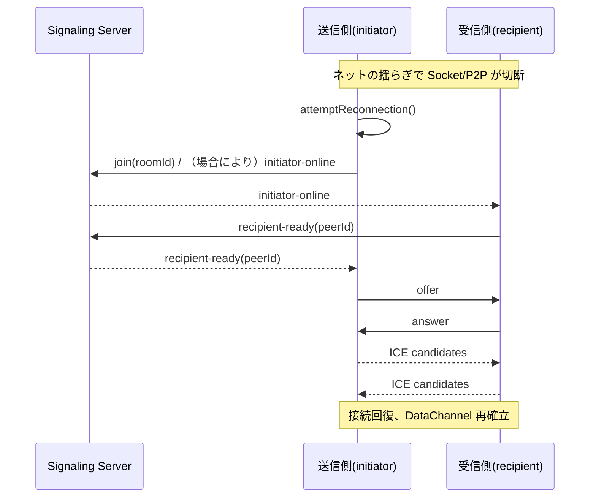

## はじめに：なぜ「自動入室」と「再接続」なのか

PrivyDrop を初めて使うと、よくある小さな引っかかりが二つあります。

- 送信から受信に切り替えるたび、部屋の ID をもう一度貼り付ける。
- カフェの Wi‑Fi やモバイル回線で一瞬切れると、手動でつなぎ直す。

小さなこと。でも現実のネットワークでは頻出で、使い心地を左右します。そこで私たちは、体験を“するり”と滑らかにする二つの磨き込みを加えました。

- 受信側「キャッシュIDの自動入室」：条件を満たせば、自動で入力＆即入室。
-, エンドツーエンドの「粘り強い再接続」：Socket / P2P のどちらが落ちても、自動で再ネゴシエーション＆復旧。

そして大切なのは、アーキテクチャのレッドラインは不変であること。バックエンドは信令とルーム管理のみ、ファイルは常に E2E 暗号化でブラウザ間を直送します。

---

## 機能1：受信側のキャッシュID自動入室

受信タブへ切り替えた際、以下の条件を満たすと、最後に保存した部屋 ID を自動入力し、すぐ入室します。

- 受信タブにいて、まだ入室していない；
- URL に `roomId` パラメータがない（URL が優先、上書きしない）；
- 入力欄が空（ユーザーの入力は上書きしない）；
- localStorage にキャッシュ ID が存在する。

この判定はタブ切り替え時に走ります。条件一致なら、入力欄を埋めてからそのまま入室ロジックを呼び出し、貼り付け/クリックを 1 回減らします。

- コード参照：
  - 受信側の自動入室 useEffect: [<u>**https://github.com/david-bai00/PrivyDrop/blob/v1.1.1/frontend/components/ClipboardApp.tsx#L151**</u>](https://github.com/david-bai00/PrivyDrop/blob/v1.1.1/frontend/components/ClipboardApp.tsx#L151)
  - キャッシュユーティリティ（localStorage）: [<u>**https://github.com/david-bai00/PrivyDrop/blob/v1.1.1/frontend/lib/roomIdCache.ts#L1**</u>](https://github.com/david-bai00/PrivyDrop/blob/v1.1.1/frontend/lib/roomIdCache.ts#L1)

発動しないとき：

- すでに入室している；
- URL が明示的に `roomId` を持つ（共有リンクなど）；
- 入力欄に既に文字があり編集中；
- キャッシュ ID が存在しない。

---

## 機能2：送信側の「保存/使用」ボタン（ダブルタップで更新）

送信側の部屋 ID 入力欄に、賢い「再利用」ボタンを追加しました。状態は 2 つに切り替わります。

- ID を保存：入力長が 8 文字以上で有効化。クリックで現在の入力をキャッシュ ID として保存。
- キャッシュ ID を使用：キャッシュがあれば、ワンタップで入力欄に反映してそのまま入室。ダブルタップすると約 3 秒だけ「ID を保存」に切り替わり、キャッシュを更新できます。

実装メモ：

- シングル/ダブルタップは 400ms の判定窓＋タイマーで実現し、アンマウント時にクリーンアップ；
- 「キャッシュ ID を使用」後は送信側が即入室（追加の「入室」操作は不要）；
- 8 文字未満は保存不可にして、短い ID の誤保存を防止。

- コード参照：
  - シングル/ダブルタップとタイマーのクリーンアップ: [<u>**https://github.com/david-bai00/PrivyDrop/blob/v1.1.1/frontend/components/ClipboardApp/CachedIdActionButton.tsx#L112**</u>](https://github.com/david-bai00/PrivyDrop/blob/v1.1.1/frontend/components/ClipboardApp/CachedIdActionButton.tsx#L112)
  - 「キャッシュ ID を使用」で即入室（送信側）: [<u>**https://github.com/david-bai00/PrivyDrop/blob/v1.1.1/frontend/components/ClipboardApp/SendTabPanel.tsx#L193**</u>](https://github.com/david-bai00/PrivyDrop/blob/v1.1.1/frontend/components/ClipboardApp/SendTabPanel.tsx#L193)

---

## 再接続：検知から復旧までの流れ

私たちは 3 つの入口から「切断」を監視し、再接続を走らせます。

- Socket 切断：再接続後に `socketId` が変わっていれば自動再入室；
- P2P 切断/失敗/クローズ：状態をマーキングし、接続再構築を試行；
- `socketId` の変化を能動チェック：Socket 復旧時に再確認。

- コード参照：
  - Socket 接続後の自動再入室: [<u>**https://github.com/david-bai00/PrivyDrop/blob/v1.1.1/frontend/lib/webrtc_base.ts#L121**</u>](https://github.com/david-bai00/PrivyDrop/blob/v1.1.1/frontend/lib/webrtc_base.ts#L121)
  - 再接続の統一エントリ: [<u>**https://github.com/david-bai00/PrivyDrop/blob/v1.1.1/frontend/lib/webrtc_base.ts#L185**</u>](https://github.com/david-bai00/PrivyDrop/blob/v1.1.1/frontend/lib/webrtc_base.ts#L185)
  - `lastJoinedSocketId` の記録と必要時の `initiator-online` 送出: [<u>**https://github.com/david-bai00/PrivyDrop/blob/v1.1.1/frontend/lib/webrtc_base.ts#L460**</u>](https://github.com/david-bai00/PrivyDrop/blob/v1.1.1/frontend/lib/webrtc_base.ts#L460)
  - 送信側の `recipient-ready` 受信と再ネゴシエーション開始: [<u>**https://github.com/david-bai00/PrivyDrop/blob/v1.1.1/frontend/lib/webrtc_Initiator.ts#L12**</u>](https://github.com/david-bai00/PrivyDrop/blob/v1.1.1/frontend/lib/webrtc_Initiator.ts#L12)
  - 受信側の `initiator-online` 受信と `recipient-ready` 応答: [<u>**https://github.com/david-bai00/PrivyDrop/blob/v1.1.1/frontend/lib/webrtc_Recipient.ts#L14**</u>](https://github.com/david-bai00/PrivyDrop/blob/v1.1.1/frontend/lib/webrtc_Recipient.ts#L14)
  - バックエンドの信令リレー：
    - ready: [<u>**https://github.com/david-bai00/PrivyDrop/blob/v1.1.1/backend/src/socket/handlers.ts#L63**</u>](https://github.com/david-bai00/PrivyDrop/blob/v1.1.1/backend/src/socket/handlers.ts#L63)
    - initiator-online: [<u>**https://github.com/david-bai00/PrivyDrop/blob/v1.1.1/backend/src/socket/handlers.ts#L102**</u>](https://github.com/david-bai00/PrivyDrop/blob/v1.1.1/backend/src/socket/handlers.ts#L102)
    - recipient-ready: [<u>**https://github.com/david-bai00/PrivyDrop/blob/v1.1.1/backend/src/socket/handlers.ts#L108**</u>](https://github.com/david-bai00/PrivyDrop/blob/v1.1.1/backend/src/socket/handlers.ts#L108)
    - peer-disconnected: [<u>**https://github.com/david-bai00/PrivyDrop/blob/v1.1.1/backend/src/socket/handlers.ts#L119**</u>](https://github.com/david-bai00/PrivyDrop/blob/v1.1.1/backend/src/socket/handlers.ts#L119)

### シーケンス（Mermaid）

### 信頼性ディテール

- ICE 候補キュー：リモート記述が未確立、または接続がクローズ系なら候補をキューイングし、後でまとめて反映；[<u>**https://github.com/david-bai00/PrivyDrop/blob/v1.1.1/frontend/lib/webrtc_base.ts#L219-L256。**</u>](https://github.com/david-bai00/PrivyDrop/blob/v1.1.1/frontend/lib/webrtc_base.ts#L219-L256。)
- DataChannel の背圧と分割送信：送信側しきい値 `bufferedAmountLowThreshold=256KB`（[<u>**https://github.com/david-bai00/PrivyDrop/blob/v1.1.1/frontend/lib/webrtc_Initiator.ts#L82）；ネットワーク制御は**</u>](https://github.com/david-bai00/PrivyDrop/blob/v1.1.1/frontend/lib/webrtc_Initiator.ts#L82）；ネットワーク制御は) `maxBuffer≈3MB / lowThreshold≈512KB / 64KB チャンク`（[<u>**https://github.com/david-bai00/PrivyDrop/blob/v1.1.1/frontend/lib/transfer/NetworkTransmitter.ts#L66-L111,**</u>](https://github.com/david-bai00/PrivyDrop/blob/v1.1.1/frontend/lib/transfer/NetworkTransmitter.ts#L66-L111,) [<u>**https://github.com/david-bai00/PrivyDrop/blob/v1.1.1/frontend/lib/transfer/NetworkTransmitter.ts#L160-L210）。**</u>](https://github.com/david-bai00/PrivyDrop/blob/v1.1.1/frontend/lib/transfer/NetworkTransmitter.ts#L160-L210）。)
- モバイルの Wake Lock：接続時に取得、切断/失敗で解放。バックグラウンド遷移による中断を低減。
- エラー包みとリトライ：まれな `sendData failed` を捕捉し、表面化＆再試行（`sendWithBackpressure` を参照）。

### 短い ID と長い ID の使い分け

- 短い ID（4 桁）は「空室で切断」時、バックエンドが 15 分（900s）の TTL に更新。猶予内は再接続が容易；[<u>**https://github.com/david-bai00/PrivyDrop/blob/v1.1.1/backend/src/socket/handlers.ts#L119-L125。**</u>](https://github.com/david-bai00/PrivyDrop/blob/v1.1.1/backend/src/socket/handlers.ts#L119-L125。)
- 既定の部屋期限は 24 時間。空室切断のときのみ 15 分の一時保持に切替；[<u>**https://github.com/david-bai00/PrivyDrop/blob/v1.1.1/backend/src/services/redis.ts#L6。**</u>](https://github.com/david-bai00/PrivyDrop/blob/v1.1.1/backend/src/services/redis.ts#L6。)
- 長い ID（UUID 相当）はセッション横断・デバイス横断の再利用に向く。キャッシュ ID ボタンと組み合わせると最良。

---

## 触ってみる（クイックスタート）

デスクトップでの手早い体験：

1. 送信側で 8 文字以上の任意 ID を入力し、「ID を保存」をクリック。
2. 受信側へ切り替え：条件を満たせば自動入力＆即入室。
3. 切断を再現（Wi‑Fi を切る、テザリングへ切替、リロード→戻る）して、自動復帰を観察。
4. 送信側で「キャッシュ ID を使用」をダブルタップし、一時的に「ID を保存」に切替→新しい長い ID へ更新。

モバイル/弱い回線の場面：

- バックグラウンド→フォアグラウンド、Wi‑Fi とセルラーの切替。
- 受信側の自動入室や、転送の自動再開を確認。

---

## 結びとお願い

“するり”とつながるほど、P2P の価値は増幅します。受信側のキャッシュ ID 自動入室と、スタック全体の再接続により、PrivyDrop は現実のネット環境でいっそう頑丈で頼れる存在になりました。

もし気に入っていただけたら、ぜひ GitHub で Star をお願いします（[<u>**https://github.com/david-bai00/PrivyDrop**</u>](https://github.com/david-bai00/PrivyDrop)）。見つけてもらいやすくなるだけでなく、私たちの磨き込みの原動力にもなります。

オンライン体験：[<u>**https://www.privydrop.app**</u>](https://www.privydrop.app)。Issue から体験フィードバックや改善提案も歓迎します。“なめらかな体験”を、さらに厚くしていきましょう。

なお、ドメインは Cloudflare CDN による加速を有効化。地域間の速度と安定性が向上し、より多くのユーザーがストレスなくアクセスできます。

関連記事：

- [<u>**なぜ PrivyDrop をオープンソース化したのか**</u>](/blog/privydrop-open-source)
- [<u>**WebRTC はどうやってブラウザ直送を実現するのか**</u>](/blog/webRTC-file-transfer)
- [<u>**レジューム転送：大容量でも焦らない**</u>](/blog/resumable-transfers)

