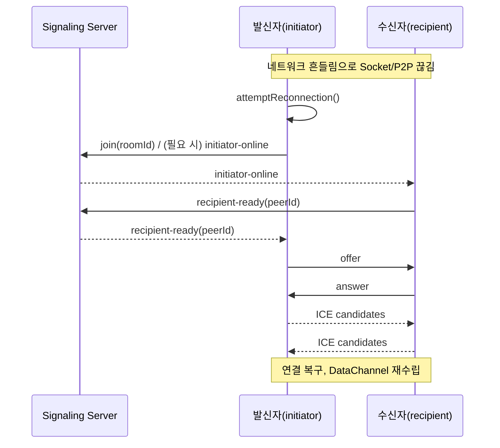

## 소개: 왜 “자동 입장”과 “재연결”인가

PrivyDrop을 처음 쓰면 자주 마주치는 두 가지 작은 마찰이 있습니다.

- 발신 → 수신으로 바꿀 때마다 방 ID를 다시 붙여넣어야 함
- 카페 Wi‑Fi나 모바일 네트워크에서 잠깐 끊기면 직접 다시 연결해야 함

작지만, 현실 네트워크에서는 자주 일어납니다. 그리고 “손맛”을 좌우합니다. 그래서 흐름을 정말 부드럽게 만드는 두 가지 개선을 넣었습니다.

- 수신 측 “캐시 ID 자동 입장”: 조건이 맞으면 자동으로 입력하고 곧바로 입장
- 전체 경로 “탄탄한 재연결”: Socket/P2P 어느 쪽이 끊겨도 스스로 재협상/복구

무엇보다 우리의 아키텍처 레드라인은 그대로입니다. 백엔드는 신호와 방 관리만 담당하고, 파일은 E2E로 암호화된 상태로 브라우저끼리 직접 전송됩니다.

---

## 기능 1: 수신 측 캐시 ID 자동 입장

수신 탭으로 전환했을 때 아래 조건을 만족하면, 마지막으로 저장된 방 ID를 자동으로 채우고 즉시 입장합니다.

- 현재 수신 탭이고 아직 방에 들어가지 않았음
- URL에 `roomId` 파라미터가 없음(주소가 우선, 덮어쓰지 않음)
- 입력 칸이 비어 있음(사용자 입력을 덮어쓰지 않음)
- localStorage에 캐시 ID가 존재함

이 로직은 탭 전환 때 트리거됩니다. 조건이 맞으면 입력 칸을 채운 뒤 바로 입장 로직을 호출하여, 붙여넣기/클릭을 한 번 줄입니다.

- 코드 앵커:
  - 수신 측 자동 입장 useEffect: [<u>**https://github.com/david-bai00/PrivyDrop/blob/v1.1.1/frontend/components/ClipboardApp.tsx#L151**</u>](https://github.com/david-bai00/PrivyDrop/blob/v1.1.1/frontend/components/ClipboardApp.tsx#L151)
  - 캐시 유틸(localStorage): [<u>**https://github.com/david-bai00/PrivyDrop/blob/v1.1.1/frontend/lib/roomIdCache.ts#L1**</u>](https://github.com/david-bai00/PrivyDrop/blob/v1.1.1/frontend/lib/roomIdCache.ts#L1)

다음 상황에서는 동작하지 않습니다.

- 이미 방에 들어가 있음
- URL에 `roomId`가 명시됨(공유 링크 등)
- 입력 칸에 이미 텍스트가 있고 편집 중임
- 캐시 ID가 없음

---

## 기능 2: 발신 측 “저장/사용” 버튼(더블 탭으로 업데이트)

발신 측 방 ID 입력란에 똑똑한 “재사용” 버튼을 추가했습니다. 두 가지 상태를 오갑니다.

- ID 저장: 입력 길이가 8자 이상이면 활성화. 클릭 시 현재 입력을 캐시 ID로 저장
- 캐시 ID 사용: 캐시가 있으면 한 번 탭으로 입력란에 채우고 곧바로 입장. 두 번 탭하면 약 3초간 “ID 저장”으로 잠시 전환되어 캐시를 업데이트할 수 있음

구현 노트:

- 단/복 탭은 400ms 윈도우로 판별하며, 컴포넌트 언마운트 시 타이머를 정리
- “캐시 ID 사용” 후에는 발신 측이 즉시 입장(추가 “입장” 클릭 불필요)
- 8자 미만은 저장 불가로 하여, 짧은 ID 오저장을 방지

- 코드 앵커:
  - 단/복 탭과 타이머 정리: [<u>**https://github.com/david-bai00/PrivyDrop/blob/v1.1.1/frontend/components/ClipboardApp/CachedIdActionButton.tsx#L112**</u>](https://github.com/david-bai00/PrivyDrop/blob/v1.1.1/frontend/components/ClipboardApp/CachedIdActionButton.tsx#L112)
  - “캐시 ID 사용” 시 즉시 입장(발신 측): [<u>**https://github.com/david-bai00/PrivyDrop/blob/v1.1.1/frontend/components/ClipboardApp/SendTabPanel.tsx#L193**</u>](https://github.com/david-bai00/PrivyDrop/blob/v1.1.1/frontend/components/ClipboardApp/SendTabPanel.tsx#L193)

---

## 재연결: 감지부터 완전 복구까지

세 가지 지점에서 끊김을 감지하고 재연결을 시도합니다.

- Socket 끊김: 재연결 후 `socketId`가 바뀌면 자동 재입장
- P2P 끊김/실패/종료: 상태를 표시하고 연결 재구성을 시도
- `socketId` 변경의 능동 확인: 소켓 복구 시 한 번 더 검증

- 코드 앵커:
  - 소켓 연결 후 자동 재입장: [<u>**https://github.com/david-bai00/PrivyDrop/blob/v1.1.1/frontend/lib/webrtc_base.ts#L121**</u>](https://github.com/david-bai00/PrivyDrop/blob/v1.1.1/frontend/lib/webrtc_base.ts#L121)
  - attemptReconnection 통합 진입점: [<u>**https://github.com/david-bai00/PrivyDrop/blob/v1.1.1/frontend/lib/webrtc_base.ts#L185**</u>](https://github.com/david-bai00/PrivyDrop/blob/v1.1.1/frontend/lib/webrtc_base.ts#L185)
  - `lastJoinedSocketId` 기록 및 필요 시 `initiator-online` 트리거: [<u>**https://github.com/david-bai00/PrivyDrop/blob/v1.1.1/frontend/lib/webrtc_base.ts#L460**</u>](https://github.com/david-bai00/PrivyDrop/blob/v1.1.1/frontend/lib/webrtc_base.ts#L460)
  - 발신 측의 `recipient-ready` 처리 및 재협상 시작: [<u>**https://github.com/david-bai00/PrivyDrop/blob/v1.1.1/frontend/lib/webrtc_Initiator.ts#L12**</u>](https://github.com/david-bai00/PrivyDrop/blob/v1.1.1/frontend/lib/webrtc_Initiator.ts#L12)
  - 수신 측의 `initiator-online` 응답(`recipient-ready` 전송): [<u>**https://github.com/david-bai00/PrivyDrop/blob/v1.1.1/frontend/lib/webrtc_Recipient.ts#L14**</u>](https://github.com/david-bai00/PrivyDrop/blob/v1.1.1/frontend/lib/webrtc_Recipient.ts#L14)
  - 백엔드 신호 릴레이:
    - ready: [<u>**https://github.com/david-bai00/PrivyDrop/blob/v1.1.1/backend/src/socket/handlers.ts#L63**</u>](https://github.com/david-bai00/PrivyDrop/blob/v1.1.1/backend/src/socket/handlers.ts#L63)
    - initiator-online: [<u>**https://github.com/david-bai00/PrivyDrop/blob/v1.1.1/backend/src/socket/handlers.ts#L102**</u>](https://github.com/david-bai00/PrivyDrop/blob/v1.1.1/backend/src/socket/handlers.ts#L102)
    - recipient-ready: [<u>**https://github.com/david-bai00/PrivyDrop/blob/v1.1.1/backend/src/socket/handlers.ts#L108**</u>](https://github.com/david-bai00/PrivyDrop/blob/v1.1.1/backend/src/socket/handlers.ts#L108)
    - peer-disconnected: [<u>**https://github.com/david-bai00/PrivyDrop/blob/v1.1.1/backend/src/socket/handlers.ts#L119**</u>](https://github.com/david-bai00/PrivyDrop/blob/v1.1.1/backend/src/socket/handlers.ts#L119)

### 시퀀스(Mermaid)

### 신뢰성 디테일

- ICE 후보 큐: 원격 설명이 준비되지 않았거나 연결이 종료 단계면 후보를 큐에 담아 두었다가 나중에 한 번에 반영; [<u>**https://github.com/david-bai00/PrivyDrop/blob/v1.1.1/frontend/lib/webrtc_base.ts#L219-L256.**</u>](https://github.com/david-bai00/PrivyDrop/blob/v1.1.1/frontend/lib/webrtc_base.ts#L219-L256.)
- DataChannel 배압과 청킹: 발신 측 임계치 `bufferedAmountLowThreshold=256KB` ([<u>**https://github.com/david-bai00/PrivyDrop/blob/v1.1.1/frontend/lib/webrtc_Initiator.ts#L82**</u>](https://github.com/david-bai00/PrivyDrop/blob/v1.1.1/frontend/lib/webrtc_Initiator.ts#L82)); 네트워크 제어 `maxBuffer≈3MB / lowThreshold≈512KB / 64KB 청크` ([<u>**https://github.com/david-bai00/PrivyDrop/blob/v1.1.1/frontend/lib/transfer/NetworkTransmitter.ts#L66-L111,**</u>](https://github.com/david-bai00/PrivyDrop/blob/v1.1.1/frontend/lib/transfer/NetworkTransmitter.ts#L66-L111,) [<u>**https://github.com/david-bai00/PrivyDrop/blob/v1.1.1/frontend/lib/transfer/NetworkTransmitter.ts#L160-L210**</u>](https://github.com/david-bai00/PrivyDrop/blob/v1.1.1/frontend/lib/transfer/NetworkTransmitter.ts#L160-L210)).
- 모바일 Wake Lock: 연결 시 획득, 끊김/실패 시 해제 — 백그라운드 전환으로 인한 중단을 줄임.
- 에러 래핑과 재시도: 드물게 발생하는 `sendData failed` 경로를 포착/표면화/재시도(`sendWithBackpressure` 참고).

### 짧은 ID와 긴 ID 재사용 전략

- 짧은 ID(4자리)는 “빈 방 + 끊김” 시 백엔드가 TTL을 15분(900s)으로 갱신 — 그 창에서 빠르게 재연결 가능; [<u>**https://github.com/david-bai00/PrivyDrop/blob/v1.1.1/backend/src/socket/handlers.ts#L119-L125.**</u>](https://github.com/david-bai00/PrivyDrop/blob/v1.1.1/backend/src/socket/handlers.ts#L119-L125.)
- 기본 방 만료는 24시간; “빈 방 + 끊김”에 한해 일시적으로 15분 보존으로 전환; [<u>**https://github.com/david-bai00/PrivyDrop/blob/v1.1.1/backend/src/services/redis.ts#L6.**</u>](https://github.com/david-bai00/PrivyDrop/blob/v1.1.1/backend/src/services/redis.ts#L6.)
- 긴 ID(UUID 유사)는 세션/디바이스를 넘어 재사용에 유리 — 캐시 ID 버튼과 함께 쓰면 가장 편함.

---

## 바로 써보기 (Hands‑on)

데스크톱 빠른 체험:

1. 발신 측에서 8자 이상 사용자 지정 ID를 입력하고 “ID 저장” 클릭
2. 수신 측으로 전환: 조건이 맞으면 자동 채움 후 즉시 입장
3. 끊김 시나리오 시뮬레이션(Wi‑Fi 끄기, 핫스팟 전환, 새로고침 후 복귀) → 자동 재연결 관찰
4. 발신 측 “캐시 ID 사용” 더블 탭 → 잠시 “ID 저장”으로 전환 → 새 긴 ID로 갱신

모바일/열악한 네트워크:

- 백그라운드 ↔ 포그라운드 전환, Wi‑Fi ↔ 셀룰러 전환
- 수신 측 자동 입장과 전송 자동 복구 동작 확인

---

## 맺음말 & 액션

연결이 매끄러울수록 P2P의 가치는 커집니다. 캐시 ID 자동 입장과 전 구간 재연결로, PrivyDrop은 현실 네트워크에서 더 튼튼하고 믿을 만해졌습니다.

유용했다면 GitHub 별을 부탁드립니다([<u>**https://github.com/david-bai00/PrivyDrop**</u>](https://github.com/david-bai00/PrivyDrop)). 더 많은 사람이 발견할 수 있고, 저희가 계속 다듬어 가는 동력이 됩니다.

온라인 체험: [<u>**https://www.privydrop.app**</u>](https://www.privydrop.app). Issue로 사용 소감과 제안을 남겨 주세요. “부드러운 경험”을 더 두텁게 만들어가겠습니다.

덧붙여, 도메인은 Cloudflare CDN 가속을 사용합니다. 지역 간 속도와 안정성이 크게 향상되어, 더 많은 지역에서 끊김 없이 접속할 수 있습니다.

더 읽기:

- [<u>**내가 PrivyDrop을 오픈 소스로 공개한 이유**</u>](/blog/privydrop-open-source)
- [<u>**WebRTC가 브라우저 직결 전송을 구현하는 방법**</u>](/blog/webRTC-file-transfer)
- [<u>**중단 후 재개 전송: 대용량 전송의 불안을 넘어**</u>](/blog/resumable-transfers)

