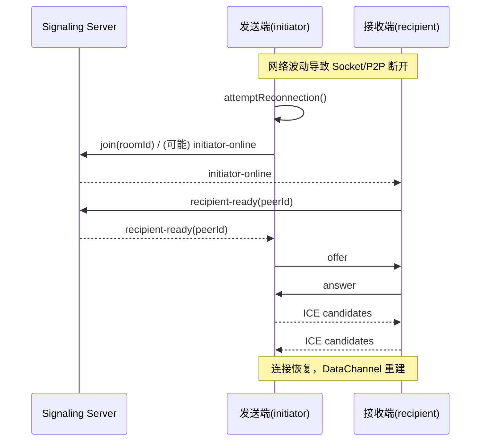

## 引言：为什么我们要做“自动入房”和“断线重连”

很多第一次使用 PrivyDrop 的用户，都会经历这样两件“小事”：

- 从发送端切到接收端时，需要再粘贴一次房间 ID；
- 在咖啡店 Wi‑Fi 或移动网络下，短暂断网就要手动重连。

这两件“小事”，在真实世界里却非常高频，也直接决定了“顺不顺手”。为此，我们上线了两项把体验打磨到“顺滑”的改进：

- 接收端“缓存 ID 自动连接”：满足条件时，自动填充并直接入房；
- 全链路“断线重连”：Socket/P2P 任一断开，均自动恢复协商与连接。

更重要的是，这些改进不改变我们的架构红线：后端只做信令与房间管理，文件数据始终端到端加密，浏览器之间直传。

---

## 功能一：接收端缓存 ID 自动连接

当你切换到“接收”面板，如果满足以下条件，将自动填充上次保存的房间 ID 并直接入房：

- 当前处于接收面板，且尚未在房间内；
- URL 未携带 `roomId` 参数（URL 优先，不做覆盖）；
- 输入框当前为空（不覆盖用户已有输入）；
- 本地存在缓存 ID（localStorage）。

上述逻辑在切换面板时触发，一旦命中，会先填充输入框，再立即调用加入逻辑，减少一次粘贴/点击。

- 代码锚点：
  - 前端自动入房 useEffect（接收端）：[<u>**frontend/components/ClipboardApp.tsx#L151**</u>](https://github.com/david-bai00/PrivyDrop/blob/v1.1.1/frontend/components/ClipboardApp.tsx#L151)
  - 缓存工具（localStorage）：[<u>**frontend/lib/roomIdCache.ts#L1**</u>](https://github.com/david-bai00/PrivyDrop/blob/v1.1.1/frontend/lib/roomIdCache.ts#L1)

何时不会触发？

- 你已在房间中；
- URL 显式携带了 `roomId`（例如分享链接带参直达）；
- 输入框里已有你正在编辑的 ID；
- 本地没有缓存 ID。

---

## 功能二：发送端“保存/使用缓存 ID”（支持双击更新）

发送端的房间 ID 输入区新增了一个“复用按钮”，在两种状态间智能切换：

- 保存 ID：当输入长度 ≥ 8 位时按钮可用，点击后将当前输入保存为缓存 ID；
- 使用缓存 ID：若存在缓存 ID，单击即将其写入输入框并立刻入房；双击会“短暂切换”为“保存 ID”，便于你替换更新缓存（约 3 秒后恢复）。

实现要点：

- 单/双击通过 400ms 窗口配合计时器实现，并在组件卸载时清理；
- “使用缓存 ID”单击后，发送端会立即加入房间（无需再点“加入”）；
- 输入长度不足 8 位时不会允许保存，避免误存短 ID。

- 代码锚点：
  - 单/双击与计时器清理：[<u>**frontend/components/ClipboardApp/CachedIdActionButton.tsx#L112**</u>](https://github.com/david-bai00/PrivyDrop/blob/v1.1.1/frontend/components/ClipboardApp/CachedIdActionButton.tsx#L112)
  - 使用缓存 ID 后立刻直连（发送端）：[<u>**frontend/components/ClipboardApp/SendTabPanel.tsx#L193**</u>](https://github.com/david-bai00/PrivyDrop/blob/v1.1.1/frontend/components/ClipboardApp/SendTabPanel.tsx#L193)

---

## 断线重连：从检测到恢复的全链路

我们从三个入口观测“断开”并触发重连：

- Socket 断开：重连后若 `socketId` 变化，将自动重新入房；
- P2P 断开/失败/关闭：标记状态并尝试重建连接；
- 主动判断 `socketId` 变化：在 socket 连接恢复时复核一次。

- 代码锚点：
  - Socket 连接后自动重入房：[<u>**frontend/lib/webrtc_base.ts#L121**</u>](https://github.com/david-bai00/PrivyDrop/blob/v1.1.1/frontend/lib/webrtc_base.ts#L121)
  - 尝试重连的统一入口：[<u>**frontend/lib/webrtc_base.ts#L185**</u>](https://github.com/david-bai00/PrivyDrop/blob/v1.1.1/frontend/lib/webrtc_base.ts#L185)
  - 记录 `lastJoinedSocketId` 并在需要时触发 `initiator-online`：[<u>**frontend/lib/webrtc_base.ts#L460**</u>](https://github.com/david-bai00/PrivyDrop/blob/v1.1.1/frontend/lib/webrtc_base.ts#L460)
  - 发送端接收 `recipient-ready` 并重启协商：[<u>**frontend/lib/webrtc_Initiator.ts#L12**</u>](https://github.com/david-bai00/PrivyDrop/blob/v1.1.1/frontend/lib/webrtc_Initiator.ts#L12)
  - 接收端响应 `initiator-online` 并发送 `recipient-ready`：[<u>**frontend/lib/webrtc_Recipient.ts#L14**</u>](https://github.com/david-bai00/PrivyDrop/blob/v1.1.1/frontend/lib/webrtc_Recipient.ts#L14)
  - 后端信令转发：
    - ready：[<u>**backend/src/socket/handlers.ts#L63**</u>](https://github.com/david-bai00/PrivyDrop/blob/v1.1.1/backend/src/socket/handlers.ts#L63)
    - initiator-online：[<u>**backend/src/socket/handlers.ts#L102**</u>](https://github.com/david-bai00/PrivyDrop/blob/v1.1.1/backend/src/socket/handlers.ts#L102)
    - recipient-ready：[<u>**backend/src/socket/handlers.ts#L108**</u>](https://github.com/david-bai00/PrivyDrop/blob/v1.1.1/backend/src/socket/handlers.ts#L108)
    - peer-disconnected：[<u>**backend/src/socket/handlers.ts#L119**</u>](https://github.com/david-bai00/PrivyDrop/blob/v1.1.1/backend/src/socket/handlers.ts#L119)

### 时序（Mermaid）

### 可靠性细节

- ICE 候选队列：若远端描述尚未建立或连接处于关闭态，候选会入队，待可用时批量补交；见 [<u>**frontend/lib/webrtc_base.ts#L219-L256**</u>](https://github.com/david-bai00/PrivyDrop/blob/v1.1.1/frontend/lib/webrtc_base.ts#L219-L256)。
- DataChannel 背压与分片：发送端阈值 `bufferedAmountLowThreshold=256KB`（[<u>**frontend/lib/webrtc_Initiator.ts#L82**</u>](https://github.com/david-bai00/PrivyDrop/blob/v1.1.1/frontend/lib/webrtc_Initiator.ts#L82)）；网络发送控制 `maxBuffer≈3MB / lowThreshold≈512KB / 64KB 分片`（[<u>**frontend/lib/transfer/NetworkTransmitter.ts#L66-L111**</u>](https://github.com/david-bai00/PrivyDrop/blob/v1.1.1/frontend/lib/transfer/NetworkTransmitter.ts#L66-L111)、[<u>**frontend/lib/transfer/NetworkTransmitter.ts#L160-L210**</u>](https://github.com/david-bai00/PrivyDrop/blob/v1.1.1/frontend/lib/transfer/NetworkTransmitter.ts#L160-L210)）。
- 移动端唤醒锁：连接建立时申请 Wake Lock，断开/失败时释放，降低切后台导致的意外中断；
- 错误兜底与重试：小概率 `sendData failed` 会被包装、上报与重试（详见 `sendWithBackpressure` 相关逻辑）。

### 短 ID 与长 ID 的复用策略

- 短 ID（4 位）在“空房断开”后，会由后端将房间 TTL 刷新为 15 分钟（900s），窗口期内可直接重连，超时回收；见 [<u>**backend/src/socket/handlers.ts#L119-L125**</u>](https://github.com/david-bai00/PrivyDrop/blob/v1.1.1/backend/src/socket/handlers.ts#L119-L125)。
- 默认房间过期时间为 24 小时，仅在空房断开发生临时 15 分钟保留；见 [<u>**backend/src/services/redis.ts#L6**</u>](https://github.com/david-bai00/PrivyDrop/blob/v1.1.1/backend/src/services/redis.ts#L6)。
- 长 ID（如 UUID 级别长度）更适合跨会话、跨设备的持续复用；与缓存 ID 按钮配合使用体验最佳。

---

## 如何体验（上手指南）

桌面端快速体验：

1. 在发送端输入一个 ≥8 位的自定义 ID，点击“保存 ID”；
2. 切换到接收端：若满足条件，将自动填充并直接入房；
3. 模拟断线（如：关闭 Wi‑Fi、切到手机热点、刷新页面再返回），观察自动重连；
4. 在发送端双击“使用缓存 ID”，短暂切换为“保存 ID”，更新为新的长 ID。

移动端/弱网场景：

- 切后台 → 回前台；Wi‑Fi ↔ 蜂窝之间切换；
- 关注接收端是否自动入房、传输是否自动恢复。

---

## 结语与行动号召

我们相信，越“顺手”的连接，越能放大 P2P 的价值。接收端缓存 ID 自动连接与断线重连，让 PrivyDrop 在真实网络环境下更加稳健、可依赖。

如果觉得好用，请到 GitHub 给我们一个 Star（[<u>**https://github.com/david-bai00/PrivyDrop**</u>](https://github.com/david-bai00/PrivyDrop)），便于更多人发现与受益；你的 Star 也会直接影响搜索与推荐权重，是我们持续打磨产品的动力。

在线体验：[<u>**https://www.privydrop.app**</u>](https://www.privydrop.app)。也欢迎在 Issue 中反馈你的使用体验与改进建议，让我们把“顺滑体验”继续做厚。

另外，域名已启用 Cloudflare CDN 加速（赛博菩萨），显著提升跨区域的访问速度与稳定性，让更多地区用户打开网站不再卡顿，整体体验更流畅。

延伸阅读：

- [<u>**我为什么开源了 PrivyDrop**</u>](/blog/privydrop-open-source)
- [<u>**WebRTC 如何实现浏览器直传**</u>](/blog/webRTC-file-transfer)
- [<u>**断点续传：让大文件传输告别焦虑**</u>](/blog/resumable-transfers)
