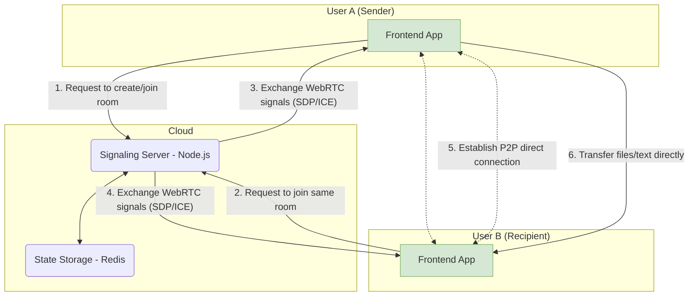

## Introduction

Today, I'm incredibly excited to announce that a personal project I've poured my heart and soul into, **PrivyDrop**, is now officially open source!

[**Try it Live »**](https://www.privydrop.app/) | [**GitHub Repo »**](https://github.com/david-bai00/PrivyDrop)

This project began with a very simple personal need: "I just want to send things between my phone and computer, securely and easily."

If you, like me, have ever been frustrated looking for a file-sharing tool that requires no registration, has no speed limits, and truly respects your privacy, then this article is for you. It will not only share the story of "scratching my own itch" but will also take you on a complete "behind-the-scenes" tour to explore PrivyDrop's core architecture and design philosophy. And most importantly, it's a sincere invitation for you to become a co-author of its next chapter.

## Part 1: The Birth of a Tool: From "I Need It" to "Everyone Can Use It"

### 1.1 A Developer's Journey of Scratching His Own Itch

It all started with a small but persistent pain point in my daily workflow.

I frequently need to quickly send files, screenshots, or text snippets between my phone and my laptop. I tried many tools, but none of them fully met my requirements:

- Some online P2P tools were powerful but could only send files, failing my need to send lightweight text or links.
- Some online clipboards could sync text conveniently, but I was deeply concerned about uploading my clipboard content to an unknown server.
- And the mainstream cloud storage or social apps either required logging in or had size and speed limits, making the whole process feel clunky and cumbersome.

After failing to find a tool that perfectly matched my three core requirements—**fast, private, and no account needed**—I decided to build one for myself.

### 1.2 From a Personal Utility to a Public Project

Initially, PrivyDrop was just a small utility to meet my own needs. But as I gradually improved its features, I realized that my pain point was likely a common one.

In an era where data and privacy are increasingly important, we deserve a better choice—a tool that doesn't force us to make a painful trade-off between "convenience" and "privacy." This idea drove me to polish PrivyDrop from a personal project into a robust and reliable public service.

Our core vision is simple, as I wrote in the project's README: **We believe everyone should have control over their own data.**

### 1.3 Why Open Source? The Only Answer for Trust

For a tool that claims "privacy and security" as its core value, being closed-source is a contradiction in itself. How can users trust your promises?

Therefore, open-sourcing was the inevitable choice and the only answer.

- **To Build Trust**: Code is the best proof. We are making all our code public to be scrutinized by the world, thereby building undeniable trust.
- **The Power of Community**: I am well aware that an individual's power is limited. I believe the collective wisdom of the community can help find flaws I've missed and suggest features I've never thought of, helping PrivyDrop go further and become more robust.
- **To Give Back and Learn**: I have benefited immensely from the open-source community, and now it's my time to give back. Open-sourcing the project is both a way to learn from talented developers and a joy of sharing.

## Part 2: A Deep Dive into the Architecture: A "Production-Grade" Practice

PrivyDrop is not just a toy project. In its architectural design, we pursued simplicity, efficiency, and scalability, striving to meet production-grade standards.

### 2.1 The Big Picture: A Simple and Efficient System

Our core design principle is: **a lightweight backend, an intelligent frontend**. The backend only acts as a "traffic cop" (for signaling), while the frontend handles all the "heavy lifting" (file processing and transfer).

### 2.2 Frontend Architecture: From Separation of Concerns to Logical Cohesion

The frontend is built with Next.js 14, and our core design philosophy is **using custom Hooks as the heart of our business logic**.

You might ask, why not Redux or Zustand? For PrivyDrop, most of the state is tightly coupled with specific, highly cohesive business logic. We encapsulated this logic and state into a series of custom Hooks (like `useWebRTCConnection`, `useRoomManager`, `useFileTransferHandler`), which brought several clear benefits:

- **Logical Cohesion**: All state and methods related to the WebRTC connection are in `useWebRTCConnection`, making it extremely easy to maintain.
- **Pure Components**: React components are freed from complex business logic, returning to their essential role of rendering UI.
- **Clear Layering**: This creates a clear data flow and dependency relationship from `app` (routing) -> `components` (UI) -> `hooks` (logic) -> `lib` (low-level capabilities), greatly enhancing the maintainability of the codebase.

### 2.3 Backend Architecture: The Art of Statelessness and Efficiency

The backend, based on Node.js and Express, strictly follows the **stateless** principle in its design.

The server itself holds no state related to rooms or users. All state is delegated to **Redis**. This allows the backend application to be scaled horizontally with ease.

We also cleverly utilized different Redis data structures to meet business needs:

- **Hash**: To store room metadata.
- **Set**: To store the `socketId` of all members in a room, ensuring uniqueness.
- **String**: To reverse-map a `socketId` to its `roomId`, facilitating quick cleanup when a user disconnects.
- **Sorted Set**: To implement IP-based rate limiting, effectively preventing malicious attacks.

All keys are set with a reasonable TTL (Time To Live), ensuring automatic resource cleanup and allowing the system to run stably over the long term.

### 2.4 "Production-Grade" Considerations: From Deployment to Security

We provide a complete production deployment plan, including:

- Using **Nginx** as a reverse proxy and for SSL termination.
- Using **PM2** for Node.js process management.
- Using **Certbot** for automatic SSL certificate acquisition and renewal.
- A comprehensive guide for setting up a **TURN/STUN** server for scenarios requiring traversal of complex NATs.

These all demonstrate that PrivyDrop is a serious project that can be trusted and deployed to a production environment.

## Part 3: More Than Code: An Invitation to Build the Future

Open sourcing is just the beginning. We have an exciting future planned for PrivyDrop, and now, we want to invite you to join us.

### 3.1 Project Roadmap

We have a public [**Project Roadmap**](./ROADMAP.md) that outlines our future priorities. We plan to add some highly requested features in the future, such as:

- **Resumable Transfers**: To handle very large files and unstable network conditions.
- **E2E Encrypted Group Chat**: To extend secure P2P communication to multi-user text chats.
- Other undetermined features.

### 3.2 How to Contribute?

We welcome contributions of all forms! No matter who you are, there's always a way to help make PrivyDrop better. Please read our [**Contributing Guidelines**](./.github/CONTRIBUTING.md) to start your journey.

- **For Users**: Use the product, report bugs, and suggest features via [GitHub Issues](https://github.com/david-bai00/PrivyDrop/issues).
- **For Developers**: Claim a bug, implement a new feature, or refactor a piece of existing code.
- **For Documentarians/Translators**: Help us improve the documentation or translate PrivyDrop into more languages.

### 3.3 A Strong Call to Action

- **For Users**: Experience the ultimate privacy and convenience with PrivyDrop now!
  [**➡️ Try it Live**](https://www.privydrop.app/)

- **For Developers**: If PrivyDrop's philosophy or technology excites you, please give our GitHub repository a Star! It's the greatest recognition and encouragement for us.
  [**⭐️ Star Us on GitHub**](https://github.com/david-bai00/PrivyDrop)

- **For Everyone**: Join our community discussions and let us hear your voice!

## Conclusion

Thank you again for taking the time to read this story.

The story of PrivyDrop began with one person's need, and I look forward to its future being written by a community.
