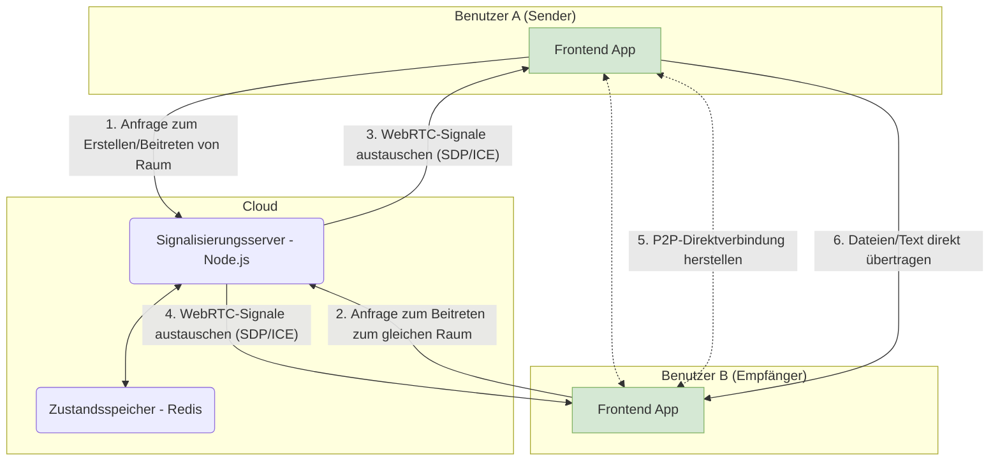

## Einleitung

Heute bin ich unglaublich aufgeregt, ankündigen zu können, dass ein persönliches Projekt, in das ich mein Herz und meine Seele gesteckt habe, **PrivyDrop**, nun offiziell Open Source ist!

[**Jetzt Live testen »**](https://www.privydrop.app/) | [**GitHub Repository »**](https://github.com/david-bai00/PrivyDrop)

Dieses Projekt begann mit einem sehr einfachen persönlichen Bedürfnis: "Ich möchte nur Dinge sicher und einfach zwischen meinem Telefon und Computer versenden."

Wenn Sie, wie ich, jemals frustriert waren bei der Suche nach einem Datei-Freigabetool, das keine Registrierung erfordert, keine Geschwindigkeitsbegrenzungen hat und Ihre Privatsphäre wirklich respektiert, dann ist dieser Artikel für Sie. Er wird nicht nur die Geschichte des "Kratzens am eigenen Juckreiz" teilen, sondern Sie auch auf eine vollständige "Hinter-den-Kulissen"-Tour mitnehmen, um PrivyDrops Kernarchitektur und Designphilosophie zu erkunden. Und am wichtigsten ist es eine aufrichtige Einladung, Co-Autor des nächsten Kapitels zu werden.

## Teil 1: Die Geburt eines Werkzeugs: Von "Ich brauche es" zu "Alle können es nutzen"

### 1.1 Die Reise eines Entwicklers, seinen eigenen Juckreiz zu kratzen

Alles begann mit einem kleinen aber hartnäckigen Schmerzpunkt in meinem täglichen Arbeitsablauf.

Ich muss häufig Dateien, Screenshots oder Text-Schnipsel zwischen meinem Telefon und meinem Laptop schnell senden. Ich habe viele Werkzeuge ausprobiert, aber keine hat meine Anforderungen vollständig erfüllt:

- Einige Online-P2P-Werkzeuge waren mächtig, konnten aber nur Dateien senden und scheiterten an meinem Bedarf, leichtgewichtigen Text oder Links zu senden.
- Einige Online-Zwischenablagen konnten Text bequem synchronisieren, aber ich war zutiefst besorgt darüber, meine Zwischenablageninhalte auf einen unbekannten Server hochzuladen.
- Und die Mainstream-Cloud-Speicher- oder Social-Apps erforderten entweder eine Anmeldung oder hatten Größen- und Geschwindigkeitsbegrenzungen, was den gesamten Prozess umständlich und mühsam machte.

Nachdem ich versagt hatte, ein Werkzeug zu finden, das perfekt meinen drei Kernanforderungen entsprach—**schnell, privat und ohne Konto erforderlich**—entschied ich mich, eines für mich selbst zu bauen.

### 1.2 Von einem persönlichen Werkzeug zu einem öffentlichen Projekt

Ursprünglich war PrivyDrop nur ein kleines Werkzeug, um meine eigenen Bedürfnisse zu erfüllen. Aber als ich nach und nach seine Funktionen verbesserte, erkannte ich, dass mein Schmerzpunkt wahrscheinlich ein gemeinsamer war.

In einer Zeit, in der Daten und Privatsphäre immer wichtiger werden, verdienen wir eine bessere Wahl—ein Werkzeug, das uns nicht zwingt, eine schmerzhafte Kompromisseingenschaft zwischen "Bequemlichkeit" und "Privatsphäre" einzugehen. Diese Idee trieb mich an, PrivyDrop von einem persönlichen Projekt zu einem robusten und zuverlässigen öffentlichen Dienst zu polieren.

Unsere Kernvision ist einfach, wie ich im README des Projekts schrieb: **Wir glauben, dass jeder die Kontrolle über seine eigenen Daten haben sollte.**

### 1.3 Warum Open Source? Die einzige Antwort für Vertrauen

Für ein Werkzeug, das "Privatsphäre und Sicherheit" als Kernwert beansprucht, ist Closed Source ein Widerspruch in sich selbst. Wie können Benutzer Ihren Versprechen vertrauen?

Daher war Open Source die unvermeidliche Wahl und die einzige Antwort.

- **Um Vertrauen aufzubauen**: Code ist der beste Beweis. Wir machen all unseren Code öffentlich, um von der Welt geprüft zu werden, und bauen so unbestreitbares Vertrauen auf.
- **Die Kraft der Gemeinschaft**: Ich bin mir sehr bewusst, dass die Kraft eines Einzelnen begrenzt ist. Ich glaube, dass die kollektive Weisheit der Gemeinschaft helfen kann, Fehler zu finden, die ich übersehen habe, und Funktionen vorzuschlagen, an die ich nie gedacht habe, und PrivyDrop dabei helfen, weiterzukommen und robuster zu werden.
- **Um zurückzugeben und zu lernen**: Ich habe ungemein von der Open-Source-Gemeinschaft profitiert, und jetzt ist es meine Zeit zurückzugeben. Das Projekt Open Source zu stellen, ist sowohl eine Möglichkeit, von talentierten Entwicklern zu lernen, als auch eine Freude des Teilens.

## Teil 2: Ein tiefer Einblick in die Architektur: Eine "Produktionsreife" Praxis

PrivyDrop ist nicht nur ein Spielzeugprojekt. In seiner architektonischen Design verfolgten wir Einfachheit, Effizienz und Skalierbarkeit und strebten danach, Produktionsstandards zu erreichen.

### 2.1 Das große Ganze: Ein einfaches und effizientes System

Unser Kern-Designprinzip ist: **ein leichtgewichtiger Backend, ein intelligentes Frontend**. Das Backend agiert nur als "Verkehrspolizist" (für Signalisierung), während das Frontend alle "schweren Arbeiten" (Dateiverarbeitung und -übertragung) übernimmt.

### 2.2 Frontend-Architektur: Von der Trennung von Belangen zur logischen Kohäsion

Das Frontend ist mit Next.js 14 gebaut, und unsere Kern-Designphilosophie ist **benutzerdefinierte Hooks als Herz unserer Geschäftslogik zu verwenden**.

Sie könnten fragen, warum nicht Redux oder Zustand? Für PrivyDrop ist der meiste Zustand eng gekoppelt mit spezifischer, hochkohärenter Geschäftslogik. Wir kapselten diese Logik und den Zustand in eine Reihe von benutzerdefinierten Hooks (wie `useWebRTCConnection`, `useRoomManager`, `useFileTransferHandler`), was mehrere klare Vorteile brachte:

- **Logische Kohäsion**: Alle Zustände und Methoden im Zusammenhang mit der WebRTC-Verbindung sind in `useWebRTCConnection`, was es extrem einfach zu warten macht.
- **Reine Komponenten**: React-Komponenten werden von komplexer Geschäftslogik befreit und kehren zu ihrer wesentlichen Rolle des UI-Renderings zurück.
- **Klare Schichtung**: Dies schafft einen klaren Datenfluss und Abhängigkeitsbeziehung von `app` (Routing) -> `components` (UI) -> `hooks` (Logik) -> `lib` (Low-Level-Fähigkeiten), was die Wartbarkeit des Code-Basis erheblich verbessert.

### 2.3 Backend-Architektur: Die Kunst der Zustandslosigkeit und Effizienz

Das Backend, basierend auf Node.js und Express, folgt in seinem Design streng dem **zustandslosen (Stateless)** Prinzip.

Der Server selbst hält keinen Zustand im Zusammenhang mit Räumen oder Benutzern. Der gesamte Zustand wird an **Redis** delegiert. Dies ermöglicht es der Backend-Anwendung, leicht horizontal skaliert zu werden.

Wir nutzten auch clever verschiedene Redis-Datenstrukturen, um Geschäftsanforderungen zu erfüllen:

- **Hash**: Zum Speichern von Raum-Metadaten.
- **Set**: Zum Speichern der `socketId` aller Mitglieder in einem Raum, wodurch Eindeutigkeit sichergestellt wird.
- **String**: Um eine `socketId` rückwärts auf ihre `roomId` abzubilden, was eine schnelle Bereinigung bei Benutzertrennung erleichtert.
- **Sorted Set**: Zur Implementierung von IP-basierter Ratenbegrenzung, was schädliche Anriffe effektiv verhindert.

Alle Schlüssel sind mit einer angemessenen TTL (Time To Live) eingestellt, was eine automatische Ressourcenbereinigung sicherstellt und dem System ermöglicht, langfristig stabil zu laufen.

### 2.4 "Produktionsreife" Überlegungen: Von Bereitstellung bis Sicherheit

Wir bieten einen vollständigen Produktionsbereitstellungsplan, einschließlich:

- Verwendung von **Nginx** als Reverse-Proxy und für SSL-Terminierung.
- Verwendung von **PM2** für Node.js-Prozessmanagement.
- Verwendung von **Certbot** für automatische SSL-Zertifikatserwerbung und -erneuerung.
- Eine umfassende Anleitung zur Einrichtung eines **TURN/STUN**-Servers für Szenarien, die das Durchqueren komplexer NATs erfordern.

All dies zeigt, dass PrivyDrop ein ernstes Projekt ist, dem vertraut und das in einer Produktionsumgebung bereitgestellt werden kann.

## Teil 3: Mehr als Code: Eine Einladung, die Zukunft zu gestalten

Open Source ist nur der Anfang. Wir haben eine aufregende Zukunft für PrivyDrop geplant, und jetzt möchten wir Sie einladen, sich uns anzuschließen.

### 3.1 Projekt-Roadmap

Wir haben eine öffentliche [<u>**Projekt-Roadmap**</u>](https://github.com/david-bai00/PrivyDrop/blob/main/ROADMAP.md), die unsere zukünftigen Prioritäten umreißt. Wir planen, in Zukunft einige stark nachgefragte Funktionen hinzuzufügen, wie zum Beispiel:

- **Wiederaufnehmbare Übertragungen**: Um sehr große Dateien und instabile Netzwerkbedingungen zu bewältigen.
- **E2E-verschlüsselter Gruppenchat**: Um sichere P2P-Kommunikation auf Multi-Benutzer-Text-Chats zu erweitern.
- Andere unbestimmte Funktionen.

### 3.2 Wie kann man beitragen?

Wir begrüßen Beiträge jeglicher Form! Egal wer Sie sind, es gibt immer einen Weg zu helfen, PrivyDrop besser zu machen. Bitte lesen Sie unsere [<u>**Beitragsrichtlinien**</u>](https://github.com/david-bai00/PrivyDrop/blob/main/.github/CONTRIBUTING.md), um Ihre Reise zu beginnen.

- **Für Benutzer**: Verwenden Sie das Produkt, melden Sie Fehler und schlagen Sie Funktionen über [GitHub Issues](https://github.com/david-bai00/PrivyDrop/issues) vor.
- **Für Entwickler**: Übernehmen Sie einen Fehler, implementieren Sie eine neue Funktion oder refaktorisieren Sie ein Stück bestehenden Codes.
- **Für Dokumentatoren/Übersetzer**: Helfen Sie uns, die Dokumentation zu verbessern oder PrivyDrop in mehr Sprachen zu übersetzen.

### 3.3 Ein starker Aufruf zum Handeln

- **Für Benutzer**: Erleben Sie jetzt die ultimative Privatsphäre und Bequemlichkeit mit PrivyDrop!
  [**➡️ Jetzt Live testen**](https://www.privydrop.app/)

- **Für Entwickler**: Wenn PrivyDrops Philosophie oder Technologie Sie begeistert, geben Sie unserem GitHub-Repository bitte einen Stern! Es ist die größte Anerkennung und Ermutigung für uns.
  [**⭐️ Geben Sie uns einen Stern auf GitHub**](https://github.com/david-bai00/PrivyDrop)

- **Für alle**: Treten Sie unseren Gemeinschaftsdiskussionen bei und lassen Sie uns Ihre Stimme hören!

## Fazit

Vielen Dank erneut, dass Sie sich Zeit genommen haben, diese Geschichte zu lesen.

Die Geschichte von PrivyDrop begann mit dem Bedürfnis einer Person, und ich freue mich darauf, dass ihre Zukunft von einer Gemeinschaft geschrieben wird.