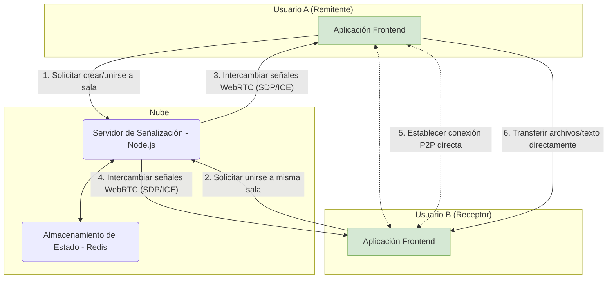

## Introducción

Hoy, estoy increíblemente emocionado de anunciar que un proyecto personal en el que he volcado mi corazón y alma, **PrivyDrop**, ahora es oficialmente código abierto.

[**Pruébalo en Vivo »**](https://www.privydrop.app/) | [**Repositorio GitHub »**](https://github.com/david-bai00/PrivyDrop)

Este proyecto comenzó con una necesidad personal muy simple: "Solo quiero enviar cosas entre mi teléfono y mi computadora, de forma segura y fácil."

Si tú, como yo, alguna vez te has frustrado buscando una herramienta para compartir archivos que no requiera registro, no tenga límites de velocidad y realmente respete tu privacidad, entonces este artículo es para ti. No solo compartirá la historia de "rascarme mi propia picazón", sino que también te llevará en un completo "detrás de cámaras" para explorar la arquitectura central y la filosofía de diseño de PrivyDrop. Y lo más importante, es una sincera invitación para que te conviertas en co-autor de su próximo capítulo.

## Parte 1: El Nacimiento de una Herramienta: Desde "Lo Necesito" hasta "Todos Pueden Usarlo"

### 1.1 El Viaje de un Desarrollador para Rascarse su Propia Picazón

Todo comenzó con un pequeño pero persistente punto de dolor en mi flujo de trabajo diario.

Frecuentemente necesito enviar rápidamente archivos, capturas de pantalla o fragmentos de texto entre mi teléfono y mi laptop. Probé muchas herramientas, pero ninguna cumplió completamente con mis requisitos:

- Algunas herramientas P2P en línea eran poderosas pero solo podían enviar archivos, fallando en mi necesidad de enviar texto ligero o enlaces.
- Algunos portapapeles en línea podían sincronizar texto convenientemente, pero estaba profundamente preocupado por subir el contenido de mi portapapeles a un servidor desconocido.
- Y las aplicaciones主流 de almacenamiento en la nube o sociales requerían iniciar sesión o tenían límites de tamaño y velocidad, haciendo que todo el proceso se sintiera torpe y engorroso.

Después de fallar en encontrar una herramienta que coincidiera perfectamente con mis tres requisitos centrales—**rápido, privado y sin necesidad de cuenta**—decidí construir una para mí mismo.

### 1.2 Desde una Utilidad Personal a un Proyecto Público

Inicialmente, PrivyDrop era solo una pequeña utilidad para satisfacer mis propias necesidades. Pero a medida que mejoré gradualmente sus características, me di cuenta de que mi punto de dolor probablemente era común.

En una era donde los datos y la privacidad son cada vez más importantes, merecemos una mejor opción—una herramienta que no nos obligue a hacer una dolorosa compensación entre "conveniencia" y "privacidad". Esta idea me impulsó a pulir PrivyDrop desde un proyecto personal hasta un servicio público robusto y confiable.

Nuestra visión central es simple, como escribí en el README del proyecto: **Creemos que todos deberían tener control sobre sus propios datos.**

### 1.3 ¿Por qué Código Abierto? La Única Respuesta para la Confianza

Para una herramienta que reclama "privacidad y seguridad" como su valor central, ser de código cerrado es una contradicción en sí misma. ¿Cómo pueden los usuarios confiar en tus promesas?

Por lo tanto, el código abierto fue la elección inevitable y la única respuesta.

- **Para Construir Confianza**: El código es la mejor prueba. Estamos haciendo público todo nuestro código para ser escrutado por el mundo, construyendo así una confianza innegable.
- **El Poder de la Comunidad**: Soy muy consciente de que el poder de un individuo es limitado. Creo que la sabiduría colectiva de la comunidad puede ayudar a encontrar defectos que he pasado por alto y sugerir características que nunca he pensado, ayudando a PrivyDrop a ir más lejos y volverse más robusto.
- **Para Devolver y Aprender**: He beneficiado inmensamente de la comunidad de código abierto, y ahora es mi momento de devolver. Abrir el código del proyecto es tanto una forma de aprender de desarrolladores talentosos como una alegría de compartir.

## Parte 2: Una Inmersión Profunda en la Arquitectura: Una Práctica de "Nivel Producción"

PrivyDrop no es solo un proyecto de juguete. En su diseño arquitectónico, buscamos simplicidad, eficiencia y escalabilidad, esforzándonos por cumplir con los estándares de nivel producción.

### 2.1 El Panorama General: Un Sistema Simple y Eficiente

Nuestro principio de diseño central es: **un backend ligero, un frontend inteligente**. El backend solo actúa como "agente de tráfico" (para señalización), mientras que el frontend maneja todo el "trabajo pesado" (procesamiento y transferencia de archivos).

### 2.2 Arquitectura Frontend: Desde la Separación de Preocupaciones hasta la Cohesión Lógica

El frontend está construido con Next.js 14, y nuestra filosofía de diseño central es **usar Hooks personalizados como el corazón de nuestra lógica de negocio**.

Podrías preguntar, ¿por qué no Redux o Zustand? Para PrivyDrop, la mayor parte del estado está estrechamente acoplado con lógica de negocio específica y altamente cohesiva. Encapsulamos esta lógica y estado en una serie de Hooks personalizados (como `useWebRTCConnection`, `useRoomManager`, `useFileTransferHandler`), lo que trajo varios beneficios claros:

- **Cohesión Lógica**: Todo el estado y métodos relacionados con la conexión WebRTC están en `useWebRTCConnection`, haciéndolo extremadamente fácil de mantener.
- **Componentes Puros**: Los componentes de React se liberan de la compleja lógica de negocio, regresando a su rol esencial de renderizar UI.
- **Capas Claras**: Esto crea un claro flujo de datos y relación de dependencia desde `app` (enrutamiento) -> `components` (UI) -> `hooks` (lógica) -> `lib` (capacidades de bajo nivel), mejorando enormemente la capacidad de mantenimiento del código base.

### 2.3 Arquitectura Backend: El Arte de la Sin Estado y Eficiencia

El backend, basado en Node.js y Express, sigue estrictamente el principio **sin estado (stateless)** en su diseño.

El servidor en sí no mantiene ningún estado relacionado con salas o usuarios. Todo el estado es delegado a **Redis**. Esto permite que la aplicación backend sea escalada horizontalmente con facilidad.

También utilizamos clevermente diferentes estructuras de datos de Redis para satisfacer las necesidades del negocio:

- **Hash**: Para almacenar metadatos de sala.
- **Set**: Para almacenar el `socketId` de todos los miembros en una sala, asegurando unicidad.
- **String**: Para mapear inversamente un `socketId` a su `roomId`, facilitando una limpieza rápida cuando un usuario se desconecta.
- **Sorted Set**: Para implementar limitación de velocidad basada en IP, previniendo efectivamente ataques maliciosos.

Todas las claves están configuradas con un TTL (Time To Live) razonable, asegurando la limpieza automática de recursos y permitiendo que el sistema funcione de manera estable a largo plazo.

### 2.4 Consideraciones de "Nivel Producción": Desde Despliegue hasta Seguridad

Proporcionamos un plan completo de despliegue en producción, incluyendo:

- Usar **Nginx** como proxy inverso y para terminación SSL.
- Usar **PM2** para gestión de procesos Node.js.
- Usar **Certbot** para adquisición y renovación automática de certificados SSL.
- Una guía comprensiva para configurar un servidor **TURN/STUN** para escenarios que requieren atravesar NATs complejos.

Todo esto demuestra que PrivyDrop es un proyecto serio que puede ser confiado y desplegado a un entorno de producción.

## Parte 3: Más Allá del Código: Una Invitación a Construir el Futuro

Abrir el código es solo el comienzo. Tenemos un futuro emocionante planeado para PrivyDrop, y ahora, queremos invitarte a unirte a nosotros.

### 3.1 Hoja de Ruta del Proyecto

Tenemos una [<u>**Hoja de Ruta del Proyecto**</u>](https://github.com/david-bai00/PrivyDrop/blob/main/ROADMAP.md) pública que describe nuestras futuras prioridades. Planeamos agregar algunas características muy solicitadas en el futuro, tales como:

- **Transferencias Reanudables**: Para manejar archivos muy grandes y condiciones de red inestables.
- **Chat Grupal Cifrado E2E**: Para extender la comunicación P2P segura a chats de texto multi-usuario.
- Otras características por determinar.

### 3.2 ¿Cómo Contribuir?

¡Bienvenimos contribuciones de todas las formas! No importa quién seas, siempre hay una manera de ayudar a hacer PrivyDrop mejor. Por favor lee nuestras [<u>**Guías de Contribución**</u>](https://github.com/david-bai00/PrivyDrop/blob/main/.github/CONTRIBUTING.md) para comenzar tu viaje.

- **Para Usuarios**: Usa el producto, reporta bugs y sugiere características a través de [GitHub Issues](https://github.com/david-bai00/PrivyDrop/issues).
- **Para Desarrolladores**: Reclama un bug, implementa una nueva característica, o refactoriza una pieza de código existente.
- **Para Documentadores/Traductores**: Ayúdanos a mejorar la documentación o traduce PrivyDrop a más idiomas.

### 3.3 Una Fuerte Llamada a la Acción

- **Para Usuarios**: ¡Experimenta la máxima privacidad y conveniencia con PrivyDrop ahora!
  [**➡️ Pruébalo en Vivo**](https://www.privydrop.app/)

- **Para Desarrolladores**: Si la filosofía o tecnología de PrivyDrop te emociona, por favor da una Estrella a nuestro repositorio GitHub. ¡Es el mayor reconocimiento y aliento para nosotros!
  [**⭐️ Danos Estrella en GitHub**](https://github.com/david-bai00/PrivyDrop)

- **Para Todos**: ¡Únete a nuestras discusiones comunitarias y deja que escuchemos tu voz!

## Conclusión

Gracias nuevamente por tomar el tiempo de leer esta historia.

La historia de PrivyDrop comenzó con la necesidad de una persona, y espero que su futuro sea escrito por una comunidad.