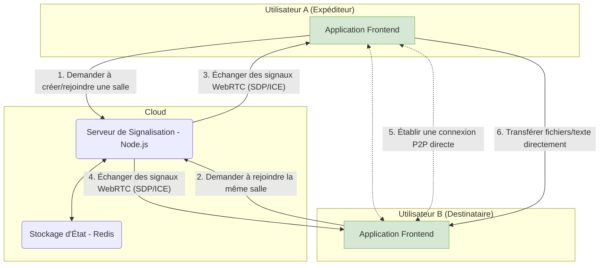

## Introduction

Aujourd'hui, je suis incroyablement excité d'annoncer qu'un projet personnel auquel j'ai consacré mon cœur et mon âme, **PrivyDrop**, est maintenant officiellement open source !

[**Essayez-le en Direct »**](https://www.privydrop.app/) | [**Dépôt GitHub »**](https://github.com/david-bai00/PrivyDrop)

Ce projet a commencé avec un besoin personnel très simple : "Je veux juste envoyer des choses entre mon téléphone et mon ordinateur, de manière sécurisée et facile."

Si vous, comme moi, avez déjà été frustré en cherchant un outil de partage de fichiers qui ne nécessite aucune inscription, n'a pas de limites de vitesse et respecte vraiment votre confidentialité, alors cet article est pour vous. Il partagera non seulement l'histoire de "me gratter là où ça me démange", mais vous emmènera également dans une visite complète "coulisses" pour explorer l'architecture centrale et la philosophie de conception de PrivyDrop. Et plus important encore, c'est une invitation sincère à devenir co-auteur de son prochain chapitre.

## Partie 1 : La naissance d'un outil : De "J'en ai besoin" à "Tout le monde peut l'utiliser"

### 1.1 Le parcours d'un développeur pour se gratter là où ça lui démange

Tout a commencé par un petit point de douleur persistant dans mon flux de travail quotidien.

J'ai fréquemment besoin d'envoyer rapidement des fichiers, des captures d'écran ou des extraits de texte entre mon téléphone et mon ordinateur portable. J'ai essayé de nombreux outils, mais aucun n'a complètement satisfait mes exigences :

- Certains outils P2P en ligne étaient puissants mais ne pouvaient envoyer que des fichiers, échouant à mon besoin d'envoyer du texte léger ou des liens.
- Certains presse-papiers en ligne pouvaient synchroniser du texte commodément, mais j'étais profondément préoccupé par l'upload de mon contenu de presse-papiers sur un serveur inconnu.
- Et les applications主流 de stockage cloud ou sociales nécessitaient soit de se connecter, soit avaient des limites de taille et de vitesse, rendant tout le processus lourd et fastidieux.

Après avoir échoué à trouver un outil qui correspondait parfaitement à mes trois exigences centrales—**rapide, privé et sans compte nécessaire**—j'ai décidé d'en construire un pour moi-même.

### 1.2 D'un utilitaire personnel à un projet public

Initialement, PrivyDrop n'était qu'un petit utilitaire pour répondre à mes propres besoins. Mais à mesure que j'améliorais progressivement ses fonctionnalités, j'ai réalisé que mon point de douleur était probablement courant.

À une époque où les données et la confidentialité sont de plus en plus importantes, nous méritons un meilleur choix—un outil qui ne nous force pas à faire un compromis douloureux entre "commodité" et "confidentialité". Cette idée m'a poussé à polir PrivyDrop d'un projet personnel à un service public robuste et fiable.

Notre vision centrale est simple, comme je l'ai écrite dans le README du projet : **Nous croyons que tout le monde devrait avoir le contrôle sur ses propres données.**

### 1.3 Pourquoi l'Open Source ? La seule réponse pour la confiance

Pour un outil qui prétend "confidentialité et sécurité" comme valeur centrale, être en code fermé est une contradiction en soi. Comment les utilisateurs peuvent-ils faire confiance à vos promesses ?

Par conséquent, l'open source était le choix inévitable et la seule réponse.

- **Pour construire la confiance** : Le code est la meilleure preuve. Nous rendons tout notre code public pour être examiné par le monde, construisant ainsi une confiance incontestable.
- **Le pouvoir de la communauté** : Je suis bien conscient que le pouvoir d'un individu est limité. Je crois que la sagesse collective de la communauté peut aider à trouver des défauts que j'ai manqués et suggérer des fonctionnalités auxquelles je n'ai jamais pensé, aidant PrivyDrop à aller plus loin et à devenir plus robuste.
- **Pour donner en retour et apprendre** : J'ai énormément bénéficié de la communauté open source, et maintenant c'est mon tour de donner en retour. Mettre le projet en open source est à la fois une façon d'apprendre de développeurs talentueux et une joie de partager.

## Partie 2 : Une plongée en profondeur dans l'architecture : Une pratique "de qualité production"

PrivyDrop n'est pas juste un projet jouet. Dans sa conception architecturale, nous avons poursuivi la simplicité, l'efficacité et la scalabilité, s'efforçant d'atteindre les standards de qualité production.

### 2.1 La vue d'ensemble : Un système simple et efficace

Notre principe de conception central est : **un backend léger, un frontend intelligent**. Le backend n'agit que comme "agent de circulation" (pour la signalisation), tandis que le frontend gère tout le "travail lourd" (traitement et transfert de fichiers).

### 2.2 Architecture Frontend : De la séparation des préoccupations à la cohésion logique

Le frontend est construit avec Next.js 14, et notre philosophie de conception centrale est **d'utiliser des Hooks personnalisés comme cœur de notre logique métier**.

Vous pourriez demander, pourquoi pas Redux ou Zustand ? Pour PrivyDrop, la plupart de l'état est étroitement couplé avec une logique métier spécifique et hautement cohésive. Nous avons encapsulé cette logique et cet état dans une série de Hooks personnalisés (comme `useWebRTCConnection`, `useRoomManager`, `useFileTransferHandler`), ce qui a apporté plusieurs avantages clairs :

- **Cohésion logique** : Tout l'état et les méthodes liés à la connexion WebRTC sont dans `useWebRTCConnection`, le rendant extrêmement facile à maintenir.
- **Composants purs** : Les composants React sont libérés de la logique métier complexe, retournant à leur rôle essentiel de rendu d'interface utilisateur.
- **Clarté des couches** : Cela crée un flux de données clair et une relation de dépendance de `app` (routage) -> `components` (interface utilisateur) -> `hooks` (logique) -> `lib` (capacités de bas niveau), améliorant grandement la maintenabilité de la base de code.

### 2.3 Architecture Backend : L'art de l'étatlessness et de l'efficacité

Le backend, basé sur Node.js et Express, suit strictement le principe **stateless (sans état)** dans sa conception.

Le serveur lui-même ne détient aucun état lié aux salles ou aux utilisateurs. Tout l'état est délégué à **Redis**. Cela permet à l'application backend d'être facilement mise à l'échelle horizontalement.

Nous avons également utilisé intelligemment différentes structures de données Redis pour répondre aux besoins métier :

- **Hash** : Pour stocker les métadonnées de salle.
- **Set** : Pour stocker le `socketId` de tous les membres dans une salle, assurant l'unicité.
- **String** : Pour mapper inversement un `socketId` à sa `roomId`, facilitant un nettoyage rapide lorsqu'un utilisateur se déconnecte.
- **Sorted Set** : Pour implémenter la limitation de débit basée sur IP, prévenant efficacement les attaques malveillantes.

Toutes les clés sont définies avec un TTL (Time To Live) raisonnable, assurant le nettoyage automatique des ressources et permettant au système de fonctionner de manière stable à long terme.

### 2.4 Considérations "de qualité production" : Du déploiement à la sécurité

Nous fournissons un plan complet de déploiement en production, incluant :

- Utilisation de **Nginx** comme proxy inverse et pour terminaison SSL.
- Utilisation de **PM2** pour la gestion des processus Node.js.
- Utilisation de **Certbot** pour l'acquisition et le renouvellement automatiques des certificats SSL.
- Un guide complet pour configurer un serveur **TURN/STUN** pour les scénarios nécessitant le traversal de NATs complexes.

Tout cela démontre que PrivyDrop est un projet sérieux qui peut être approuvé et déployé dans un environnement de production.

## Partie 3 : Plus que du code : Une invitation à construire l'avenir

L'open source n'est que le début. Nous avons planifié un avenir passionnant pour PrivyDrop, et maintenant, nous voulons vous inviter à nous rejoindre.

### 3.1 Feuille de route du projet

Nous avons une [<u>**Feuille de route du projet**</u>](https://github.com/david-bai00/PrivyDrop/blob/main/ROADMAP.md) publique qui décrit nos priorités futures. Nous prévoyons d'ajouter certaines fonctionnalités très demandées à l'avenir, telles que :

- **Transferts repriseables** : Pour gérer les très gros fichiers et les conditions réseau instables.
- **Chat de groupe chiffré E2E** : Pour étendre la communication P2P sécurisée aux chats texte multi-utilisateurs.
- Autres fonctionnalités à déterminer.

### 3.2 Comment contribuer ?

Nous accueillons les contributions de toutes formes ! Peu importe qui vous êtes, il y a toujours un moyen d'aider à rendre PrivyDrop meilleur. Veuillez lire nos [<u>**Directives de contribution**</u>](https://github.com/david-bai00/PrivyDrop/blob/main/.github/CONTRIBUTING.md) pour commencer votre voyage.

- **Pour les utilisateurs** : Utilisez le produit, signalez des bugs et suggérez des fonctionnalités via les [GitHub Issues](https://github.com/david-bai00/PrivyDrop/issues).
- **Pour les développeurs** : Réclamez un bug, implémentez une nouvelle fonctionnalité, ou refactorez un morceau de code existant.
- **Pour les documentaristes/traducteurs** : Aidez-nous à améliorer la documentation ou traduisez PrivyDrop en plus de langues.

### 3.3 Un fort appel à l'action

- **Pour les utilisateurs** : Expérimentez maintenant la confidentialité et la commodité ultimes avec PrivyDrop !
  [**➡️ Essayez-le en Direct**](https://www.privydrop.app/)

- **Pour les développeurs** : Si la philosophie ou la technologie de PrivyDrop vous excite, veuillez donner une Étoile à notre dépôt GitHub ! C'est la plus grande reconnaissance et encouragement pour nous.
  [**⭐️ Donnez-nous une Étoile sur GitHub**](https://github.com/david-bai00/PrivyDrop)

- **Pour tous** : Rejoignez nos discussions communautaires et laissez-nous entendre votre voix !

## Conclusion

Merci encore d'avoir pris le temps de lire cette histoire.

L'histoire de PrivyDrop a commencé avec le besoin d'une personne, et j'attends avec impatience que son avenir soit écrit par une communauté.