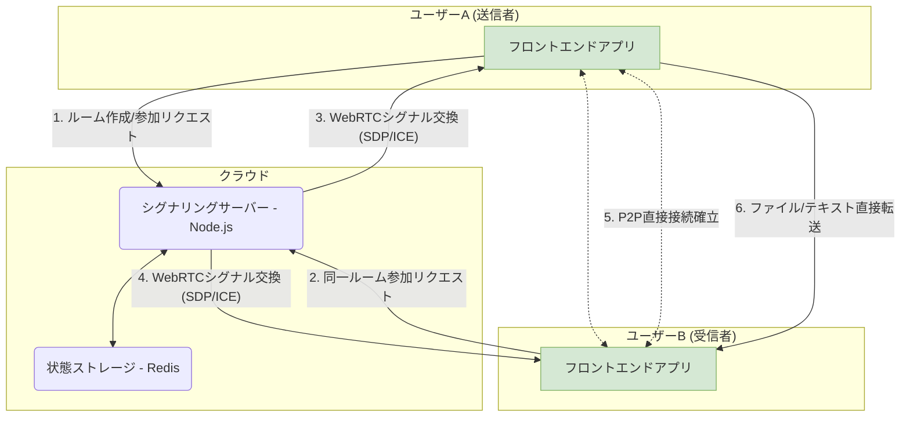

## はじめに

本日、心を込めて開発してきた個人プロジェクトである**PrivyDrop**が、正式にオープンソースとなりましたことを、心より誇りに思います！

[**今すぐ体験 »**](https://www.privydrop.app/) | [**GitHubリポジトリ »**](https://github.com/david-bai00/PrivyDrop)

このプロジェクトは、非常にシンプルな個人的なニーズから始まりました：「スマートフォンとコンピューターの間で、安全かつ簡単にファイルを送信したいだけ。」

もしあなたも私のように、登録不要、速度制限なし、真にプライバシーを尊重するファイル共有ツールを探して困った経験があるなら、この記事はあなたのためのものです。自分自身の「痒いところに手が届く」ツール開発の物語を共有するだけでなく、PrivyDropの中核的なアーキテクチャと設計哲学を探求する完全な「舞台裏」ツアーをご案内します。そして最も重要なこととして、あなたをこの物語の次の章の共同執筆者として招待します。

## 第1部：ツールの誕生：「私が必要」から「皆が使える」へ

### 1.1 開発者自身の痒いところに手を届ける物語

すべては、私の日々のワークフローにおける小さくも持続的な痛みから始まりました。

私は頻繁にスマートフォンとノートパソコンの間でファイル、スクリーンショット、テキストの断片を素早く送信する必要がありました。多くのツールを試しましたが、どれも私の要求を完全には満たしていませんでした：

- 一部のオンラインP2Pツールは強力でしたが、ファイルしか送信できず、軽量なテキストやリンクを送信するニーズには応えられませんでした。
- 一部のオンラインクリップボードはテキストを便利に同期できましたが、クリップボードの内容を未知のサーバーにアップロードすることに深い懸念を感じました。
- そして主流のクラウドストレージやソーシャルアプリは、ログインが必要か、サイズと速度の制限があり、プロセス全体を重くて面倒なものにしていました。

「**高速、プライベート、アカウント不要**」という3つの中核要件を完全に満たすツールが見つからなかった後、自分で作ることを決意しました。

### 1.2 個人用ツールから公開プロジェクトへ

当初、PrivyDropは自分自身のニーズを満たすための小さなユーティリティでした。しかし、機能を徐々に改善していくうちに、私の痛み点がおそらく多くの人々共通のものであることに気づきました。

データとプライバシーがますます重要になる時代において、私たちは「利便性」と「プライバシー」の間で苦痛な取引を強いられない、より良い選択に値します。この考えがPrivyDropを個人プロジェクトから堅牢で信頼性の高い公開サービスへと磨き上げる原動力となりました。

私たちの中核的なビジョンはシンプルで、プロジェクトのREADMEに記述した通りです：**すべての人が自分のデータをコントロールできるべきだと信じています。**

### 1.3 なぜオープンソースなのか？信頼の唯一の答え

「プライバシーとセキュリティ」を中核価値とするツールにとって、クローズドソースであること自体が矛盾です。ユーザーはどうしてあなたの約束を信頼できるのでしょうか？

したがって、オープンソースは必然的な選択であり、唯一の答えでした。

- **信頼の構築**：コードが最良の証明です。私たちはすべてのコードを公開し、世界からの監視を受けることで、議論の余地のない信頼を構築します。
- **コミュニティの力**：個人の力には限界があることをよく知っています。コミュニティの集合的知恵が、私が見逃した欠陥を見つけたり、私が思いもよらなかった機能を提案したりして、PrivyDropをさらに進化させ、より堅牢にしてくれると信じています。
- **還元と学習**：私はオープンソースコミュニティから多大な恩恵を受けてきました。今が還元するときです。プロジェクトをオープンソースにすることは、才能ある開発者たちから学ぶ機会であり、共有の喜びでもあります。

## 第2部：アーキテクチャ深掘り：「生産レベル」の実践

PrivyDropは単なるおもちゃプロジェクトではありません。アーキテクチャ設計において、私たちはシンプルさ、効率性、スケーラビリティを追求し、生産レベルの基準を満たすよう努めています。

### 2.1 全体像：シンプルで効率的なシステム

私たちの中核設計原則は：**軽量バックエンド、インテリジェントフロントエンド**です。バックエンドは「交通警察」（シグナリング用）としてのみ機能し、フロントエンドがすべて「重労働」（ファイル処理と転送）を担います。

### 2.2 フロントエンドアーキテクチャ：関心の分離から論理的凝集へ

フロントエンドはNext.js 14で構築されており、私たちの最も中核的な設計哲学は**カスタムフックをビジネスロジックの中心とすること**です。

なぜReduxやZustandを使わないのかと尋ねるかもしれません。PrivyDropの場合、ほとんどの状態は特定の、高凝集なビジネスロジックと密接に関連しています。私たちは一連のカスタムフック（`useWebRTCConnection`、`useRoomManager`、`useFileTransferHandler`など）を使用してこれらのロジックと状態をカプル化し、いくつかの明らかな利点をもたらしました：

- **論理的凝集**：WebRTC接続に関連するすべての状態とメソッドが`useWebRTCConnection`にまとめられており、極めて保守しやすいです。
- **純粋なコンポーネント**：Reactコンポーネントは複雑なビジネスロジックから解放され、UIレンダリングという本質的な役割に戻ります。
- **明確な階層化**：`app`（ルーティング）→`components`（UI）→`hooks`（ロジック）→`lib`（低レベル機能）の明確なデータフローと依存関係が形成され、コードベースの保守性が大幅に向上します。

### 2.3 バックエンドアーキテクチャ：ステートレスと効率性の芸術

Node.jsとExpressに基づくバックエンドは、設計において厳密に**ステートレス（Stateless）**原則に従っています。

サーバー自体はルームやユーザーに関連する状態を一切保持しません。すべての状態は**Redis**に委ねられます。これにより、バックエンドアプリケーションを非常に簡単に水平スケールできます。

私たちはまた、ビジネスニーズを満たすためにRedisの異なるデータ構造を巧みに活用しました：

- **Hash**: ルームのメタデータを格納する
- **Set**: ルーム内のすべてのメンバーの`socketId`を格納し、一意性を保証する
- **String**: `socketId`を`roomId`に逆マッピングし、ユーザー切断時の迅速なクリーンアップを容易にする
- **Sorted Set**: IPベースのレート制限を実装し、悪意のある攻撃を効果的に防ぐ

すべてのキーには合理的なTTL（有効期間）が設定されており、リソースの自動クリーンアップを保証し、システムを長期にわたり安定して実行できるようにしています。

### 2.4 「生産レベル」の考慮事項：デプロイメントからセキュリティまで

私たちは、包括的な本番環境デプロイメントプランを提供しています：

- **Nginx**をリバースプロキシおよびSSL終端として使用
- **PM2**によるNode.jsプロセス管理
- **Certbot**によるSSL証明書の自動取得と更新
- 複雑なNATのトラバーサルが必要なシナリオのための包括的な**TURN/STUN**サーバー設定ガイド

これらはすべて、PrivyDropが信頼でき、本番環境にデプロイ可能な深刻なプロジェクトであることを示しています。

## 第3部：コードを超えて：未来を共に築くための招待

オープンソースは始まりにすぎません。私たちはPrivyDropのためにエキサイティングな未来を計画しており、今、あなたに参加してほしいと願っています。

### 3.1 プロジェクトロードマップ

私たちは公開の[<u>**プロジェクトロードマップ**</u>](https://github.com/david-bai00/PrivyDrop/blob/main/ROADMAP.md)を持っており、未来の優先事項を概説しています。将来的に、以下のような要望の高い機能を追加する予定です：

- **レジューム可能な転送**：非常に大きなファイルと不安定なネットワーク状況に対応するため
- **E2E暗号化グループチャット**：安全なP2P通信をマルチユーザーテキストチャットに拡張する
- その他未定の機能

### 3.2 貢献するには？

私たちはあらゆる形式の貢献を歓迎します！あなたが誰であれ、PrivyDropをより良くする方法が必ずあります。[<u>**貢献ガイドライン**</u>](https://github.com/david-bai00/PrivyDrop/blob/main/.github/CONTRIBUTING.md)をお読みいただき、あなたの旅を始めてください。

- **ユーザーの皆さん**：製品を使用し、[GitHub Issues](https://github.com/david-bai00/PrivyDrop/issues)を通じてバグを報告し、機能を提案してください
- **開発者の皆さん**：バグを募集し、新機能を実装し、既存のコードをリファクタリングしてください
- **ドキュメンター/翻訳者の皆さん**：ドキュメントの改善やPrivyDropの多言語化を手伝ってください

### 3.3 力強い行動喚起

- **ユーザーの皆さん**：今すぐPrivyDropを体験し、究極のプライバシーと利便性を感じてください！
  [**➡️ 今すぐ体験**](https://www.privydrop.app/)

- **開発者の皆さん**：PrivyDropの哲学や技術に目を輝かせたなら、私たちのGitHubリポジトリにStarを付けてください！それは私たちにとって最高の評価と励みになります。
  [**⭐️ GitHubでStarを付ける**](https://github.com/david-bai00/PrivyDrop)

- **すべての皆さん**：コミュニティディスカッションに参加し、私たちにあなたの声を聞かせてください！

## 結論

この物語を読む時間を作ってくださり、再度感謝申し上げます。

PrivyDropの物語は一人の人間のニーズから始まりましたが、その未来はコミュニティによって書かれることを期待しています。