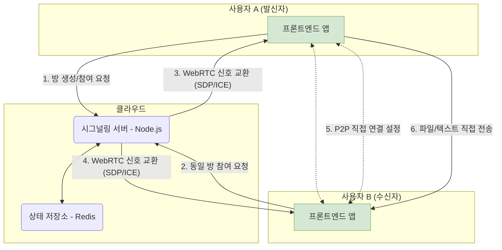

## 서론

오늘, 제가 마음과 영혼을 쏟아부은 개인 프로젝트인 **PrivyDrop**이 공식적으로 오픈소스가 되었음을 매우 기쁘게 알려드립니다!

[**지금 바로 사용해보세요 »**](https://www.privydrop.app/) | [**GitHub 저장소 »**](https://github.com/david-bai00/PrivyDrop)

이 프로젝트는 매우 간단한 개인적인 필요에서 시작되었습니다: "그냥 휴대폰과 컴퓨터 사이에 안전하고 쉽게 파일을 보내고 싶어요."

만약 당신도 저처럼, 등록이 필요 없고 속도 제한이 없으며, 진정으로 당신의 개인정보를 존중하는 파일 공유 도구를 찾다가 좌절했다면, 이 글은 당신을 위한 것입니다. 이 글은 제 '가려운 곳을 긁는' 이야기를 공유할 뿐만 아니라, PrivyDrop의 핵심 아키텍처와 디자인 철학을 탐구하는 완전한 '비하인드 스토리' 투어를 안내할 것입니다. 그리고 가장 중요한 것은, 당신을 다음 장의 공동 저자로 초대하는 진심 어린 초대장입니다.

## 1부: 도구의 탄생: "내가 필요해"에서 "모두가 사용할 수 있게"까지

### 1.1 개발자의 자기 필요 해소 여정

모든 것은 제 일상 워크플로우의 작지만 지속적인 불편함에서 시작되었습니다.

저는 자주 휴대폰과 노트북 사이에 파일, 스크린샷, 또는 텍스트 조각을 빠르게 보내야 합니다. 많은 도구를 시도했지만, 어느 것도 제 요구사항을 완전히 만족시키지 못했습니다:

- 일부 온라인 P2P 도구는 강력했지만 파일만 보낼 수 있어서 가벼운 텍스트나 링크를 보내는 필요에 부응하지 못했습니다.
- 일부 온라인 클립보드는 텍스트를 편리하게 동기화할 수 있었지만, 클립보드 내용을 알 수 없는 서버에 업로드하는 것에 대해 깊은 우려를 가졌습니다.
- 그리고 메인스트림 클라우드 저장소나 소셜 앱은 로그인이 필요하거나 크기와 속도 제한이 있어 전체 과정이 불편하고 번거롭게 느껴졌습니다.

제 세 가지 핵심 요구사항—**빠르고, 사적이며, 계정이 필요 없는**—에 완벽하게 맞는 도구를 찾지 못한 후, 스스로 하나를 만들기로 결정했습니다.

### 1.2 개인 유틸리티에서 공개 프로젝트로

처음에 PrivyDrop은 제 자신의 필요를 만족시키는 작은 유틸리티였습니다. 하지만 점차 기능을 개선하면서 제 불편함이 아마도 많은 사람들의 공통된 불편함일 것이라는 것을 깨달았습니다.

데이터와 개인정보 보호가 점점 더 중요해지는 시대에서, 우리는 "편리함"과 "개인정보 보호" 사이에서 고통스러운 타협을 강요받지 않는 더 나은 선택을 가치 있습니다. 이 아이디어는 PrivyDrop을 개인 프로젝트에서 견고하고 신뢰할 수 있는 공개 서비스로 다듬게 하는 원동력이 되었습니다.

저희의 핵심 비전은 간단합니다. 프로젝트 README에 쓴 것처럼: **우리는 모든 사람이 자신의 데이터를 통제할 수 있어야 한다고 믿습니다.**

### 1.3 왜 오픈소스인가? 신뢰를 위한 유일한 답

"개인정보 보호와 보안"을 핵심 가치로 주장하는 도구에 있어, 소스 코드를 닫는 것은 그 자체로 모순입니다. 사용자들이 어떻게 당신의 약속을 신뢰할 수 있을까요?

따라서 오픈소스는 필연적인 선택이자 유일한 답이었습니다.

- **신뢰 구축**: 코드가 최고의 증거입니다. 저희는 세계의 검토를 받을 수 있도록 모든 코드를 공개하여, 논쟁의 여지가 없는 신뢰를 구축하고 있습니다.
- **커뮤니티의 힘**: 개인의 힘은 제한적이라는 것을 잘 알고 있습니다. 커뮤니티의 집단 지성이 제가 놓친 결함을 발견하고 제가 상상하지 못했던 기능을 제안하여, PrivyDrop이 더 나아가고 더 견고해지도록 도울 수 있다고 믿습니다.
- **보답과 학습**: 저는 오픈소스 커뮤니티에서 엄청난 혜택을 받았고, 이제 제가 보답할 차례입니다. 프로젝트를 오픈소스로 만드는 것은 재능 있는 개발자들로부터 배우는 기회이자 공유의 기쁨입니다.

## 2부: 아키텍처 심층 분석: "프로덕션급" 실천

PrivyDrop은 단순한 장난감 프로젝트가 아닙니다. 아키텍처 설계에서 저희는 단순함, 효율성, 확장성을 추구하며 프로덕션급 표준을 만족시키기 위해 노력했습니다.

### 2.1 큰 그림: 단순하고 효율적인 시스템

저희의 핵심 설계 원칙은: **가벼운 백엔드, 지능적인 프론트엔드**입니다. 백엔드는 "교통 경찰"(시그널링용)으로만 작동하고, 프론트엔드는 모든 "무거운 작업"(파일 처리와 전송)을 처리합니다.

### 2.2 프론트엔드 아키텍처: 관심사 분리에서 논리적 응집까지

프론트엔드는 Next.js 14로 구축되었으며, 저희의 핵심 설계 철학은 **사용자 정의 Hooks를 비즈니스 로직의 핵심으로 사용**하는 것입니다.

왜 Redux나 Zustand를 사용하지 않았는지 물을 수 있습니다. PrivyDrop의 경우, 대부분의 상태가 특정하고 응집도가 높은 비즈니스 로직과 밀접하게 결합되어 있습니다. 저희는 일련의 사용자 정의 Hooks(`useWebRTCConnection`, `useRoomManager`, `useFileTransferHandler` 등)를 사용하여 이 로직과 상태를 캡슐화했으며, 이는 몇 가지 명확한 이점을 가져왔습니다:

- **논리적 응집**: WebRTC 연결과 관련된 모든 상태와 메서드가 `useWebRTCConnection`에 있어 유지보수가 극도로 쉽습니다.
- **순수 컴포넌트**: React 컴포넌트는 복잡한 비즈니스 로직에서 해방되어 UI 렌더링이라는 본질적인 역할로 돌아갑니다.
- **명확한 계층화**: 이것은 `app` (라우팅) -> `components` (UI) -> `hooks` (로직) -> `lib` (저수준 기능)의 명확한 데이터 흐름과 의존 관계를 만들어 코드베이스의 유지보수성을 크게 향상시킵니다.

### 2.3 백엔드 아키텍처: 무상태성과 효율성의 예술

Node.js와 Express 기반의 백엔드는 설계에서 엄격하게 **무상태(Stateless)** 원칙을 따릅니다.

서버 자체는 방이나 사용자와 관련된 상태를 유지하지 않습니다. 모든 상태는 **Redis**에 위임됩니다. 이를 통해 백엔드 애플리케이션을 매우 쉽게 수평적으로 확장할 수 있습니다.

저희는 또한 비즈니스 요구를 충족시키기 위해 Redis의 다양한 데이터 구조를 교묘하게 활용했습니다:

- **Hash**: 방 메타데이터를 저장하기 위해
- **Set**: 방 내 모든 멤버의 `socketId`를 저장하여 고유성 보장
- **String**: `socketId`를 `roomId`로 역매핑하여 사용자 연결 끊김 시 빠른 정리 용이화
- **Sorted Set**: IP 기반 속도 제한을 구현하여 악의적인 공격 효과적으로 방지

모든 키는 합리적인 TTL(Time To Live)로 설정되어 자동 리소스 정리를 보장하고 시스템이 장기적으로 안정적으로 실행되도록 합니다.

### 2.4 "프로덕션급" 고려사항: 배포에서 보안까지

저희는 포괄적인 프로덕션 배포 계획을 제공합니다:

- **Nginx**를 리버스 프록시 및 SSL 종료로 사용
- **PM2**를 통한 Node.js 프로세스 관리
- **Certbot**을 통한 SSL 인증서 자동 획득 및 갱신
- 복잡한 NAT 통과가 필요한 시나리오를 위한 포괄적인 **TURN/STUN** 서버 설정 가이드

이 모든 것은 PrivyDrop이 신뢰할 수 있고 프로덕션 환경에 배포할 수 있는 심각한 프로젝트임을 보여줍니다.

## 3부: 코드를 넘어서: 미래를 함께 만들기 위한 초대

오픈소스는 시작일 뿐입니다. 저희는 PrivyDrop을 위해 흥미로운 미래를 계획하고 있으며, 이제 당신이 저희와 함께하기를 원합니다.

### 3.1 프로젝트 로드맵

저희는 미래의 우선순위를 개요하는 공개 [<u>**프로젝트 로드맵**</u>](https://github.com/david-bai00/PrivyDrop/blob/main/ROADMAP.md)을 가지고 있습니다. 미래에 다음과 같이 많은 요청이 있었던 기능들을 추가할 계획입니다:

- **재개 가능한 전송**: 매우 큰 파일과 불안정한 네트워크 상황을 처리하기 위해
- **E2E 암호화 그룹 채팅**: 안전한 P2P 통신을 다중 사용자 텍스트 채팅으로 확장
- 기타 미정 기능

### 3.2 기여하는 방법?

저희는 모든 형태의 기여를 환영합니다! 당신이 누구든, PrivyDrop을 더 나게 만드는 방법이 항상 있습니다. 당신의 여정을 시작하기 위해 저희의 [<u>**기여 가이드라인**</u>](https://github.com/david-bai00/PrivyDrop/blob/main/.github/CONTRIBUTING.md)을 읽어주세요.

- **사용자**: 제품을 사용하고, [GitHub Issues](https://github.com/david-bai00/PrivyDrop/issues)를 통해 버그를 보고하고 기능을 제안하세요
- **개발자**: 버그를 담당하고, 새로운 기능을 구현하거나, 기존 코드의 일부를 리팩토링하세요
- **문서 작성자/번역가**: 문서 개선을 도와주시거나 PrivyDrop을 더 많은 언어로 번역해주세요

### 3.3 강력한 행동 촉구

- **사용자**: 지금 바로 PrivyDrop을 경험하고 궁극의 개인정보 보호와 편리함을 느껴보세요!
  [**➡️ 지금 바로 사용해보세요**](https://www.privydrop.app/)

- **개발자**: PrivyDrop의 철학이나 기술에 감명받았다면, 저희 GitHub 저장소에 Star를 주세요! 이것은 저희에게 가장 큰 인정과 격려입니다.
  [**⭐️ GitHub에서 Star 주기**](https://github.com/david-bai00/PrivyDrop)

- **모두**: 저희 커뮤니티 토론에 참여하여 당신의 목소리를 들려주세요!

## 결론

이 이야기를 읽는 시간을 내어주셔서 다시 한번 감사드립니다.

PrivyDrop의 이야기는 한 사람의 필요로 시작되었고, 그 미래가 커뮤니티에 의해 쓰여지기를 기대합니다.