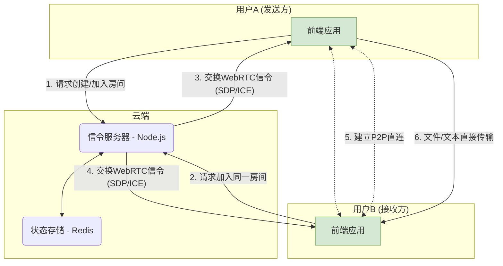

## 引言

今天，我怀着无比激动的心情宣布，我投入了大量心血开发的个人项目——**PrivyDrop**，现在正式开源！

[**在线体验 »**](https://www.privydrop.app/) | [**GitHub 仓库 »**](https://github.com/david-bai00/PrivyDrop)

这个项目始于一个非常简单的个人需求：“我只是想在手机和电脑间安全、方便地传点东西。”

如果你也曾像我一样，在寻找一个无需注册、不限速、真正尊重你隐私的文件分享工具时感到困惑，那么这篇文章就是为你而写。它不仅会分享这个“自救”故事，还将带你进行一次彻底的“幕后之旅”，深入探索 PrivyDrop 的核心架构与设计哲学，并真诚地邀请你，成为这个故事新篇章的共同作者。

## 第一部分：一个工具的诞生：从“我需要”到“大家用”

### 1.1 一个开发者的“自救”之路

一切都源于我日常工作中的一个不大不小的痛点。

我经常需要在手机和笔记本电脑之间快速发送文件、截图或一段文本链接。我试过很多工具，但没有一个能完全满足我的要求：

- 有的在线 P2P 工具，功能强大，但只能发送文件，无法满足我发送轻便文本或链接的需求。
- 有的在线剪贴板工具，可以方便地同步文本，但我又对将剪贴板内容上传到未知服务器感到深深的担忧。
- 而那些主流的云存储或社交软件，要么需要登录，要么有大小和速度的限制，整个过程显得笨重而繁琐。

在找不到一个完美符合我“**快速、私密、无需账户**”这三点核心要求的工具后，我决定，自己动手，为自己打造一个。

### 1.2 从个人工具到公开项目的演变

最初，PrivyDrop 只是一个满足我个人需求的小工具。但随着功能的逐步完善，我意识到，我的痛点可能也是许多人的痛点。

在这个数据和隐私日益重要的时代，我们值得拥有一个更好的选择。一个让我们不必在“便利”和“隐私”之间做痛苦抉择的工具。这个想法驱动着我将 PrivyDrop 从一个个人项目，逐渐打磨成一个健壮、可靠的公开服务。

我们的核心愿景很简单，正如我在项目文档里写下的：**我们相信，每个人都应掌控自己的数据。**

### 1.3 为什么是开源？——信任的唯一答案

对于一个将“隐私安全”作为核心价值的工具，闭源本身就是一种矛盾。用户凭什么相信你的承诺？

因此，开源是必然的选择，也是唯一的答案。

- **建立信任**：代码是最好的证明。我们将所有代码公开，接受全世界的审视，以此建立无可辩驳的信任。
- **社区力量**：我深知个人的力量是有限的。我相信社区的集体智慧可以发现我忽略的缺陷，提出我未曾想到的功能，帮助 PrivyDrop 走得更远、更健壮。
- **回馈与学习**：我从开源社区中受益良多，现在是我回馈的时候了。将项目开源，既是向优秀的开发者们学习，也是一种分享的快乐。

## 第二部分：深入架构：一次“生产级”实践

PrivyDrop 不仅仅是一个玩具项目。在架构设计上，我们追求简洁、高效与可扩展性，力求达到生产级标准。

### 2.1 宏观视角：简洁而高效的系统

我们的核心设计原则是：**后端轻量化、前端智能化**。后端只做“交通警察”（信令协调），而前端负责所有“重活”（文件处理与传输）。

### 2.2 前端架构：从“关注点分离”到“逻辑内聚”

前端采用 Next.js 14 构建，我们最核心的设计哲学是**以自定义 Hooks 作为业务逻辑的核心**。

你可能会问，为什么没有用 Redux 或 Zustand？因为对于 PrivyDrop 而言，大部分状态都与特定的、高内聚的业务逻辑紧密相关。我们通过一系列自定义 Hooks（如 `useWebRTCConnection`, `useRoomManager`, `useFileTransferHandler`）来封装这些逻辑和状态，带来了几个显而易见的好处：

- **逻辑内聚**：所有与 WebRTC 连接相关的状态和方法都在 `useWebRTCConnection` 中，极易维护。
- **组件纯粹**：React 组件从复杂的业务逻辑中解放出来，回归到 UI 渲染的本质职责。
- **清晰分层**：形成了 `app` (路由) -> `components` (UI) -> `hooks` (逻辑) -> `lib` (底层能力) 的清晰数据流和依赖关系，代码库的可维护性大大增强。

### 2.3 后端架构：无状态与高效率的艺术

后端基于 Node.js 和 Express，设计上严格遵循**无状态 (Stateless)** 原则。

服务器本身不持有任何与房间或用户相关的状态。所有状态都被委托给 **Redis** 进行管理。这使得后端应用可以非常轻松地进行水平扩展。

我们还巧妙地利用了 Redis 不同的数据结构来满足业务需求：

- **Hash**: 存储房间的元数据。
- **Set**: 存储一个房间内所有成员的 `socketId`，保证唯一性。
- **String**: 将 `socketId` 反向映射到 `roomId`，便于在用户断线时快速清理。
- **Sorted Set**: 用于实现基于 IP 的速率限制，有效防止恶意攻击。

所有 Key 都设置了合理的 TTL (过期时间)，确保了资源的自动清理，系统可以长期稳定运行。

### 2.4 “生产级”的考量：从部署到安全

我们提供了一套完整的生产环境部署方案，包括：

- 使用 **Nginx** 作为反向代理和 SSL 终止。
- 使用 **PM2** 进行 Node.js 进程管理。
- 使用 **Certbot** 实现 SSL 证书的自动申请和续期。
- 为需要穿透复杂 NAT 的场景，提供了完整的 **TURN/STUN** 服务器搭建指南。

这些都证明了 PrivyDrop 是一个可以被信赖并部署到生产环境的严肃项目。

## 第三部分：不止于代码：邀请你共建未来

开源只是一个开始。我们为 PrivyDrop 规划了激动人心的未来，而现在，我们想邀请你加入我们。

### 3.1 项目路线图 (Roadmap)

我们有一个公开的 [<u>**项目路线图**</u>](https://github.com/david-bai00/PrivyDrop/blob/main/ROADMAP.zh-CN.md)，其中概述了未来的工作重点。我们计划在未来加入一些大家呼声很高的功能，例如：

- **断点续传**：应对超大文件传输和网络不稳定的情况。
- **E2E 加密群聊**：将安全的 P2P 通信扩展到多人文本聊天。
- 其他待定功能

### 3.2 如何参与贡献？

我们欢迎任何形式的贡献！无论你是谁，总有一种方式可以帮助 PrivyDrop 变得更好。请阅读我们的 [<u>**贡献指南**</u>](https://github.com/david-bai00/PrivyDrop/blob/main/.github/CONTRIBUTING.zh-CN.md) 来开始你的旅程。

- **普通用户**：使用产品，通过 [GitHub Issues](https://github.com/david-bai00/PrivyDrop/issues) 报告 Bug、提出功能建议。
- **开发者**：认领一个 Bug、实现一个新功能、或者优化一段既有代码。
- **文档/国际化贡献者**：帮助我们改进文档，或将 PrivyDrop 翻译成更多语言。

### 3.3 响亮的行动号召 (Call to Action)

- **对于用户**：立即体验 PrivyDrop，感受极致的私密与便捷！
  [**➡️ 在线体验**](https://www.privydrop.app/)

- **对于开发者**：如果 PrivyDrop 的理念或技术让你眼前一亮，请给我们的 GitHub 仓库一个 Star 吧！这是对我们最大的认可和鼓励！
  [**⭐️ Star Us on GitHub**](https://github.com/david-bai00/PrivyDrop)

- **对于所有人**：加入我们的社区讨论，让我们听到你的声音！

## 结语

再次感谢你花时间阅读这个故事。

PrivyDrop 的故事始于一个人的需求，而它的未来，期待由一群人共同书写。
