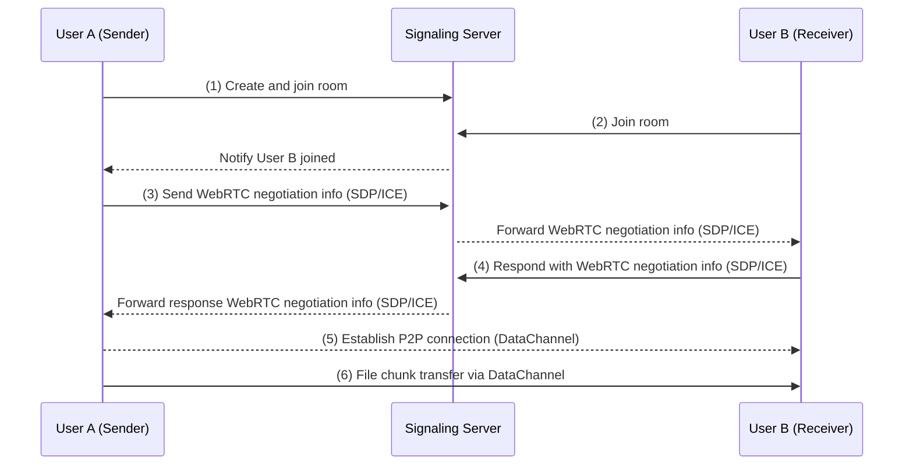
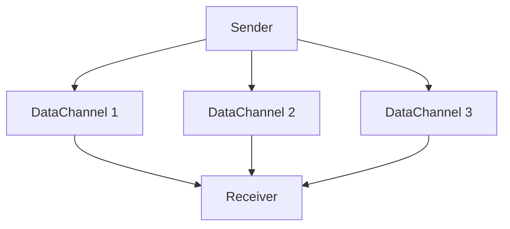
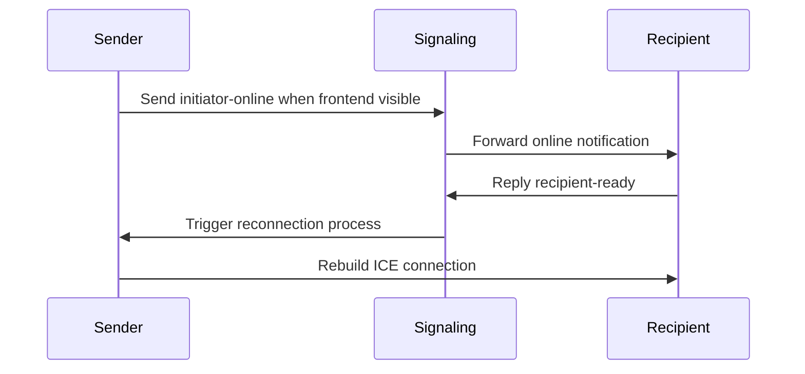

## Introduction

Traditional file transfer methods largely rely on cloud storage or centralized servers, raising concerns about data privacy while facing limitations on upload sizes and speed bottlenecks. Our tool leverages WebRTC technology to enable direct device-to-device transfers, effectively addressing these challenges.

Our developed tool([<u>**SecureShare**</u>](https://www.securityshare.xyz)) features several notable characteristics:

- Device-to-device direct transfer using WebRTC technology, eliminating the need for intermediate servers
- End-to-end encryption (E2EE) ensuring secure data transmission
- No registration required, instant usage, supporting multiple simultaneous receivers
- Support for various data types including text, images, files, and folders
- Transfer speed and file size limited only by network bandwidth and disk space between devices

In this article, we'll explore the technical architecture, working principles, and why this tool can provide such a secure and efficient file transfer experience. Whether you're a tech enthusiast or a general user, you'll gain insights into how WebRTC technology is revolutionizing file transfer.

## I. Redefining File Transfer: The Architectural Revolution of WebRTC

WebRTC (Web Real-Time Communication) is an open standard supporting real-time communication between browsers. Our file transfer tool, developed based on WebRTC, comprises several core components:

1. **Signaling Server**: Coordinates connections between devices without participating in actual data transfer.
2. **P2P Connection**: Direct device-to-device connections without third-party server intervention.
3. **E2EE Encryption**: All data is end-to-end encrypted using the DTLS protocol during transmission.

### 1.1 Traditional vs WebRTC Approach

| Feature | Traditional HTTP Transfer | WebRTC P2P Transfer |
|---------|-------------------------|-------------------|
| Transfer Path | Client → Server → Client | Direct Device-to-Device |
| Latency | Limited by central server bandwidth | Limited only by physical network bandwidth |
| File Size Limit | Usually restricted | Limited only by disk space |
| Privacy Protection | Depends on service provider security | Mandatory encryption via DTLS protocol |

### 1.2 P2P Connection Establishment Process


**Process:**

1. User A creates and joins a room, connecting to the signaling server.
2. User B joins the room and connects to the signaling server.
3. User A initiates WebRTC negotiation with User B (including SDP and ICE information).
4. User B responds with WebRTC negotiation information, completing P2P connection establishment.
5. Finally, files are transferred via DataChannel over the P2P connection.

### 1.3 The Performance Magic of SCTP (over DTLS & UDP)

WebRTC's **DataChannel** is based on the **Stream Control Transmission Protocol (SCTP)** running over **DTLS** and **UDP**, offering three major advantages over traditional TCP:

1. **Stream Multiplexing (Not Currently Used)**: File chunks can be transmitted in parallel, improving transfer efficiency.
2. **No Head-of-Line Blocking**: Loss of a single chunk doesn't affect overall progress, ensuring transfer stability.
3. **Automatic Congestion Control**: Dynamically adapts to network jitter, optimizing transfer performance.

**UDP Advantages:**

- **Low Latency**: UDP is a connectionless protocol requiring no three-way handshake, ideal for real-time communication.
- **Flexible Reliability**: While UDP itself is unreliable, SCTP implements reliable transmission mechanisms on top of it, combining UDP's flexibility with TCP's reliability.

**SCTP Multi-Stream Transfer Diagram**


## II. Browser Direct Transfer Engine: Core Technology Decoded

### 2.1 Precise Control of Chunk Transfer
```typescript
// lib/fileSender.ts - 64KB Fixed-Size Chunks

// Define chunk size as 65536 bytes (64KB) to precisely match network MTU (Maximum Transmission Unit) size.
// This prevents network congestion or fragmentation issues caused by oversized packets.
private readonly CHUNK_SIZE = 65536;

// Create an async generator function for processing files in fixed-size chunks.
// Each generator call returns an ArrayBuffer type chunk data.
private async *createChunkGenerator(file: File) {
  let offset = 0; // Initialize offset to mark current file reading position
  
  // Loop through file until all data is processed
  while (offset < file.size) {
    // Use File.slice method to extract data segment from [offset, offset + CHUNK_SIZE)
    const chunk = file.slice(offset, offset + this.CHUNK_SIZE);
    
    // Convert extracted data to ArrayBuffer and return via yield
    yield await chunk.arrayBuffer();
    
    // Update offset for next chunk
    offset += this.CHUNK_SIZE;
  }
}

// Back-pressure control algorithm: Ensures sending doesn't exceed DataChannel buffer limits.
// If buffer is full, wait until buffer space becomes available before continuing.
private async sendWithBackpressure(chunk: ArrayBuffer) {
  // Pause sending when DataChannel buffer usage exceeds preset maximum
  while (this.dataChannel.bufferedAmount > this.MAX_BUFFER) {
    // Use Promise to wait for bufferedamountlow event indicating buffer space freed
    await new Promise(r => this.dataChannel.bufferedamountlow = r);
  }
  
  // Send current chunk when buffer has sufficient space
  this.dataChannel.send(chunk);
}
```

### 2.2 Zero-Copy Memory Writing
Implemented through File System Access API:
```typescript
// lib/fileReceiver.ts

// Write received chunk data directly to disk, avoiding extra memory copies
private async writeToDisk(chunk: ArrayBuffer) {
  // Initialize file writer if not yet created
  if (!this.writer) {
    // Show save file picker dialog for user to choose save location
    this.currentFileHandle = await window.showSaveFilePicker();
    
    // Create writable stream through file handle for subsequent writes
    this.writer = await this.currentFileHandle.createWritable();
  }
  
  // Convert received ArrayBuffer to Uint8Array and write directly to disk
  // This bypasses memory buffer, achieving zero-copy writing for improved performance
  await this.writer.write(new Uint8Array(chunk));
}
```

## III. Distributed Room Management System

### 3.1 Four-Digit Collision Detection:
```typescript
// server.ts
async function getAvailableRoomId() {
  let roomId;
  do {
    roomId = Math.floor(1000 + Math.random() * 9000); // Generate four-digit random number
  } while (await redis.hexists(`room:${roomId}`, 'created_at')); // Check if exists
  return roomId;
}
```
Note: The 4-digit number is a system-generated random room ID. You can specify any room ID you prefer.

### 3.2 Graceful Expiration Strategy:
```typescript
// server.ts
await refreshRoom(roomId, 3600 * 24); // Active rooms retained for 24 hours
if (await isRoomEmpty(roomId)) { // Release room if idle (both sender and receiver left)
  await deleteRoom(roomId);
}
```

### 3.3 Signaling-Driven Recovery Protocol
Mobile Disconnection Recovery Flow:



Through this mechanism, the system can quickly restore connections even when users switch applications or enter background on mobile devices (mobile also includes Wakelock to prevent sleep), ensuring a good user experience.

## IV. Security and Privacy Defense Line

### 4.1 Encryption Protocol Flywheel

```
  Application Layer
        ↑
  DTLS 1.2+ → TLS_ECDHE_RSA_AES_128_GCM_SHA256
        ↑
  OS-Level Encryption
```

**Explanation:**

1. **DTLS (Datagram Transport Layer Security)**:
    - DTLS is a UDP-based secure transport protocol providing TLS-like encryption.
    - In WebRTC, all data channels are end-to-end encrypted via DTLS, preventing eavesdropping or tampering during transmission.
    - Uses encryption suite **`TLS_ECDHE_RSA_AES_128_GCM_SHA256`** for high-strength security.
2. **OS-Level Encryption**:
    - Modern browsers provide additional protection for sensitive data in memory at the OS level, preventing malicious software access.

**Summary:**
Through dual protection of DTLS and OS-level encryption, WebRTC provides robust privacy protection ensuring data security during file transfer.

### 4.2 Attack Surface Defense Matrix

| **Attack Type** | **Defense Measure** | **Explanation** |
| --- | --- | --- |
| **MITM** | **SDP Fingerprint Verification** | **Generates unique fingerprint from DTLS public key hash to ensure communication party identity, preventing middleman data stream forgery or tampering.** |
| **RoomID Traversal Attack** | **Room Entry Rate Limiting** | **Limits room entry frequency per IP address (e.g., max 2 joins per 5 seconds) to prevent malicious users from traversing room numbers to access content.** |

**Explanation:**
1. **MITM (Man-in-the-Middle Attack)**
    - **Principle**: WebRTC uses SDP fingerprints (based on DTLS public key hash) to verify communication party identity during handshake. Attackers cannot forge valid fingerprints, thus cannot impersonate legitimate parties.
    - **Effect**: Ensures P2P connection security and data integrity, preventing eavesdropping or tampering.
2. **RoomID Traversal Attack**
    - **Definition**: Malicious users might attempt different room numbers (e.g., four-digit IDs) to enter unauthorized rooms and access shared content.
    - **Defense Measures**:
      - **Rate Limiting**: Restrict room entry frequency per IP address, e.g., max 2 room joins per 5 seconds.
      - **Implementation**: Use Redis to cache IP request records for quick detection and blocking of abnormal behavior.
    - **Effect**: Effectively prevents malicious users from accessing sensitive content through room number traversal, protecting user privacy.

## Conclusion: Building Trustworthy Transfer Infrastructure

We believe technology should serve essential human needs rather than create new surveillance dependencies. Experience this privacy-secure file transfer tool now and feel the revolutionary changes brought by P2P technology! Click [<u>**SecureShare Portal**</u>](https://www.securityshare.xyz) to begin.

**Code Transparency Commitment**: Code will be open-sourced in the future. We are committed to establishing truly trustworthy privacy tools through community co-governance.

## FAQ

  - **Will large file transfers be prone to interruption?**
    - Haven't observed such cases yet. P2P (device-to-device) connections are generally stable. We may add resume-from-breakpoint capability based on future feedback.
  - **Would adding room passwords be more secure?**
    - Theoretically yes. Considering password addition would slightly impact usability, it's not implemented yet. For enhanced security, you can use any custom string as RoomID and share via links and QR codes. Additionally, the system limits receiver room entry frequency, further improving security.
  - **Can senders close the SecureShare page anytime?**
    - Yes, preferably after content is received. Since it's direct device connection, sharing isn't possible if sender is offline. If you want to stop sharing, you can close the page immediately.

  More questions? Click [<u>**SecureShare FAQ**</u>](https://www.securityshare.xyz/faq) or [<u>**SecureShare Help**</u>](https://www.securityshare.xyz/help) sections for more answers and help.

**Developer Resources**
- [<u>**WebRTC Official Documentation**</u>](https://webrtc.org/)
