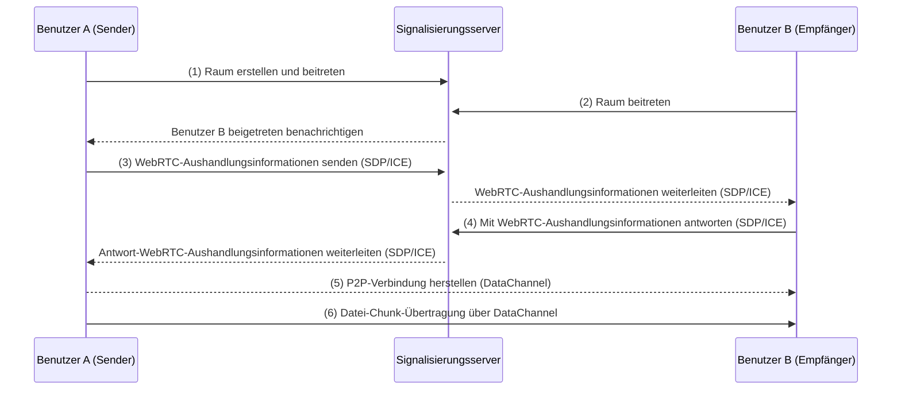
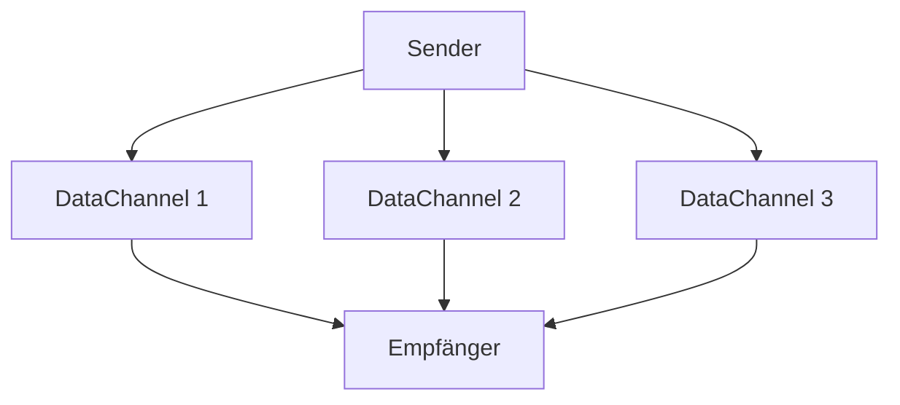
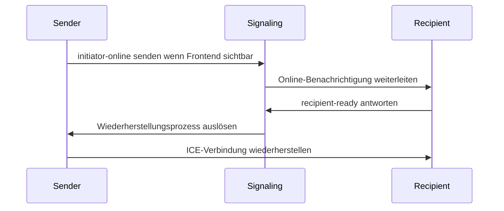

## Einleitung

Traditionelle Dateitransfermethoden stützen sich weitgehend auf Cloud-Speicher oder zentralisierte Server, was Bedenken hinsichtlich des Datenschutzes aufwirft und gleichzeitig Beschränkungen bei Upload-Größen und Geschwindigkeitsengpässen gegenübersteht. Unser Werkzeug nutzt WebRTC-Technologie, um direkte Gerät-zu-Gerät-Übertragungen zu ermöglichen und diese Herausforderungen effektiv zu bewältigen.

Unser entwickeltes Werkzeug ([<u>**PrivyDrop**</u>](https://www.privydrop.app)) zeichnet sich durch mehrere bemerkenswerte Merkmale aus:

- Direkte Gerät-zu-Gerät-Übertragung mittels WebRTC-Technologie, ohne Zwischenserver
- Ende-zu-Ende-Verschlüsselung (E2EE) zur Gewährleistung sicherer Datenübertragung
- Keine Registrierung erforderlich, sofortige Nutzung, Unterstützung für mehrere gleichzeitige Empfänger
- Unterstützung für verschiedene Datentypen einschließlich Text, Bilder, Dateien und Ordner
- Übertragungsgeschwindigkeit und Dateigröße nur begrenzt durch Netzwerkbandbreite und Speicherplatz zwischen Geräten

In diesem Artikel erkunden wir die technische Architektur, die Funktionsweise und warum dieses Werkzeug eine so sichere und effiziente Dateitransfererfahrung bieten kann. Ob Sie ein Technikbegeisterter oder ein allgemeiner Benutzer sind, Sie werden Einblicke darin gewinnen, wie WebRTC-Technologie den Dateitransfer revolutioniert.

## I. Neubewertung des Dateitransfers: Die architektonische Revolution von WebRTC

WebRTC (Web Real-Time Communication) ist ein offener Standard, der Echtzeitkommunikation zwischen Browsern unterstützt. Unser auf WebRTC basierendes Dateitransferwerkzeug besteht aus mehreren Kernkomponenten:

1. **Signalisierungsserver**: Koordiniert Verbindungen zwischen Geräten, ohne an der eigentlichen Datenübertragung teilzunehmen.
2. **P2P-Verbindung**: Direkte Gerät-zu-Gerät-Verbindungen ohne Eingreifen von Drittanbieterservern.
3. **E2EE-Verschlüsselung**: Alle Daten werden während der Übertragung mittels DTLS-Protokoll ende-zu-ende verschlüsselt.

### 1.1 Traditioneller Ansatz vs. WebRTC-Ansatz

| Merkmal | Traditionelle HTTP-Übertragung | WebRTC P2P-Übertragung |
| --- | --- | --- |
| Übertragungspfad | Client → Server → Client | Direkte Gerät-zu-Gerät-Verbindung |
| Latenz | Begrenzt durch zentrale Serverbandbreite | Nur begrenzt durch physische Netzwerkbandbreite |
| Dateigrößenlimit | Üblicherweise beschränkt | Nur begrenzt durch Speicherplatz |
| Datenschutz | Abhängig von Sicherheitsmaßnahmen des Anbieters | Zwingende Verschlüsselung durch DTLS-Protokoll |

### 1.2 Prozess der P2P-Verbindungsherstellung



**Prozess:**

1. Benutzer A erstellt einen Raum und tritt bei ihm ein, verbindet sich mit dem Signalisierungsserver.
2. Benutzer B tritt dem Raum bei und verbindet sich mit dem Signalisierungsserver.
3. Benutzer A leitet die WebRTC-Aushandlung mit Benutzer B ein (einschließlich SDP- und ICE-Informationen).
4. Benutzer B antwortet mit WebRTC-Aushandlungsinformationen, vervollständigt die P2P-Verbindungsherstellung.
5. Schließlich werden Dateien über DataChannel auf der P2P-Verbindung übertragen.

### 1.3 Die Leistungsmagie von SCTP (over DTLS & UDP)

WebRTCs **DataChannel** basiert auf dem **Stream Control Transmission Protocol (SCTP)**, das über **DTLS** und **UDP** läuft, und bietet drei wesentliche Vorteile gegenüber herkömmlichem TCP:

1. **Stream-Multiplexing (derzeit nicht genutzt)**: Datei-Chunks können parallel übertragen werden, was die Übertragungseffizienz verbessert.
2. **Kein Head-of-Line-Blocking**: Der Verlust eines einzelnen Chunks beeinflusst nicht den Gesamtfortschritt und gewährleistet die Übertragungsstabilität.
3. **Automatische Überlastungssteuerung**: Dynamische Anpassung an Netzwerkschwankungen zur Optimierung der Übertragungsleistung.

**UDP-Vorteile:**

- **Niedrige Latenz**: UDP ist ein verbindungsloses Protokoll, das kein Three-Way-Handshake erfordert, ideal für Echtzeitkommunikation.
- **Flexible Zuverlässigkeit**: Während UDP selbst unzuverlässig ist, implementiert SCTP darüber zuverlässige Übertragungsmechanismen und kombiniert die Flexibilität von UDP mit der Zuverlässigkeit von TCP.

**SCTP-Multi-Stream-Übertragungsdiagramm**



## II. Browser-Direktübertragungs-Engine: Kerntechnologie entschlüsselt

### 2.1 Präzise Steuerung der Chunk-Übertragung

```typescript
// lib/fileSender.ts - 64KB-Festgrößen-Chunks

// Definiert Chunk-Größe als 65536 Bytes (64KB), um genau der Netzwerk-MTU (Maximum Transmission Unit) Größe zu entsprechen.
// Dies verhindert Netzwerküberlastung oder Fragmentierungsprobleme durch übergroße Pakete.
private readonly CHUNK_SIZE = 65536;

// Erstellt eine asynchrone Generatorfunktion zur Verarbeitung von Dateien in Festgrößen-Chunks.
// Jeder Generatoraufruf gibt Chunk-Daten vom Typ ArrayBuffer zurück.
private async *createChunkGenerator(file: File) {
  let offset = 0; // Initialisiert Offset zur Markierung der aktuellen Dateileseposition

  // Schleife durch Datei, bis alle Daten verarbeitet sind
  while (offset < file.size) {
    // Verwendet File.slice-Methode, um Datensegment aus [offset, offset + CHUNK_SIZE) zu extrahieren
    const chunk = file.slice(offset, offset + this.CHUNK_SIZE);

    // Konvertiert extrahierte Daten zu ArrayBuffer und gibt sie über yield zurück
    yield await chunk.arrayBuffer();

    // Aktualisiert Offset für nächsten Chunk
    offset += this.CHUNK_SIZE;
  }
}

// Back-Pressure-Steuerungsalgorithmus: Stellt sicher, dass Senden die DataChannel-Puffergrenzen nicht überschreitet.
// Wenn Puffer voll ist, warten, bis Pufferspeicherplatz verfügbar wird, bevor fortgefahren wird.
private async sendWithBackpressure(chunk: ArrayBuffer) {
  // Senden pausieren, wenn DataChannel-Puffernutzung voreingestelltes Maximum überschreitet
  while (this.dataChannel.bufferedAmount > this.MAX_BUFFER) {
    // Promise verwenden, um auf bufferedamountlow-Ereignis zu warten, das Pufferplatzfreigabe anzeigt
    await new Promise(r => this.dataChannel.bufferedamountlow = r);
  }

  // Aktuellen Chunk senden, wenn Puffer ausreichend Platz hat
  this.dataChannel.send(chunk);
}
```

### 2.2 Zero-Copy-Speicherschreiben

Implementiert durch File System Access API:

```typescript
// lib/fileReceiver.ts

// Schreibt empfangene Chunk-Daten direkt auf die Festplatte, vermeidet zusätzliche Speicherkopien
private async writeToDisk(chunk: ArrayBuffer) {
  // Initialisiert Dateischreiber, falls noch nicht erstellt
  if (!this.writer) {
    // Dateispeicher-Dialog anzeigen, damit Benutzer Speicherort auswählen kann
    this.currentFileHandle = await window.showSaveFilePicker();

    // Erstellt beschreibbaren Stream durch Dateihandle für nachfolgende Schreibvorgänge
    this.writer = await this.currentFileHandle.createWritable();
  }

  // Konvertiert empfangenen ArrayBuffer zu Uint8Array und schreibt direkt auf Festplatte
  // Dies umgeht Speicherpuffer, erreicht Zero-Copy-Schreiben zur Leistungsverbesserung
  await this.writer.write(new Uint8Array(chunk));
}
```

## III. Verteiltes Raummanagementsystem

### 3.1 Vierstellige Kollisionserkennung:

```typescript
// server.ts
async function getAvailableRoomId() {
  let roomId;
  do {
    roomId = Math.floor(1000 + Math.random() * 9000); // Vierstellige Zufallszahl generieren
  } while (await redis.hexists(`room:${roomId}`, "created_at")); // Prüft ob existiert
  return roomId;
}
```

Hinweis: Die 4-stellige Zahl ist eine systemgenerierte zufällige Raum-ID. Sie können jede beliebige Raum-ID angeben, die Sie bevorzugen.

### 3.2 Elegante Ablaufstrategie:

```typescript
// server.ts
await refreshRoom(roomId, 3600 * 24); // Aktive Räume 24 Stunden behalten
if (await isRoomEmpty(roomId)) {
  // Raum freigeben wenn leer (sowohl Sender als auch Empfänger verlassen haben)
  await deleteRoom(roomId);
}
```

### 3.3 Signalisierungsgetriebenes Wiederherstellungsprotokoll

Mobile Verbindungsunterbrechung-Wiederherstellungsfluss:



Durch diesen Mechanismus kann das System Verbindungen schnell wiederherstellen, selbst wenn Benutzer auf mobilen Geräten Anwendungen wechseln oder in den Hintergrund gehen (Mobile umfasst auch Wakelock zur Schlaffverhinderung), was eine gute Benutzererfahrung gewährleistet.

## IV. Sicherheits- und Datenschutzverteidigungslinie

### 4.1 Verschlüsselungsprotokoll-Flywheel

```
  Anwendungsschicht
        ↑
  DTLS 1.2+ → TLS_ECDHE_RSA_AES_128_GCM_SHA256
        ↑
  Betriebssystem-Level-Verschlüsselung
```

**Erklärung:**

1. **DTLS (Datagram Transport Layer Security)**:
   - DTLS ist ein UDP-basiertes sicheres Transportprotokoll, das TLS-ähnliche Verschlüsselung bietet.
   - In WebRTC werden alle Datenkanäle über DTLS ende-zu-ende verschlüsselt, was Abhören oder Manipulation während der Übertragung verhindert.
   - Verwendet Verschlüsselungssuite **`TLS_ECDHE_RSA_AES_128_GCM_SHA256`** für hochsichere Sicherheit.
2. **Betriebssystem-Level-Verschlüsselung**:
   - Moderne Browser bieten auf Betriebssystemebene zusätzlichen Schutz für sensible Daten im Speicher, um Zugriff durch bösartige Software zu verhindern.

**Zusammenfassung:**
Durch dualen Schutz von DTLS und Betriebssystem-Level-Verschlüsselung bietet WebRTC robusten Datenschutz und gewährleistet Datensicherheit während des Dateitransfers.

### 4.2 Angriffsfläche-Abwehrmatrix

| **Angriffstyp** | **Abwehrmaßnahme** | **Erklärung** |
| --- | --- | --- |
| **MITM** | **SDP-Fingerabdruck-Verifizierung** | **Generiert eindeutigen Fingerabdruck aus DTLS-öffentlichen Schlüssel-Hash, um Identität der Kommunikationspartner zu gewährleisten, verhindert Datenstrom-Fälschung oder Manipulation durch Mittelsmänner.** |
| **RaumID-Traversierungsangriff** | **Raumeintritts-Ratenbegrenzung** | **Begrenzt Raumeintrittsfrequenz pro IP-Adresse (z.B. max 2 joins pro 5 Sekunden), um zu verhindern, dass bösartige Benutzer Raumnummern durchlaufen, um auf Inhalte zuzugreifen.** |

**Erklärung:**

1. **MITM (Man-in-the-Middle-Angriff)**
   - **Prinzip**: WebRTC verwendet SDP-Fingerabdrücke (basierend auf DTLS-öffentlichen Schlüssel-Hash), um Identität der Kommunikationspartner während des Handshakes zu verifizieren. Angreifer können gültige Fingerabdrücke nicht fälschen und können sich daher nicht als legitime Parteien ausgeben.
   - **Wirkung**: Gewährleistet P2P-Verbindungssicherheit und Datenintegrität, verhindert Abhören oder Manipulation.
2. **RaumID-Traversierungsangriff**
   - **Definition**: Bösartige Benutzer könnten verschiedene Raumnummern (z.B. vierstellige IDs) ausprobieren, um unerlaubte Räume zu betreten und auf geteilte Inhalte zuzugreifen.
   - **Abwehrmaßnahmen**:
     - **Ratenbegrenzung**: Begrenzt Raumeintrittsfrequenz pro IP-Adresse, z.B. max 2 Raumbeitritte pro 5 Sekunden.
     - **Implementierung**: Redis verwenden, um IP-Anfragedatensätze zwischenzuspeichern für schnelle Erkennung und Blockierung abnormalen Verhaltens.
   - **Wirkung**: Verhindert effektiv, dass bösartige Benutzer durch Raumnummern-Durchlauf auf sensible Inhalte zugreifen, schützt Benutzerdatenschutz.

## Schlussfolgerung: Vertrauenswürdige Übertragungsinfrastruktur aufbauen

Wir glauben, dass Technologie wesentliche menschliche Bedürfnisse dienen sollte, nicht neue Überwachungsabhängigkeiten schaffen. Erleben Sie jetzt dieses datenschutzsichere Dateitransferwerkzeug und fühlen Sie die revolutionären Veränderungen, die P2P-Technologie bringt! Klicken Sie auf [<u>**PrivyDrop-Portal**</u>](https://www.privydrop.app) zu beginnen.

**Verpflichtung zur Codetransparenz**: Code wird zukünftig Open Source sein. Wir sind verpflichtet, wirklich vertrauenswürdige Datenschutzwerkzeuge durch Community-Mitverwaltung zu etablieren.

## Häufig gestellte Fragen

- **Werden große Dateiübertragungen leicht unterbrochen?**
  - Solche Fälle noch nicht beobachtet. P2P (Gerät-zu-Gerät) Verbindungen sind im Allgemeinen stabil. Wir können Resume-from-Breakpoint-Fähigkeit basierend auf zukünftigem Feedback hinzufügen.
- **Wären Raumpasswörter sicherer?**
  - Theoretisch ja. Da Passworthinzufügung die Benutzerfreundlichkeit leicht beeinträchtigen würde, noch nicht implementiert. Für erhöhte Sicherheit können Sie jeden benutzerdefinierten String als RoomID verwenden und über Links und QR-Codes teilen. Außerdem begrenzt das System die Empfänger-Raumeintrittsfrequenz, was die Sicherheit weiter verbessert.
- **Können Sender die PrivyDrop-Seite jederzeit schließen?**
  - Ja, vorzugsweise nachdem Inhalt empfangen wurde. Da es direkte Gerätekommunikation ist, ist Sharing nicht möglich, wenn Sender offline ist. Wenn Sie nicht mehr teilen möchten, können Sie die Seite sofort schließen.

Weitere Fragen? Klicken Sie auf [<u>**PrivyDrop FAQ**</u>](https://www.privydrop.app/faq) oder [<u>**PrivyDrop Hilfe**</u>](https://www.privydrop.app/help) Abschnitte für weitere Antworten und Hilfe.

**Entwicklerressourcen**

- [<u>**WebRTC Offizielle Dokumentation**</u>](https://webrtc.org/)