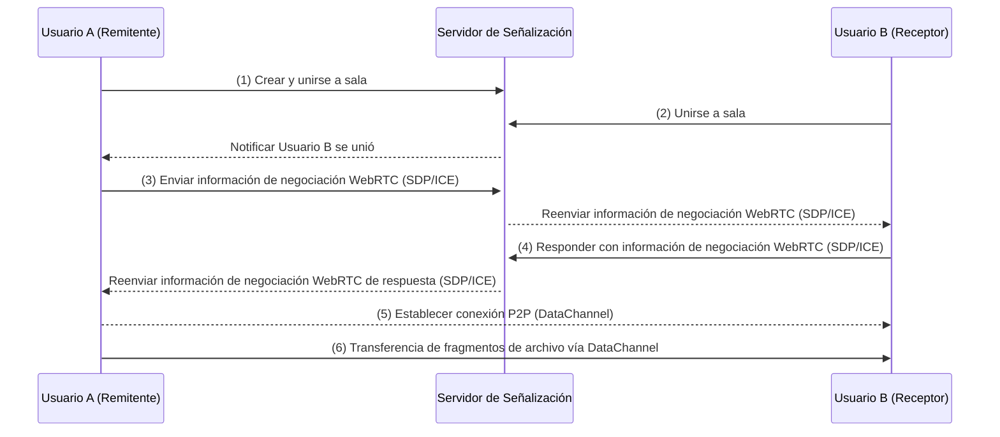
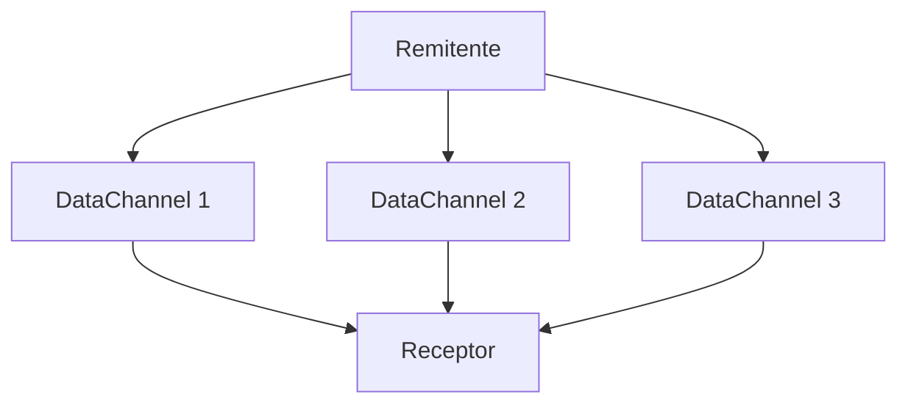
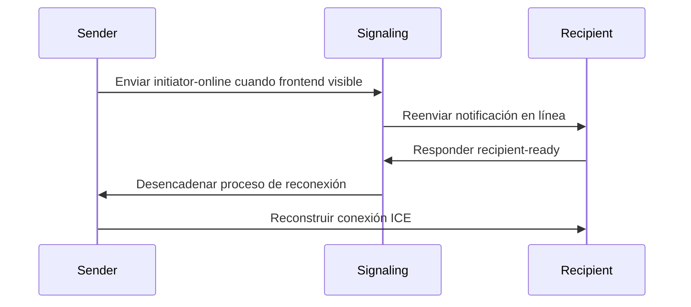

## Introducción

Los métodos tradicionales de transferencia de archivos dependen en gran medida del almacenamiento en la nube o servidores centralizados, lo que genera preocupaciones sobre la privacidad de los datos y al mismo tiempo enfrenta limitaciones en el tamaño de carga y cuellos de botella de velocidad. Nuestra herramienta aprovecha la tecnología WebRTC para permitir transferencias directas de dispositivo a dispositivo, abordando efectivamente estos desafíos.

Nuestra herramienta desarrollada ([<u>**PrivyDrop**</u>](https://www.privydrop.app)) presenta varias características notables:

- Transferencia directa de dispositivo a dispositivo usando tecnología WebRTC, eliminando la necesidad de servidores intermedios
- Cifrado de extremo a extremo (E2EE) garantizando la transmisión segura de datos
- Sin registro requerido, uso instantáneo, soporte para múltiples receptores simultáneos
- Soporte para varios tipos de datos incluyendo texto, imágenes, archivos y carpetas
- Velocidad de transferencia y tamaño de archivo limitados solo por el ancho de banda de la red y el espacio en disco entre dispositivos

En este artículo, exploraremos la arquitectura técnica, los principios de funcionamiento y por qué esta herramienta puede proporcionar una experiencia de transferencia de archivos tan segura y eficiente. Ya sea que sea un entusiasta de la tecnología o un usuario general, obtendrá información sobre cómo la tecnología WebRTC está revolucionando la transferencia de archivos.

## I. Redefiniendo la Transferencia de Archivos: La Revolución Arquitectónica de WebRTC

WebRTC (Web Real-Time Communication) es un estándar abierto que admite comunicación en tiempo real entre navegadores. Nuestra herramienta de transferencia de archivos desarrollada basada en WebRTC comprende varios componentes centrales:

1. **Servidor de Señalización**: Coordina conexiones entre dispositivos sin participar en la transferencia real de datos.
2. **Conexión P2P**: Conexiones directas de dispositivo a dispositivo sin intervención de servidores de terceros.
3. **Cifrado E2EE**: Todos los datos se cifran de extremo a extremo usando el protocolo DTLS durante la transmisión.

### 1.1 Enfoque Tradicional vs Enfoque WebRTC

| Característica | Transferencia HTTP Tradicional | Transferencia P2P WebRTC |
| --- | --- | --- |
| Ruta de Transferencia | Cliente → Servidor → Cliente | Dispositivo a Dispositivo Directo |
| Latencia | Limitada por ancho de banda del servidor central | Limitada solo por ancho de banda de red física |
| Límite de Tamaño de Archivo | Usualmente restringido | Limitado solo por espacio en disco |
| Protección de Privacidad | Depende de seguridad del proveedor de servicios | Cifrado obligatorio vía protocolo DTLS |

### 1.2 Proceso de Establecimiento de Conexión P2P



**Proceso:**

1. El Usuario A crea y se une a una sala, conectándose al servidor de señalización.
2. El Usuario B se une a la sala y se conecta al servidor de señalización.
3. El Usuario A inicia la negociación WebRTC con el Usuario B (incluyendo información SDP e ICE).
4. El Usuario B responde con información de negociación WebRTC, completando el establecimiento de la conexión P2P.
5. Finalmente, los archivos se transfieren a través de DataChannel en la conexión P2P.

### 1.3 La Magia de Rendimiento de SCTP (sobre DTLS & UDP)

El **DataChannel** de WebRTC se basa en el **Protocolo de Control de Transmisión de Flujo (SCTP)** que se ejecuta sobre **DTLS** y **UDP**, ofreciendo tres ventajas principales sobre el TCP tradicional:

1. **Multiplexación de Flujo (Actualmente No Utilizado)**: Los fragmentos de archivo pueden transmitirse en paralelo, mejorando la eficiencia de transferencia.
2. **Sin Bloqueo de Cabeza de Línea**: La pérdida de un solo fragmento no afecta el progreso general, asegurando estabilidad de transferencia.
3. **Control Automático de Congestión**: Se adapta dinámicamente a la fluctuación de la red, optimizando el rendimiento de transferencia.

**Ventajas de UDP:**

- **Baja Latencia**: UDP es un protocolo sin conexión que no requiere protocolo de enlace de tres vías, ideal para comunicación en tiempo real.
- **Fiabilidad Flexible**: Mientras que UDP en sí no es confiable, SCTP implementa mecanismos de transmisión confiables sobre él, combinando la flexibilidad de UDP con la fiabilidad de TCP.

**Diagrama de Transferencia Multi-Flujo SCTP**



## II. Motor de Transferencia Directa de Navegador: Tecnología Central Decodificada

### 2.1 Control Preciso de Transferencia de Fragmentos

```typescript
// lib/fileSender.ts - Fragmentos de 64KB de Tamaño Fijo

// Definir tamaño de fragmento como 65536 bytes (64KB) para coincidir precisamente con el tamaño MTU (Unidad Máxima de Transmisión) de red.
// Esto previene congestión de red o problemas de fragmentación causados por paquetes sobredimensionados.
private readonly CHUNK_SIZE = 65536;

// Crear una función generadora asíncrona para procesar archivos en fragmentos de tamaño fijo.
// Cada llamada al generador devuelve datos de fragmento de tipo ArrayBuffer.
private async *createChunkGenerator(file: File) {
  let offset = 0; // Inicializar offset para marcar posición actual de lectura de archivo

  // Bucle a través del archivo hasta que todos los datos sean procesados
  while (offset < file.size) {
    // Usar método File.slice para extraer segmento de datos de [offset, offset + CHUNK_SIZE)
    const chunk = file.slice(offset, offset + this.CHUNK_SIZE);

    // Convertir datos extraídos a ArrayBuffer y devolver vía yield
    yield await chunk.arrayBuffer();

    // Actualizar offset para siguiente fragmento
    offset += this.CHUNK_SIZE;
  }
}

// Algoritmo de control de contra-presión: Asegura que el envío no exceda los límites del búfer de DataChannel.
// Si el búfer está lleno, esperar hasta que el espacio del búfer esté disponible antes de continuar.
private async sendWithBackpressure(chunk: ArrayBuffer) {
  // Pausar envío cuando el uso del búfer de DataChannel excede el máximo preestablecido
  while (this.dataChannel.bufferedAmount > this.MAX_BUFFER) {
    // Usar Promise para esperar evento bufferedamountlow indicando espacio de búfer liberado
    await new Promise(r => this.dataChannel.bufferedamountlow = r);
  }

  // Enviar fragmento actual cuando el búfer tiene espacio suficiente
  this.dataChannel.send(chunk);
}
```

### 2.2 Escritura de Memoria de Copia Cero

Implementado a través de File System Access API:

```typescript
// lib/fileReceiver.ts

// Escribir datos de fragmento recibidos directamente al disco, evitando copias de memoria adicionales
private async writeToDisk(chunk: ArrayBuffer) {
  // Inicializar escritor de archivo si aún no está creado
  if (!this.writer) {
    // Mostrar diálogo de selector de guardado de archivo para que el usuario elija ubicación de guardado
    this.currentFileHandle = await window.showSaveFilePicker();

    // Crear flujo escribible a través del manejador de archivo para escrituras posteriores
    this.writer = await this.currentFileHandle.createWritable();
  }

  // Convertir ArrayBuffer recibido a Uint8Array y escribir directamente al disco
  // Esto evita el búfer de memoria, logrando escritura de copia cero para mejor rendimiento
  await this.writer.write(new Uint8Array(chunk));
}
```

## III. Sistema de Gestión de Salas Distribuido

### 3.1 Detección de Colisión de Cuatro Dígitos:

```typescript
// server.ts
async function getAvailableRoomId() {
  let roomId;
  do {
    roomId = Math.floor(1000 + Math.random() * 9000); // Generar número aleatorio de cuatro dígitos
  } while (await redis.hexists(`room:${roomId}`, "created_at")); // Verificar si existe
  return roomId;
}
```

Nota: El número de 4 dígitos es una ID de sala aleatoria generada por el sistema. Puede especificar cualquier ID de sala que prefiera.

### 3.2 Estrategia de Expiración Elegante:

```typescript
// server.ts
await refreshRoom(roomId, 3600 * 24); // Salas activas retenidas por 24 horas
if (await isRoomEmpty(roomId)) {
  // Liberar sala si está vacía (tanto remitente como receptor se fueron)
  await deleteRoom(roomId);
}
```

### 3.3 Protocolo de Recuperación Impulsado por Señalización

Flujo de Recuperación de Desconexión Móvil:



A través de este mecanismo, el sistema puede restaurar rápidamente conexiones incluso cuando los usuarios cambian aplicaciones o entran en segundo plano en dispositivos móviles (móvil también incluye Wakelock para evitar dormir), asegurando una buena experiencia de usuario.

## IV. Línea de Defensa de Seguridad y Privacidad

### 4.1 Rueda de Protocolos de Cifrado

```
  Capa de Aplicación
        ↑
  DTLS 1.2+ → TLS_ECDHE_RSA_AES_128_GCM_SHA256
        ↑
  Cifrado a Nivel de Sistema Operativo
```

**Explicación:**

1. **DTLS (Datagram Transport Layer Security)**:
   - DTLS es un protocolo de transporte seguro basado en UDP que proporciona cifrado similar a TLS.
   - En WebRTC, todos los canales de datos se cifran de extremo a extremo a través de DTLS, evitando escucha o manipulación durante la transmisión.
   - Utiliza suite de cifrado **`TLS_ECDHE_RSA_AES_128_GCM_SHA256`** para alta seguridad.
2. **Cifrado a Nivel de Sistema Operativo**:
   - Los navegadores modernos proporcionan protección adicional para datos sensibles en memoria a nivel de sistema operativo, evitando el acceso de software malicioso.

**Resumen:**
A través de la protección dual de DTLS y cifrado a nivel de sistema operativo, WebRTC proporciona robusta protección de privacidad asegurando la seguridad de datos durante la transferencia de archivos.

### 4.2 Matriz de Defensa de Superficie de Ataque

| **Tipo de Ataque** | **Medida de Defensa** | **Explicación** |
| --- | --- | --- |
| **MITM** | **Verificación de Huella SDP** | **Genera huella única desde hash de clave pública DTLS para asegurar identidad de partes de comunicación, evitando falsificación o manipulación de flujo de datos por intermediarios.** |
| **Ataque de Traversía de RoomID** | **Limitación de Tasa de Entrada a Sala** | **Limita frecuencia de entrada a sala por dirección IP (ej. máximo 2 joins por 5 segundos), evitando que usuarios maliciosos atraviesen números de sala para acceder a contenido.** |

**Explicación:**

1. **MITM (Ataque de Hombre en el Medio)**
   - **Principio**: WebRTC usa huellas SDP (basadas en hash de clave pública DTLS) para verificar identidad de partes de comunicación durante el handshake. Los atacantes no pueden falsificar huellas válidas, por lo tanto no pueden hacerse pasar por partes legítimas.
   - **Efecto**: Asegura seguridad de conexión P2P e integridad de datos, evitando escucha o manipulación.
2. **Ataque de Traversía de RoomID**
   - **Definición**: Usuarios maliciosos podrían intentar diferentes números de sala (ej. IDs de cuatro dígitos) para entrar en salas no autorizadas y acceder a contenido compartido.
   - **Medidas de Defensa**:
     - **Limitación de Tasa**: Restringir frecuencia de entrada a sala por dirección IP, ej. máximo 2 entradas a sala por 5 segundos.
     - **Implementación**: Usar Redis para almacenar en caché registros de solicitudes IP para rápida detección y bloqueo de comportamiento anormal.
   - **Efecto**: Previene eficazmente que usuarios maliciosos accedan a contenido sensible a través de traversía de números de sala, protegiendo la privacidad del usuario.

## Conclusión: Construyendo Infraestructura de Transferencia Confiable

Creemos que la tecnología debería servir necesidades humanas esenciales en lugar de crear nuevas dependencias de vigilancia. ¡Experimente ahora esta herramienta de transferencia de archivos segura para la privacidad y sienta los cambios revolucionarios traídos por la tecnología P2P! Haga clic en [<u>**Portal PrivyDrop**</u>](https://www.privydrop.app) para comenzar.

**Compromiso de Transparencia de Código**: El código será de código abierto en el futuro. Estamos comprometidos en establecer herramientas de privacidad verdaderamente confiables a través de la cogobernanza comunitaria.

## Preguntas Frecuentes

- **¿Las transferencias de archivos grandes serán propensas a interrupciones?**
  - Aún no se han observado tales casos. Las conexiones P2P (dispositivo a dispositivo) generalmente son estables. Podríamos agregar capacidad de reanudación desde punto de interrupción basado en retroalimentación futura.
- **¿Sería más seguro agregar contraseñas a las salas?**
  - Teóricamente sí. Considerando que agregar contraseñas afectaría ligeramente la usabilidad, aún no está implementado. Para mayor seguridad, puede usar cualquier cadena personalizada como RoomID y compartir a través de enlaces y códigos QR. Además, el sistema limita la frecuencia de entrada a sala del receptor, mejorando aún más la seguridad.
- **¿Pueden los remitentes cerrar la página PrivyDrop en cualquier momento?**
  - Sí, preferiblemente después de que el contenido sea recibido. Como es conexión directa de dispositivo, compartir no es posible si el remitente está fuera de línea. Si no desea seguir compartiendo, puede cerrar la página inmediatamente.

¿Más preguntas? Haga clic en [<u>**PrivyDrop FAQ**</u>](https://www.privydrop.app/faq) o [<u>**PrivyDrop Ayuda**</u>](https://www.privydrop.app/help) para más respuestas y ayuda.

**Recursos para Desarrolladores**

- [<u>**Documentación Oficial de WebRTC**</u>](https://webrtc.org/)