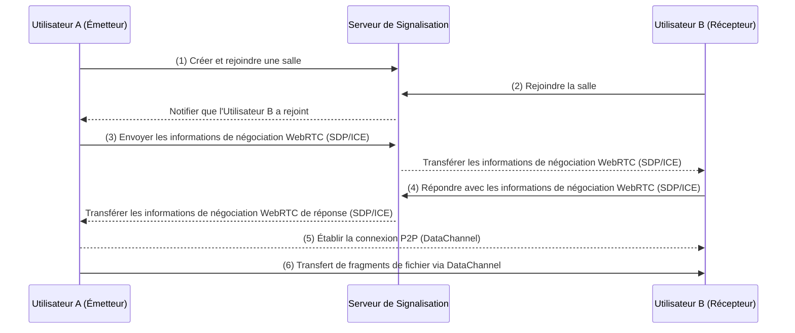
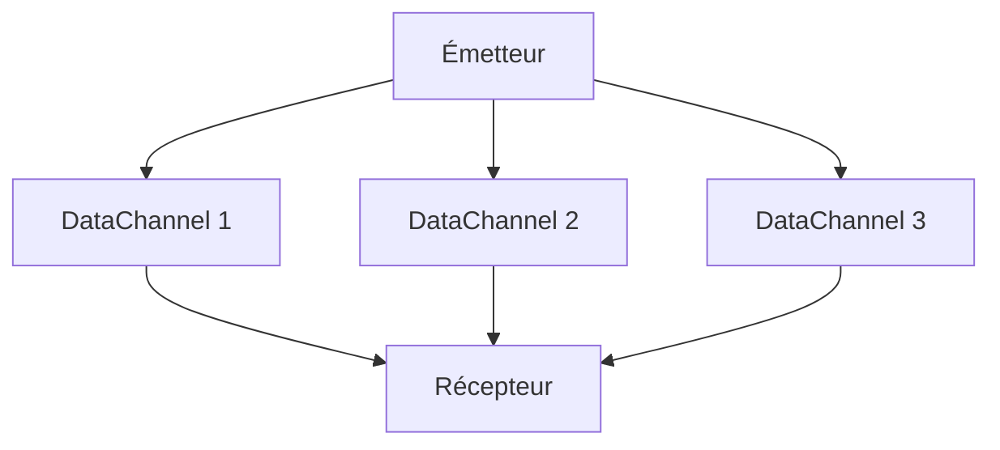
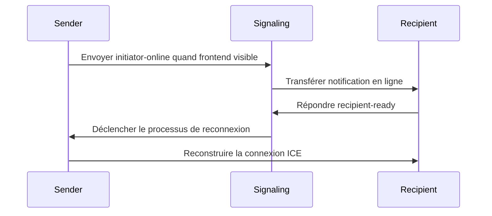

## Introduction

Les méthodes traditionnelles de transfert de fichiers dépendent largement du stockage cloud ou de serveurs centralisés, ce qui soulève des préoccupations concernant la confidentialité des données tout en faisant face à des limitations de taille de téléchargement et des goulots d'étranglement de vitesse. Notre outil exploite la technologie WebRTC pour permettre des transferts directs d'appareil à appareil, adressant efficacement ces défis.

Notre outil développé ([<u>**PrivyDrop**</u>](https://www.privydrop.app)) présente plusieurs caractéristiques notables :

- Transfert direct d'appareil à appareil utilisant la technologie WebRTC, éliminant le besoin de serveurs intermédiaires
- Chiffrement de bout en bout (E2EE) garantissant une transmission sécurisée des données
- Aucune inscription requise, utilisation instantanée, support pour plusieurs récepteurs simultanés
- Support pour divers types de données incluant texte, images, fichiers et dossiers
- Vitesse de transfert et taille de fichier limitées seulement par la bande passante réseau et l'espace disque entre appareils

Dans cet article, nous explorerons l'architecture technique, les principes de fonctionnement et pourquoi cet outil peut offrir une expérience de transfert de fichiers si sécurisée et efficace. Que vous soyez un passionné de technologie ou un utilisateur général, vous obtiendrez des informations sur la manière dont la technologie WebRTC révolutionne le transfert de fichiers.

## I. Redéfinir le Transfert de Fichiers : La Révolution Architecturale de WebRTC

WebRTC (Web Real-Time Communication) est un standard ouvert supportant la communication en temps réel entre navigateurs. Notre outil de transfert de fichiers développé basé sur WebRTC comprend plusieurs composants centraux :

1. **Serveur de Signalisation** : Coordonne les connexions entre appareils sans participer au transfert réel de données.
2. **Connexion P2P** : Connexions directes d'appareil à appareil sans intervention de serveurs tiers.
3. **Chiffrement E2EE** : Toutes les données sont chiffrées de bout en bout utilisant le protocole DTLS pendant la transmission.

### 1.1 Approche Traditionnelle vs Approche WebRTC

| Caractéristique | Transfert HTTP Traditionnel | Transfert P2P WebRTC |
| --- | --- | --- |
| Chemin de Transfert | Client → Serveur → Client | Direct d'Appareil à Appareil |
| Latence | Limitée par la bande passante du serveur central | Limitée seulement par la bande passante réseau physique |
| Limite de Taille de Fichier | Généralement restreinte | Limitée seulement par l'espace disque |
| Protection de la Confidentialité | Dépend de la sécurité du fournisseur de services | Chiffrement obligatoire via protocole DTLS |

### 1.2 Processus d'Établissement de Connexion P2P



**Processus :**

1. L'Utilisateur A crée et rejoint une salle, se connectant au serveur de signalisation.
2. L'Utilisateur B rejoint la salle et se connecte au serveur de signalisation.
3. L'Utilisateur A initie la négociation WebRTC avec l'Utilisateur B (incluant les informations SDP et ICE).
4. L'Utilisateur B répond avec les informations de négociation WebRTC, complétant l'établissement de la connexion P2P.
5. Finalement, les fichiers sont transférés via DataChannel sur la connexion P2P.

### 1.3 La Magie de Performance de SCTP (sur DTLS & UDP)

Le **DataChannel** de WebRTC est basé sur le **Stream Control Transmission Protocol (SCTP)** fonctionnant sur **DTLS** et **UDP**, offrant trois avantages majeurs par rapport au TCP traditionnel :

1. **Multiplexage de Flux (Pas Actuellement Utilisé)** : Les fragments de fichiers peuvent être transmis en parallèle, améliorant l'efficacité de transfert.
2. **Pas de Blocage de Tête de Ligne** : La perte d'un fragment unique n'affecte pas la progression globale, assurant la stabilité du transfert.
3. **Contrôle Automatique de Congestion** : S'adapte dynamiquement à la gigue réseau, optimisant les performances de transfert.

**Avantages UDP :**

- **Faible Latence** : UDP est un protocole sans connexion n'exigeant pas de handshake en trois temps, idéal pour la communication en temps réel.
- **Fiabilité Flexible** : Bien qu'UDP lui-même ne soit pas fiable, SCTP implémente des mécanismes de transmission fiables par-dessus, combinant la flexibilité d'UDP avec la fiabilité de TCP.

**Diagramme de Transfert Multi-Flux SCTP**



## II. Moteur de Transfert Direct Navigateur : Technologie Centrale Décryptée

### 2.1 Contrôle Précis du Transfert de Fragments

```typescript
// lib/fileSender.ts - Fragments de Taille Fixe 64KB

// Définir la taille de fragment comme 65536 octets (64KB) pour correspondre précisément à la taille MTU (Maximum Transmission Unit) réseau.
// Ceci prévient la congestion réseau ou les problèmes de fragmentation causés par des paquets surdimensionnés.
private readonly CHUNK_SIZE = 65536;

// Créer une fonction générateur asynchrone pour traiter les fichiers en fragments de taille fixe.
// Chaque appel au générateur retourne des données de fragment de type ArrayBuffer.
private async *createChunkGenerator(file: File) {
  let offset = 0; // Initialiser l'offset pour marquer la position actuelle de lecture de fichier

  // Boucler à travers le fichier jusqu'à ce que toutes les données soient traitées
  while (offset < file.size) {
    // Utiliser la méthode File.slice pour extraire un segment de données de [offset, offset + CHUNK_SIZE)
    const chunk = file.slice(offset, offset + this.CHUNK_SIZE);

    // Convertir les données extraites en ArrayBuffer et retourner via yield
    yield await chunk.arrayBuffer();

    // Mettre à jour l'offset pour le fragment suivant
    offset += this.CHUNK_SIZE;
  }
}

// Algorithme de contrôle de contre-pression : Assure que l'envoi n'excède pas les limites du tampon DataChannel.
// Si le tampon est plein, attendre que l'espace du tampon devienne disponible avant de continuer.
private async sendWithBackpressure(chunk: ArrayBuffer) {
  // Mettre en pause l'envoi quand l'utilisation du tampon DataChannel dépasse le maximum préréglé
  while (this.dataChannel.bufferedAmount > this.MAX_BUFFER) {
    // Utiliser Promise pour attendre l'événement bufferedamountlow indiquant l'espace de tampon libéré
    await new Promise(r => this.dataChannel.bufferedamountlow = r);
  }

  // Envoyer le fragment actuel quand le tampon a suffisamment d'espace
  this.dataChannel.send(chunk);
}
```

### 2.2 Écriture Mémoire de Copie Zéro

Implémenté via File System Access API :

```typescript
// lib/fileReceiver.ts

// Écrire les données de fragment reçues directement sur le disque, évitant les copies mémoire supplémentaires
private async writeToDisk(chunk: ArrayBuffer) {
  // Initialiser l'écrivain de fichier si pas encore créé
  if (!this.writer) {
    // Afficher le dialogue de sauvegarde de fichier pour que l'utilisateur choisisse l'emplacement de sauvegarde
    this.currentFileHandle = await window.showSaveFilePicker();

    // Créer un flux inscriptible via le handle de fichier pour les écritures ultérieures
    this.writer = await this.currentFileHandle.createWritable();
  }

  // Convertir l'ArrayBuffer reçu en Uint8Array et écrire directement sur le disque
  // Ceci contourne le tampon mémoire, réalisant une écriture de copie zéro pour une performance améliorée
  await this.writer.write(new Uint8Array(chunk));
}
```

## III. Système de Gestion de Salle Distribué

### 3.1 Détection de Collision à Quatre Chiffres :

```typescript
// server.ts
async function getAvailableRoomId() {
  let roomId;
  do {
    roomId = Math.floor(1000 + Math.random() * 9000); // Générer un nombre aléatoire à quatre chiffres
  } while (await redis.hexists(`room:${roomId}`, "created_at")); // Vérifier si existe
  return roomId;
}
```

Note : Le nombre à 4 chiffres est un ID de salle aléatoire généré par le système. Vous pouvez spécifier n'importe quel ID de salle que vous préférez.

### 3.2 Stratégie d'Expiration Élégante :

```typescript
// server.ts
await refreshRoom(roomId, 3600 * 24); // Salles actives retenues pendant 24 heures
if (await isRoomEmpty(roomId)) {
  // Libérer la salle si vide (émetteur et récepteur sont partis)
  await deleteRoom(roomId);
}
```

### 3.3 Protocole de Récupération Piloté par Signalisation

Flux de Récupération de Déconnexion Mobile :



À travers ce mécanisme, le système peut rapidement restaurer les connexions même lorsque les utilisateurs basculent d'application ou entrent en arrière-plan sur les appareils mobiles (mobile inclut aussi Wakelock pour empêcher le sommeil), assurant une bonne expérience utilisateur.

## IV. Ligne de Défense Sécurité et Confidentialité

### 4.1 Volant de Protocoles de Chiffrement

```
  Couche Application
        ↑
  DTLS 1.2+ → TLS_ECDHE_RSA_AES_128_GCM_SHA256
        ↑
  Chiffrement au Niveau OS
```

**Explication :**

1. **DTLS (Datagram Transport Layer Security)** :
   - DTLS est un protocole de transport sécurisé basé sur UDP fournissant un chiffrement similaire à TLS.
   - Dans WebRTC, tous les canaux de données sont chiffrés de bout en bout via DTLS, empêchant l'écoute ou la manipulation pendant la transmission.
   - Utilise la suite de chiffrement **`TLS_ECDHE_RSA_AES_128_GCM_SHA256`** pour une sécurité haute force.
2. **Chiffrement au Niveau OS** :
   - Au niveau OS, les navigateurs modernes fournissent une protection supplémentaire pour les données sensibles en mémoire, empêchant l'accès par logiciel malveillant.

**Résumé :**
À travers la protection double de DTLS et du chiffrement au niveau OS, WebRTC fournit une robuste protection de confidentialité assurant la sécurité des données pendant le transfert de fichiers.

### 4.2 Matrice de Défense de Surface d'Attaque

| **Type d'Attaque** | **Mesure de Défense** | **Explication** |
| --- | --- | --- |
| **MITM** | **Vérification d'Empreinte SDP** | **Génère une empreinte unique depuis le hash de clé publique DTLS pour assurer l'identité des parties de communication, empêchant la falsification ou manipulation de flux de données par intermédiaires.** |
| **Attaque de Parcours RoomID** | **Limitation de Taux d'Entrée de Salle** | **Limite la fréquence d'entrée en salle par adresse IP (ex. max 2 joins par 5 secondes), empêchant les utilisateurs malveillants de parcourir les numéros de salle pour accéder au contenu.** |

**Explication :**

1. **MITM (Attaque de l'Homme du Milieu)**
   - **Principe** : WebRTC utilise les empreintes SDP (basées sur le hash de clé publique DTLS) pour vérifier l'identité des parties de communication pendant le handshake. Les attaquants ne peuvent pas falsifier d'empreintes valides, donc ne peuvent pas se faire passer pour des parties légitimes.
   - **Effet** : Assure la sécurité de connexion P2P et l'intégrité des données, empêchant l'écoute ou la manipulation.
2. **Attaque de Parcours RoomID**
   - **Définition** : Les utilisateurs malveillants pourraient tenter différents numéros de salle (ex. IDs à quatre chiffres) pour entrer dans des salas non autorisées et accéder au contenu partagé.
   - **Mesures de Défense** :
     - **Limitation de Taux** : Restreindre la fréquence d'entrée en salle par adresse IP, ex. max 2 entrées de salle par 5 secondes.
     - **Implémentation** : Utiliser Redis pour mettre en cache les enregistrements de requêtes IP pour détection rapide et blocage de comportement anormal.
   - **Effet** : Empêche efficacement les utilisateurs malveillants d'accéder à du contenu sensible via le parcours de numéros de salle, protégeant la confidentialité utilisateur.

## Conclusion : Construire une Infrastructure de Transfert Fiable

Nous croyons que la technologie devrait servir les besoins humains essentiels plutôt que créer de nouvelles dépendances de surveillance. Expérimentez maintenant cet outil de transfert de fichiers sécurisé pour la confidentialité et sentez les changements révolutionnaires apportés par la technologie P2P ! Cliquez sur [<u>**Portail PrivyDrop**</u>](https://www.privydrop.app) pour commencer.

**Engagement de Transparence de Code** : Le code sera open source à l'avenir. Nous sommes engagés à établir de véritables outils de confidentialité fiables à travers la co-gouvernance communautaire.

## FAQ

- **Les transferts de gros fichiers seront-ils sujets à interruption ?**
  - Pas encore observé de tels cas. Les connexions P2P (appareil à appareil) sont généralement stables. Nous pourrions ajouter la capacité de reprise depuis point d'arrêt basée sur les retours futurs.
- **Ajouter des mots de passe aux salles serait-il plus sécurisé ?**
  - Théoriquement oui. Considérant que l'ajout de mots de passe impacterait légèrement l'utilisabilité, pas encore implémenté. Pour une sécurité accrue, vous pouvez utiliser n'importe quelle chaîne personnalisée comme RoomID et partager via liens et codes QR. De plus, le système limite la fréquence d'entrée en salle du récepteur, améliorant encore la sécurité.
- **Les émetteurs peuvent-ils fermer la page PrivyDrop à tout moment ?**
  - Oui, de préférence après que le contenu soit reçu. Comme c'est une connexion directe d'appareil, le partage n'est pas possible si l'émetteur est hors ligne. Si vous voulez arrêter de partager, vous pouvez fermer la page immédiatement.

Plus de questions ? Cliquez sur [<u>**PrivyDrop FAQ**</u>](https://www.privydrop.app/faq) ou [<u>**PrivyDrop Aide**</u>](https://www.privydrop.app/help) pour plus de réponses et d'aide.

**Ressources Développeur**

- [<u>**Documentation Officielle WebRTC**</u>](https://webrtc.org/)