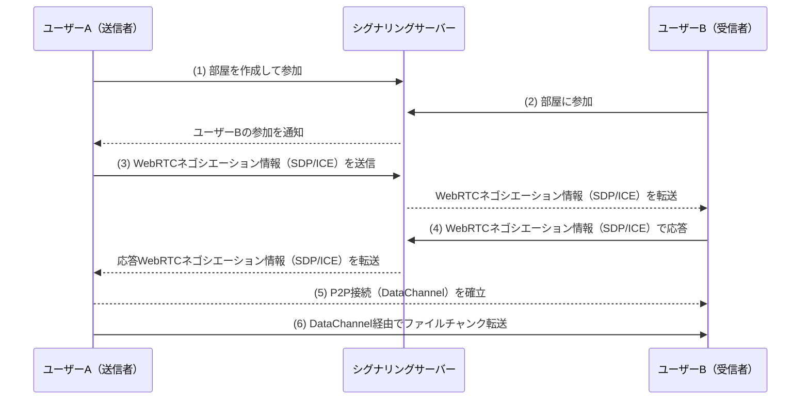
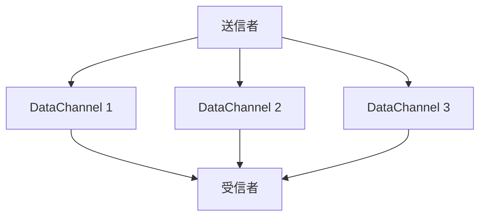
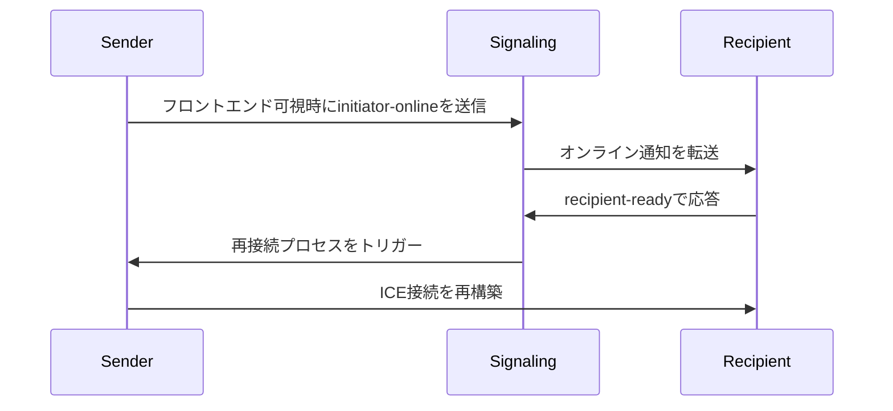

## はじめに

従来のファイル転送方式のほとんどはクラウドストレージまたは中央集権型サーバーに依存しており、これによりデータプライバシーの懸念が生まれるだけでなく、アップロードサイズの制限や速度ボトルネックといった多くの問題に直面していました。私たちのツールはWebRTC技術を活用してデバイス間の直接転送を実現し、これらの問題を完全に解決しました。

私たちが開発したこのツール（[<u>**PrivyDrop**</u>](https://www.privydrop.app)）には、以下の顕著な特徴があります：

- WebRTC技術を活用したデバイス間直接転送、中間サーバー不要
- エンドツーエンド暗号化（E2EE）による安全なデータ転送保証
- 登録不要、即利用可能、複数人同時受信対応
- テキスト、画像、ファイル、フォルダなど多様なデータタイプをサポート
- 転送速度とファイルサイズはデバイス間のネットワーク帯域とディスク空間のみに制限

この記事では、このツールの技術アーキテクチャ、動作原理、そしてなぜこれほど安全で効率的なファイル転送体験を提供できるのかについて探求します。技術愛好家であっても一般ユーザーであっても、WebRTC技術がファイル転送分野にもたらす革命的変化を理解できるでしょう。

## 一、ファイル転送の再定義：WebRTCのアーキテクチャ革命

WebRTC（Web Real-Time Communication）は、ブラウザー間のリアルタイム通信をサポートするオープンスタンダードです。WebRTCベースで開発された私たちのファイル転送ツールは、主に以下のコアコンポーネントで構成されています：

1. **シグナリングサーバー**：デバイス間の接続を調整しますが、実際のデータ転送には関与しません。
2. **P2P接続**：デバイス間で直接接続を確立し、第三者サーバーを介さずにデータを転送します。
3. **E2EE暗号化**：すべてのデータが転送中にDTLSプロトコルでエンドツーエンド暗号化されます。

### 1.1 従来方式 vs WebRTC方式

| 特性 | 従来のHTTP転送 | WebRTC P2P転送 |
| --- | --- | --- |
| 転送パス | クライアント → サーバー → クライアント | デバイス間直接接続 |
| 遅延 | 中央サーバーの帯域に制限 | 物理ネットワーク帯域のみに制限 |
| ファイルサイズ制限 | 通常制限あり | ディスク容量のみに制限 |
| プライバシー保護 | サービスプロバイダーのセキュリティに依存 | DTLSプロトコルによる強制暗号化 |

### 1.2 P2P接続確立プロセス



**プロセス：**

1. ユーザーAが部屋を作成して参加し、シグナリングサーバーに接続します。
2. ユーザーBが部屋に参加し、シグナリングサーバーに接続します。
3. ユーザーAがユーザーBとのWebRTCネゴシエーション（SDPとICE情報を含む）を開始します。
4. ユーザーBがWebRTCネゴシエーション情報で応答し、P2P接続の確立を完了します。
5. 最後に、ファイルがP2P接続上のDataChannelを通じて転送されます。

### 1.3 SCTP（over DTLS & UDP）の性能魔法

WebRTCの**DataChannel**は**DTLS**と**UDP**上で動作する**ストリーム制御伝送プロトコル（SCTP）**に基づいており、従来のTCPに対して3つの大きな利点があります：

1. **ストリーム多重化（現未採用）**：ファイルチャンクを並列転送でき、転送効率を向上させます。
2. **ヘッドオブラインブロッキングなし**：単一チャンクの損失が全体の進行に影響せず、転送安定性を保証します。
3. **自動輻輳制御**：ネットワークジッターに動的に適応し、転送性能を最適化します。

**UDPの利点：**

- **低遅延**：UDPはコネクションレスプロトコルで、3wayハンドシェイク不要で、リアルタイム通信に適しています。
- **柔軟な信頼性**：UDP自体は信頼性ありませんが、SCTPがその上に信頼性ある伝送メカニズムを実装し、UDPの柔軟性とTCPの信頼性を組み合わせています。

**SCTPマルチストリーム転送図**



## 二、ブラウザー直接転送エンジン：核心技術解読

### 2.1 チャンク転送の精密制御

```typescript
// lib/fileSender.ts - 64KB固定サイズチャンク

// 各チャンクサイズを65536バイト（64KB）と定義し、ネットワークMTU（最大伝送単位）サイズに正確に一致させます。
// これにより、過大なパケットによるネットワーク輻輳やフラグメンテーション問題を防ぎます。
private readonly CHUNK_SIZE = 65536;

// 固定サイズでファイルをチャンク処理するための非同期ジェネレーター関数を作成します。
// 各ジェネレーター呼び出しでArrayBuffer型のチャンクデータを返します。
private async *createChunkGenerator(file: File) {
  let offset = 0; // 現在のファイル読み取り位置をマークするためにオフセットを初期化

  // ファイル全体が処理されるまでループ
  while (offset < file.size) {
    // File.sliceメソッドを使用して[offset, offset + CHUNK_SIZE)範囲のデータセグメントを抽出
    const chunk = file.slice(offset, offset + this.CHUNK_SIZE);

    // 抽出したデータをArrayBufferに変換し、yield経由で返す
    yield await chunk.arrayBuffer();

    // 次のチャンク用にオフセットを更新
    offset += this.CHUNK_SIZE;
  }
}

// バックプレッシャー制御アルゴリズム：送信がDataChannelバッファー制限を超えないようにします。
// バッファーが満杯の場合、バッファー空間が利用可能になるまで待機します。
private async sendWithBackpressure(chunk: ArrayBuffer) {
  // DataChannelバッファー使用量がプリセット最大値を超えた場合に送信を一時停止
  while (this.dataChannel.bufferedAmount > this.MAX_BUFFER) {
    // bufferedamountlowイベントを待機してバッファー空間が解放されたことを示すPromiseを使用
    await new Promise(r => this.dataChannel.bufferedamountlow = r);
  }

  // バッファーに十分な空間がある場合に現在のチャンクを送信
  this.dataChannel.send(chunk);
}
```

### 2.2 ゼロコピーメモリ書き込み

File System Access APIを通じて実装：

```typescript
// lib/fileReceiver.ts

// 受信したチャンクデータを直接ディスクに書き込み、余分なメモリコピーを回避します
private async writeToDisk(chunk: ArrayBuffer) {
  // ファイルライターがまだ初期化されていない場合
  if (!this.writer) {
    // ファイル保存ピッカーダイアログを表示し、ユーザーが保存場所を選択
    this.currentFileHandle = await window.showSaveFilePicker();

    // ファイルハンドル経由で書き込み可能ストリームを作成し、後続の書き込み用に準備
    this.writer = await this.currentFileHandle.createWritable();
  }

  // 受信したArrayBufferをUint8Arrayに変換し、直接ディスクに書き込み
  // これによりメモリバッファーを回避し、ゼロコピー書き込みを実現して性能を向上
  await this.writer.write(new Uint8Array(chunk));
}
```

## 三、分散部屋管理システム

### 3.1 四桁数字衝突検出：

```typescript
// server.ts
async function getAvailableRoomId() {
  let roomId;
  do {
    roomId = Math.floor(1000 + Math.random() * 9000); // 四桁の乱数を生成
  } while (await redis.hexists(`room:${roomId}`, "created_at")); // 存在するかチェック
  return roomId;
}
```

注：4桁の数字はシステム生成のランダム部屋IDです。お好みの任意の部屋IDを指定できます。

### 3.2 優雅な有効期限戦略：

```typescript
// server.ts
await refreshRoom(roomId, 3600 * 24); // アクティブ部屋は24時間保持
if (await isRoomEmpty(roomId)) {
  // 空き部屋の場合（送信者と受信者の両方が退出した場合）、部屋を解放
  await deleteRoom(roomId);
}
```

### 3.3 シグナリング駆動の復旧プロトコル

モバイル切断回復フロー：



このメカニズムにより、ユーザーがモバイルデバイスでアプリを切り替えたりバックグラウンドに入ったりしても、システムは迅速に接続を回復できます（モバイルでもWakelockでスリープを防止）、良好なユーザー体験を保証します。

## 四、セキュリティとプライバシー防御ライン

### 4.1 暗号化プロトコルフライホイール

```
  アプリケーション層
        ↑
  DTLS 1.2+ → TLS_ECDHE_RSA_AES_128_GCM_SHA256
        ↑
  OSレベル暗号化
```

**説明：**

1. **DTLS（Datagram Transport Layer Security）**：
   - DTLSはUDPベースのセキュア伝送プロトコルで、TLS類似の暗号化機能を提供します。
   - WebRTCでは、すべてのデータチャネルがDTLS経由でエンドツーエンド暗号化され、伝送中の盗聴や改ざんを防ぎます。
   - 暗号化スイート**`TLS_ECDHE_RSA_AES_128_GCM_SHA256`**を使用し、高強度のセキュリティを提供します。
2. **OSレベル暗号化**：
   - OSレベルで、現代ブラウザーはメモリ内の機密データに追加保護を提供し、悪意のあるソフトウェアによるアクセスを防ぎます。

**要約：**
DTLSとOSレベル暗号化の二重保護により、WebRTCは強力なプライバシー保護能力を提供し、ファイル転送中のデータセキュリティを保証します。

### 4.2 攻撃面防御マトリックス

| **攻撃タイプ** | **防御措置** | **説明** |
| --- | --- | --- |
| **MITM** | **SDP指紋検証** | **DTLS公開鍵ハッシュ値から一意の指紋を生成し、通信相手の信頼性を確保し、中間者によるデータストリームの偽造や改ざんを防止します。** |
| **部屋ID巡回攻撃** | **部屋入室レート制限** | **各IPアドレスの部屋入室頻度を制限し（例：5秒以内に最大2回）、悪意のあるユーザーが部屋番号を巡回してコンテンツにアクセスするのを防ぎます。** |

**説明：**

1. **MITM（Man-in-the-Middle Attack）**
   - **原理**：WebRTCはSDP指紋（DTLS公開鍵ハッシュ値に基づく）を使用してハンドシェイク中に通信相手の身份を検証します。攻撃者は有効な指紋を偽造できないため、正当な通信者を装うことができません。
   - **効果**：P2P接続のセキュリティとデータ完全性を保証し、盗聴や改ざんを防ぎます。
2. **部屋ID巡回攻撃**
   - **定義**：悪意のあるユーザーが異なる部屋番号（例：4桁ID）を試すことで、未承認の部屋に入り共有コンテンツにアクセスしようとする可能性があります。
   - **防御措置**：
     - **レート制限**：各IPアドレスの部屋入室頻度を制限します。例：5秒以内に最大2回の部屋入室を許可。
     - **実装方法**：Redisを使用してIPリクエスト記録をキャッシュし、異常な動作の迅速な検出とブロッキングを行います。
   - **効果**：悪意のあるユーザーが部屋番号巡回による機密コンテンツアクセスを効果的に防ぎ、ユーザープライバシーを保護します。

## 結論：信頼できる転送インフラの構築

私たちは、技術が本質的な人間のニーズに奉仕すべきであり、新しい監視依存を作るべきではないと固く信じています。今すぐこのプライバシーセキュアなファイル転送ツールを体験し、P2P技術がもたらす革命的変化を感じてください！[<u>**PrivyDropポータル**</u>](https://www.privydrop.app)をクリックして開始してください。

**コード透明性コミットメント**：コードは将来的にオープンソース化されます。私たちは、社区共同ガバナンスを通じて真に信頼できるプライバシーツールを確立することに取り組んでいます。

## よくある質問

- **大きなファイル転送は中断しやすいですか？**
  - まだそのようなケースは観察されていません。P2P（デバイス間）接続は一般的に安定しています。将来のフィードバックに基づき、レジューム機能を追加する可能性があります。
- **部屋にパスワードを追加するとより安全になりますか？**
  - 理論的にははい。パスワード追加がわずかに使いやすさに影響することを考慮し、まだ実装されていません。セキュリティを向上させたい場合、任意のカスタム文字列をRoomIDとして使用し、リンクとQRコード経由で共有できます。さらに、システムは受信者の部屋入室頻度を制限し、さらなるセキュリティ向上を図っています。
- **送信者はいつでもPrivyDropページを閉じられますか？**
  - はい、コンテンツが受信された後に閉じることが望ましいです。デバイス間直接接続のため、送信者がオフラインの場合、共有は不可能です。共有を停止したい場合、ページをすぐに閉じることができます。

その他の質問？[<u>**PrivyDrop FAQ**</u>](https://www.privydrop.app/faq)または[<u>**PrivyDrop Help**</u>](https://www.privydrop.app/help)セクションをクリックして、さらに回答とヘルプをご覧ください。

**開発者リソース**

- [<u>**WebRTC公式ドキュメント**</u>](https://webrtc.org/)