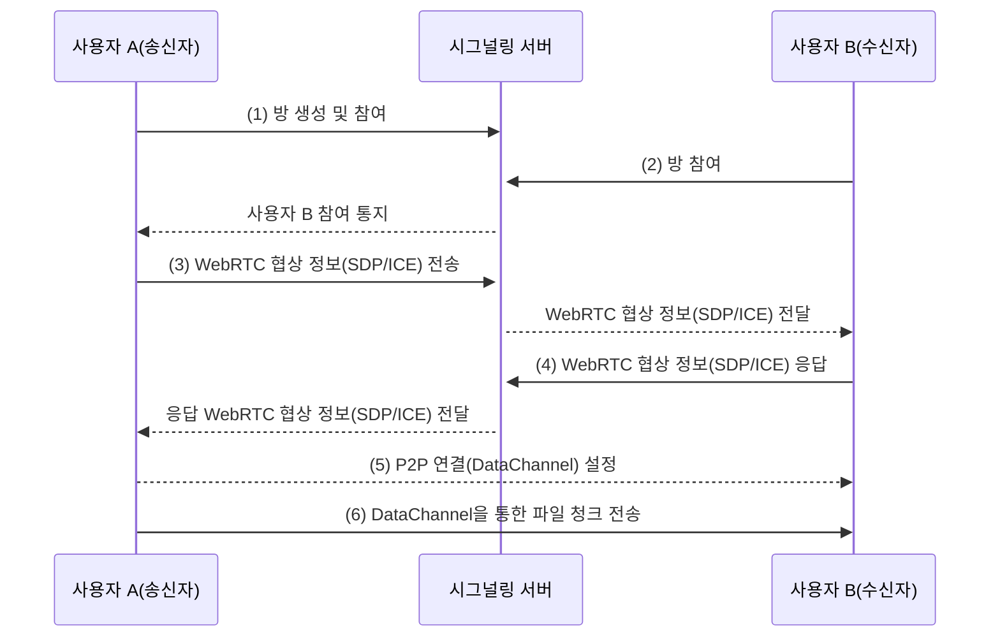
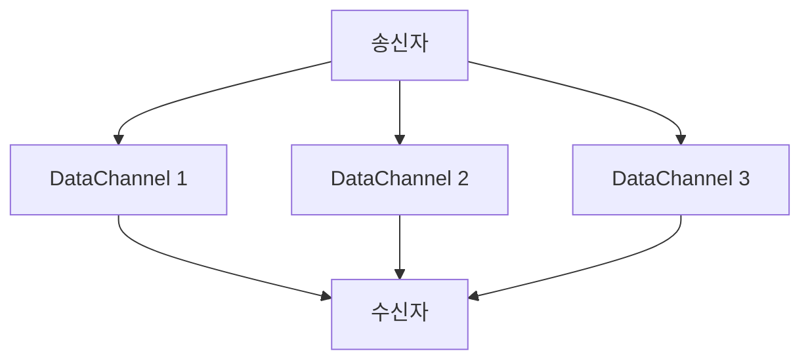
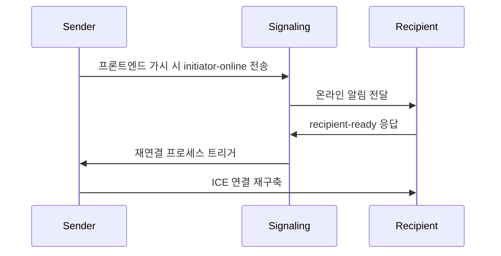

## 서론

전통적인 파일 전송 방식은 대부분 클라우드 스토리지나 중앙 집중식 서버에 의존하여 데이터 프라이버시에 대한 우려를 제기할 뿐만 아니라 업로드 크기 제한, 속도 병목 현상 등 많은 문제에 직면했습니다. 우리의 도구는 WebRTC 기술을 활용하여 기기 간 직접 전송을 실현하여 이러한 문제들을 완전히 해결했습니다.

우리가 개발한 이 도구([<u>**PrivyDrop**</u>](https://www.privydrop.app))는 다음과 같은 두드러진 특징을 가지고 있습니다:

- WebRTC 기술을 사용한 기기 간 직접 전송, 중간 서버 불필요
- 종단 간 암호화(E2EE)로 안전한 데이터 전송 보장
- 등록 불필요, 즉시 사용 가능, 다중 동시 수신자 지원
- 텍스트, 이미지, 파일, 폴더 등 다양한 유형의 데이터 전송 지원
- 전송 속도와 파일 크기는 기기 간 네트워크 대역폭과 디스크 공간에만 제한

이 기사에서는 이 도구의 기술 아키텍처, 작동 원리, 그리고 왜 이렇게 안전하고 효율적인 파일 전송 경험을 제공할 수 있는지에 대해 탐구합니다. 기술 애호가이든 일반 사용자이든, WebRTC 기술이 파일 전송 분야에 가져온 혁명적인 변화를 이해할 수 있을 것입니다.

## 일. 파일 전송 재정의: WebRTC의 아키텍처 혁명

WebRTC(Web Real-Time Communication)는 브라우저 간 실시간 통신을 지원하는 개방형 표준입니다. WebRTC 기반으로 개발된 우리의 파일 전송 도구는 주로 다음과 같은 핵심 구성 요소를 포함합니다:

1. **시그널링 서버**: 기기 간 연결을 조정하지만 실제 데이터 전송에는 참여하지 않습니다.
2. **P2P 연결**: 제3자 서버 개입 없이 기기 간 직접 연결을 설정합니다.
3. **E2EE 암호화**: 모든 데이터가 전송 중 DTLS 프로토콜로 종단 간 암호화됩니다.

### 1.1 전통적인 방식 vs WebRTC 방식

| 특징 | 전통적 HTTP 전송 | WebRTC P2P 전송 |
| --- | --- | --- |
| 전송 경로 | 클라이언트 → 서버 → 클라이언트 | 기기 간 직접 연결 |
| 지연 시간 | 중앙 서버 대역폭에 제한됨 | 물리적 네트워크 대역폭에만 제한됨 |
| 파일 크기 제한 | 일반적으로 제한 있음 | 디스크 공간에만 제한됨 |
| 프라이버시 보호 | 서비스 제공업체 보안 조치에 의존 | DTLS 프로토콜 강제 암호화 |

### 1.2 P2P 연결 설정 프로세스



**프로세스:**

1. 사용자 A가 방을 생성하고 참여하여 시그널링 서버에 연결합니다.
2. 사용자 B가 방에 참여하여 시그널링 서버에 연결합니다.
3. 사용자 A가 사용자 B와 WebRTC 협상(SDP 및 ICE 정보 포함)을 시작합니다.
4. 사용자 B가 WebRTC 협상 정보로 응답하여 P2P 연결 설정을 완료합니다.
5. 최종적으로 파일이 P2P 연결 위의 DataChannel을 통해 전송됩니다.

### 1.3 SCTP(over DTLS & UDP)의 성능 마법

WebRTC의 **DataChannel**은 **DTLS**와 **UDP** 위에서 실행되는 **스트림 제어 전송 프로토콜(SCTP)**을 기반으로 하며, 전통적인 TCP에 비해 세 가지 큰 장점을 가집니다:

1. **스트림 멀티플렉싱(현재 미사용)**: 파일 청크를 병렬로 전송할 수 있어 전송 효율을 향상시킵니다.
2. **헤드 오브 라인 블로킹 없음**: 단일 청크 손실이 전체 진행에 영향을 주지 않아 전송 안정성을 보장합니다.
3. **자동 혼잡 제어**: 네트워크 지터에 동적으로 적응하여 전송 성능을 최적화합니다.

**UDP의 장점:**

- **낮은 지연 시간**: UDP는 3-way 핸드셰이크가 필요 없는 연결 없는 프로토콜로, 실시간 통신에 이상적입니다.
- **유연한 신뢰성**: UDP 자체는 신뢰성 없지만, SCTP가 그 위에 신뢰성 있는 전송 메커니즘을 구현하여 UDP의 유연성과 TCP의 신뢰성을 결합합니다.

**SCTP 다중 스트림 전송 다이어그램**



## 이. 브라우저 직접 전송 엔진: 핵심 기술 해독

### 2.1 청크 전송의 정밀 제어

```typescript
// lib/fileSender.ts - 64KB 고정 크기 청크

// 각 청크 크기를 65536 바이트(64KB)로 정의하여 네트워크 MTU(최대 전송 단위) 크기에 정확히 일치시킵니다.
// 이는 과대한 패킷으로 인한 네트워크 혼잡이나 단편화 문제를 방지합니다.
private readonly CHUNK_SIZE = 65536;

// 고정 크기로 파일을 청크 처리하기 위한 비동기 생성기 함수를 생성합니다.
// 각 생성기 호출 시 ArrayBuffer 유형의 청크 데이터를 반환합니다.
private async *createChunkGenerator(file: File) {
  let offset = 0; // 현재 파일 읽기 위치를 표시하기 위해 오프셋 초기화

  // 모든 데이터가 청크 처리될 때까지 파일 루프
  while (offset < file.size) {
    // File.slice 메서드를 사용하여 [offset, offset + CHUNK_SIZE) 범위의 데이터 세그먼트 추출
    const chunk = file.slice(offset, offset + this.CHUNK_SIZE);

    // 추출한 데이터를 ArrayBuffer로 변환하고 yield를 통해 반환
    yield await chunk.arrayBuffer();

    // 다음 청크용 오프셋 업데이트
    offset += this.CHUNK_SIZE;
  }
}

// 백 프레셔 제어 알고리즘: 전송이 DataChannel 버퍼 제한을 초과하지 않도록 합니다.
// 버퍼가 가득 찬 경우 버퍼 공간이 사용 가능해질 때까지 기다립니다.
private async sendWithBackpressure(chunk: ArrayBuffer) {
  // DataChannel 버퍼 사용량이 사전 설정된 최대치를 초과할 때 전송 일시 중지
  while (this.dataChannel.bufferedAmount > this.MAX_BUFFER) {
    // 버퍼 공간 해제를 나타내는 bufferedamountlow 이벤트를 위해 Promise 사용
    await new Promise(r => this.dataChannel.bufferedamountlow = r);
  }

  // 버퍼에 충분한 공간이 있을 때 현재 청크 전송
  this.dataChannel.send(chunk);
}
```

### 2.2 제로 카피 메모리 쓰기

File System Access API를 통해 구현:

```typescript
// lib/fileReceiver.ts

// 수신된 청크 데이터를 디스크에 직접 쓰기, 추가 메모리 복사 방지
private async writeToDisk(chunk: ArrayBuffer) {
  // 파일 작성기가 아직 초기화되지 않은 경우
  if (!this.writer) {
    // 파일 저장 선택 대화상자 표시, 사용자가 저장 위치 선택
    this.currentFileHandle = await window.showSaveFilePicker();

    // 파일 핸들을 통해 쓰기 가능 스트림(WritableStream) 생성, 후속 쓰기용 준비
    this.writer = await this.currentFileHandle.createWritable();
  }

  // 수신된 ArrayBuffer 데이터를 Uint8Array로 변환하고 디스크에 직접 쓰기
  // 이는 메모리 버퍼를 우회하여 제로 카피 쓰기를 구현하고 성능 향상
  await this.writer.write(new Uint8Array(chunk));
}
```

## 삼. 분산 방 관리 시스템

### 3.1 네 자리 숫자 충돌 감지:

```typescript
// server.ts
async function getAvailableRoomId() {
  let roomId;
  do {
    roomId = Math.floor(1000 + Math.random() * 9000); // 네 자리 난수 생성
  } while (await redis.hexists(`room:${roomId}`, "created_at")); // 존재 여부 확인
  return roomId;
}
```

참고: 4자리 숫자는 시스템 생성 난수 방 ID입니다. 원하는 모든 방 ID를 지정할 수 있습니다.

### 3.2 우아한 만료 전략:

```typescript
// server.ts
await refreshRoom(roomId, 3600 * 24); // 활성 방 24시간 유지
if (await isRoomEmpty(roomId)) {
  // 방이 비어있는 경우(송신자, 수신자 모두 나간 경우), 방 해제
  await deleteRoom(roomId);
}
```

### 3.3 시그널링 구동 재생 프로토콜

모바일 연결 끊김 복구 흐름:



이 메커니즘을 통해 사용자가 모바일 기기에서 앱을 전환하거나 백그라운드로 들어가도 시스템은 빠르게 연결을 복구할 수 있습니다(모바일도 수면 방지를 위해 Wakelock 포함), 양호한 사용자 경험을 보장합니다.

## 사. 보안 및 프라이버시 방어선

### 4.1 암호화 프로토콜 플라이휠

```
  애플리케이션 계층
        ↑
  DTLS 1.2+ → TLS_ECDHE_RSA_AES_128_GCM_SHA256
        ↑
  OS 레벨 암호화
```

**설명:**

1. **DTLS(Datagram Transport Layer Security)**:
   - DTLS는 UDP 기반의 보안 전송 프로토콜로 TLS 유사 암호화 기능을 제공합니다.
   - WebRTC에서 모든 데이터 채널(DataChannel)은 DTLS를 통해 종단 간 암호화되어 전송 중 도청이나 변조를 방지합니다.
   - 암호화 스위트 **`TLS_ECDHE_RSA_AES_128_GCM_SHA256`**를 사용하여 고강도 보안을 제공합니다.
2. **OS 레벨 암호화**:
   - OS 레벨에서 현대 브라우저는 메모리 내 민감 데이터에 대한 추가 보호를 제공하여 악성 소프트웨어 접근을 방지합니다.

**요약:**
DTLS와 OS 레벨 암호화의 이중 보호를 통해 WebRTC는 강력한 프라이버시 보호 능력을 제공하여 파일 전송 과정의 데이터 안전을 보장합니다.

### 4.2 공격 표면 방어 행렬

| **공격 유형** | **방어 조치** | **설명** |
| --- | --- | --- |
| **MITM** | **SDP 지문 검증** | **DTLS 공개 키 해시값에서 고유 지문 생성, 통신 당사자 신뢰성 보장, 중간자 데이터 스트림 위조나 변조 방지.** |
| **방 ID 순회 공격** | **방 입장 속도 제한** | **각 IP 주소의 방 입장 빈도 제한(예: 5초 내 최대 2회), 악의적 사용자가 방 번호 순회로 내용 접근 방지.** |

**설명:**

1. **MITM(Man-in-the-Middle Attack)**
   - **원리**: WebRTC는 핸드셰이크 과정에서 SDP 지문(DTLS 공개 키 해시값 기반)을 사용하여 통신 당사자 신원을 검증합니다. 공격자는 유효한 지문을 위조할 수 없으므로 합법적 통신 당사자로 가장할 수 없습니다.
   - **효과**: P2P 연결 보안과 데이터 무결성 보장, 도청이나 변조 방지.
2. **방 ID 순회 공격**
   - **정의**: 악의적 사용자가 다른 방 번호(예: 네 자리 ID)를 시도하여 미승인 방에 들어가 공유 콘텐츠에 접근하려고 시도할 수 있습니다.
   - **방어 조치**:
     - **속도 제한**: 각 IP 주소의 방 입장 빈도 제한, 예: 5초 내 최대 2회 방 입장 허용.
     - **구현 방식**: Redis를 사용하여 IP 요청 기록 캐시, 이상 동작 빠른 감지 및 차단.
   - **효과**: 악의적 사용자가 방 번호 순회를 통한 민감 콘텐츠 접근을 효과적으로 방지, 사용자 프라이버시 보호.

## 결론: 신뢰할 수 있는 전송 인프라 구축

우리는 기술이 인간의 본질적인 요구를 봉사해야 하며, 새로운 감시 의존을 만들어서는 안 된다고 굳게 믿습니다. 지금 이 프라이버시 보안 파일 전송 도구를 경험하고 P2P 기술이 가져온 혁명적 변화를 느껴보세요! [<u>**PrivyDrop 포털**</u>](https://www.privydrop.app)을 클릭하여 시작하세요.

**코드 투명성 약속**: 코드는 미래에 오픈 소스가 될 것입니다. 우리는 커뮤니티 공동 거버넌스를 통해 진정으로 신뢰할 수 있는 프라이버시 도구를 확립하는 데 전념하고 있습니다.

## 자주 묻는 질문

- **큰 파일 전송이 중단되기 쉬운가요?**
  - 아직 그런 경우를 관찰하지 않았습니다. P2P(기기 간) 연결은 일반적으로 안정적입니다. 향후 피드백에 따라 재시작 기능을 추가할 수 있습니다.
- **방에 비밀번호를 추가하면 더 안전한가요?**
  - 이론적으로 그렇습니다. 비밀번호 추가가 사용성에 약간 영향을 줄 것을 고려하여 아직 구현되지 않았습니다. 보안을 높이고 싶다면 임의의 사용자 정의 문자열을 RoomID로 사용하고 링크와 QR 코드를 통해 공유할 수 있습니다. 또한 시스템은 수신자의 방 입장 빈도를 제한하여 추가로 보안을 향상시킵니다.
- **송신자는 언제든지 PrivyDrop 페이지를 닫을 수 있나요?**
  - 네, 공유 콘텐츠가 수신된 후에 닫는 것이 좋습니다. 기기 간 직접 연결이므로 송신자가 오프라인이면 공유가 불가능합니다. 공유를 중단하고 싶다면 즉시 페이지를 닫을 수 있습니다.

더 궁금한 점이 있으신가요? [<u>**PrivyDrop FAQ**</u>](https://www.privydrop.app/faq) 또는 [<u>**PrivyDrop 도움말**</u>](https://www.privydrop.app/help) 섹션을 클릭하여 더 많은 답변과 도움을 확인하세요.

**개발자 리소스**

- [<u>**WebRTC 공식 문서**</u>](https://webrtc.org/)