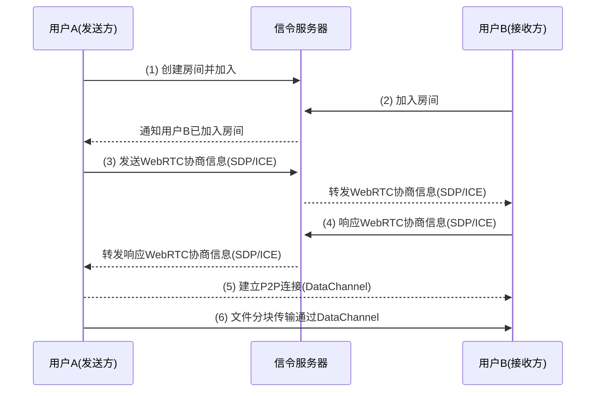
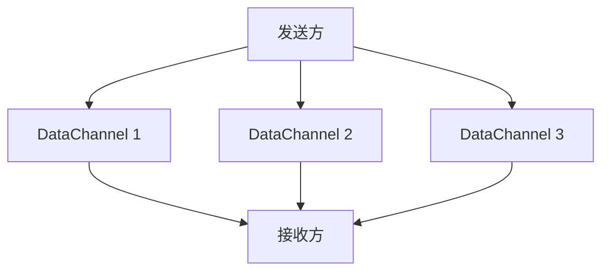
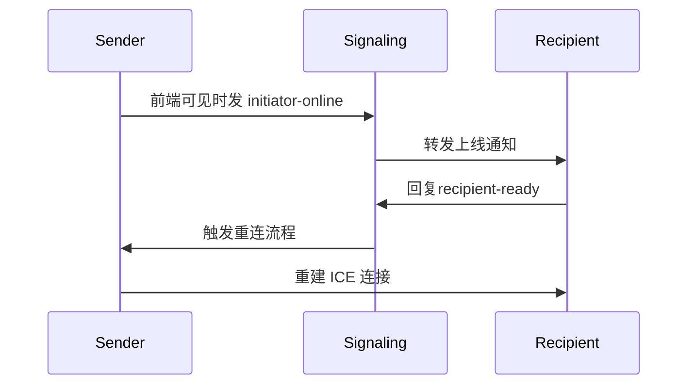

## 引言

传统的文件传输方式大多依赖云存储或中心化服务器，这不仅带来了数据隐私的顾虑，还可能面临上传大小限制、速度瓶颈等诸多问题。而我们的工具通过 WebRTC 技术实现了设备间的直接传输，彻底解决了这些问题。

我们开发的这款工具([<u>**PrivyDrop**</u>](https://www.privydrop.app))具有以下突出特点：

- 采用 WebRTC 技术实现设备间直接传输，无需经过中间服务器
- 端到端加密（E2EE）确保数据传输安全
- 无需注册登录，即开即用，可多人同时接收
- 支持文本、图片、文件、文件夹等多种类型的数据传输
- 传输速度和文件大小仅受限于设备间的网络带宽和磁盘空间

在这篇文章中，我们将深入探讨这款工具的技术架构、工作原理以及它为什么能够提供如此安全和高效的文件传输体验。无论您是技术爱好者还是普通用户，都能从中了解到 WebRTC 技术在文件传输领域带来的革命性变化。

## 一、重新定义文件传输:WebRTC 的架构革命

WebRTC（Web Real-Time Communication）是一种支持浏览器之间实时通信的开放标准。我们的文件传输工具基于 WebRTC 开发，主要包含以下几个核心组件：

1. **信令服务器**：用于协调设备之间的连接，但不参与实际数据传输。
2. **P2P 连接**：设备之间直接建立连接，数据不经过第三方服务器。
3. **E2EE 加密**：所有数据在传输过程中使用 DTLS 协议进行端到端加密。

### 1.1 传统方案 vs WebRTC 方案

| 特性         | 传统 HTTP 传输           | WebRTC P2P 传输      |
| ------------ | ------------------------ | -------------------- |
| 传输路径     | 客户端 → 服务器 → 客户端 | 端到端直连           |
| 延时特性     | 受中心服务器带宽限制     | 仅受网络物理带宽限制 |
| 文件大小限制 | 通常有一定的限制         | 仅受磁盘空间限制     |
| 隐私保护     | 依赖服务商安全措施       | DTLS 协议强制加密    |

### 1.2 建立 P2P 连接的流程



**流程：**

1. 用户 A 创建房间并加入，连接到信令服务器。
2. 用户 B 加入房间后，也连接到信令服务器。
3. 用户 A 开始与用户 B 发起 WebRTC 协商（包括 SDP 和 ICE 信息）。
4. 用户 B 响应 WebRTC 协商信息，完成 P2P 连接的建立。
5. 最终，文件通过 DataChannel 在 P2P 连接上传输。

### 1.3 SCTP(over DTLS & UDP) 协议的性能魔法

WebRTC 的 **DataChannel** 基于 **流控制传输协议 (SCTP)** ，运行在 **DTLS** 和 **UDP** 之上，相较于传统 TCP 具有三大优势：

1. **多流复用（暂未采用）** ：文件分片可并行传输，提升传输效率。
2. **无队头阻塞** ：单个分片丢失不会影响整体进度，确保传输稳定性。
3. **自动拥塞控制** ：动态适应网络抖动，优化传输性能。

**UDP 的优势：**

- **低延迟** ：UDP 是一种无连接协议，无需建立三次握手，适合实时通信场景。
- **灵活可靠** ：虽然 UDP 本身不可靠，但 SCTP 在其基础上实现了可靠的传输机制，结合了 UDP 的灵活性和 TCP 的可靠性。

**SCTP 多流传输示意图**



## 二、浏览器直传引擎:核心技术解密

### 2.1 分片传输的精密控制

```typescript
// lib/fileSender.ts - 64KB 定长分片

// 定义每个分片的大小为 65536 字节（即 64KB），这是为了精确匹配网络 MTU（最大传输单元）尺寸。
// 这样可以避免因数据包过大而导致的网络拥塞或分片问题。
private readonly CHUNK_SIZE = 65536;

// 创建一个异步生成器函数，用于将文件按固定大小分片处理。
// 每次调用生成器时，返回一个 ArrayBuffer 类型的分片数据。
private async *createChunkGenerator(file: File) {
  let offset = 0; // 初始化偏移量，用于标记当前读取到文件的位置。

  // 循环读取文件，直到所有数据都被分片处理完毕。
  while (offset < file.size) {
    // 使用 File.slice 方法从文件中截取一段数据，范围为 [offset, offset + CHUNK_SIZE)。
    const chunk = file.slice(offset, offset + this.CHUNK_SIZE);

    // 将截取的数据转换为 ArrayBuffer，并通过 yield 返回给调用者。
    yield await chunk.arrayBuffer();

    // 更新偏移量，准备处理下一个分片。
    offset += this.CHUNK_SIZE;
  }
}

// 背压控制算法：确保发送数据时不会超过 DataChannel 的缓冲区限制。
// 如果缓冲区已满，则等待缓冲区可用后再继续发送。
private async sendWithBackpressure(chunk: ArrayBuffer) {
  // 当 DataChannel 的缓冲区占用量超过预设的最大值时，暂停发送。
  while (this.dataChannel.bufferedAmount > this.MAX_BUFFER) {
    // 使用 Promise 等待 bufferedamountlow 事件触发，表示缓冲区空间已释放。
    await new Promise(r => this.dataChannel.bufferedamountlow = r);
  }

  // 缓冲区有足够空间后，发送当前分片数据。
  this.dataChannel.send(chunk);
}
```

### 2.2 内存零拷贝写入

通过 File System Access API 实现:

```typescript
// lib/fileReceiver.ts

// 将接收到的分片数据直接写入磁盘，避免内存中的额外拷贝操作。
private async writeToDisk(chunk: ArrayBuffer) {
  // 如果尚未初始化文件写入器（writer），则需要先创建一个文件句柄并获取写入器。
  if (!this.writer) {
    // 使用 showSaveFilePicker 弹出文件保存对话框，让用户选择保存位置。
    this.currentFileHandle = await window.showSaveFilePicker();

    // 通过文件句柄创建一个可写流（WritableStream），用于后续写入操作。
    this.writer = await this.currentFileHandle.createWritable();
  }

  // 将接收到的 ArrayBuffer 数据转换为 Uint8Array 格式，并直接写入磁盘。
  // 这种方式绕过了内存缓冲区，实现了零拷贝写入，提升了性能。
  await this.writer.write(new Uint8Array(chunk));
}
```

## 三、分布式房间管理系统

### 3.1 四位数字碰撞检测：

碰撞检测 ：通过循环检查 Redis 中是否存在相同的房间号，避免重复。

```typescript
// server.ts
async function getAvailableRoomId() {
let roomId;
do {
roomId = Math.floor(1000 + Math.random() * 9000); // 生成四位随机数
} while (await redis.hexists(room:${roomId}, 'created_at')); // 检查是否已存在
return roomId;
}
```

ps:4 位数字是系统生成的一个随机房间 ID，你也可以指定任意自己喜欢的房间 ID.

### 3.2 优雅过期策略：

优雅过期 ：活跃房间会自动延长过期时间，而空闲房间会被及时清理，节省资源。

```typescript
// server.ts
await refreshRoom(roomId, 3600 * 24); // 活跃房间保留24小时
if (await isRoomEmpty(roomId)) {
  // 如果房间空闲（发送方、接收方都退出了），则释放房间
  await deleteRoom(roomId);
}
```

### 3.3 信令驱动的重生协议

移动端断线恢复流程:



通过这一机制，即使用户在移动设备上切换应用或进入后台，系统也能快速恢复连接（移动端也加入了 Wakelock 防休眠），确保良好的用户体验。

## 四、安全隐私防线

### 4.1 加密协议飞轮

```
  应用层
    ↑
 DTLS 1.2+ → TLS_ECDHE_RSA_AES_128_GCM_SHA256
    ↑
 操作系统级加密
```

**解释：**

1. **DTLS（Datagram Transport Layer Security）** ：
   - DTLS 是基于 UDP 的安全传输协议，提供类似于 TLS 的加密功能。
   - 在 WebRTC 中，所有数据通道（DataChannel）都通过 DTLS 进行端到端加密，确保数据在传输过程中无法被窃听或篡改。
   - 使用的加密套件为 **`TLS_ECDHE_RSA_AES_128_GCM_SHA256`**，提供高强度的安全性。
2. **操作系统级加密** ：
   - 在操作系统层面，现代浏览器会对内存中的敏感数据进行额外保护，防止恶意软件访问。

**总结：**
通过 DTLS 和操作系统级加密的双重保障，WebRTC 提供了强大的隐私保护能力，确保文件传输过程中的数据安全。

### 4.2 攻击面防御矩阵

| **攻击类型**       | **防御措施**         | **解释**                                                                                             |
| ------------------ | -------------------- | ---------------------------------------------------------------------------------------------------- |
| **MITM**           | **SDP 指纹校验**     | **通过 DTLS 公钥哈希值生成唯一指纹，确保通信双方身份可信，防止中间人伪造或篡改数据流。**             |
| **房间号遍历攻击** | **进入房间速率限制** | **对每个 IP 地址的进入房间频率进行限制（如 5 秒内最多加入 2 次），防止恶意用户遍历房间号获取内容。** |

**解释：**

1. **MITM（中间人攻击）**
   - **原理** ：WebRTC 使用 SDP 指纹（基于 DTLS 公钥哈希值）在握手过程中验证通信双方的身份。攻击者无法伪造合法的指纹，因此无法伪装成合法通信方。
   - **作用** ：确保 P2P 连接的安全性和数据完整性，防止数据被窃听或篡改。
2. **房间号遍历攻击**
   - **定义** ：恶意用户可能通过暴力尝试不同的房间号（例如四位数字 ID），试图进入未授权的房间并获取分享内容。
   - **防御措施** ：
     - **速率限制** ：对每个 IP 地址的进入房间频率进行限制，例如 5 秒内最多允许加入 2 次房间。
     - **实现方式** ：使用 Redis 缓存每个 IP 的请求记录，快速检测和阻止异常行为。
   - **作用** ：有效防止恶意用户通过遍历房间号获取敏感内容，保护用户隐私。

## 结语:打造可信赖的传输基础设施

我们坚信技术应该服务于人的本质需求，而非制造新的监控依赖。立即体验这款隐私安全的文件传输工具，感受 P2P 技术带来的革命性变化！点击[<u>**PrivyDrop 入口**</u>](https://www.privydrop.app)开始 。

**代码透明度承诺**:代码未来会开源,我们致力于通过社区共治建立真正值得信赖的隐私工具。

## 常见问题

- **传大文件会不会容易中断？**
  - 暂时没发现这种情况。由于是 P2P（设备间）连接，一般比较稳定。后面可以看反馈情况择机加入断点续传。
- **房间加上密码更安全？**
  - 理论上是的。考虑到加密码易用性上体验会差点，暂时没有加。如果想提高安全性，可以自定义任意长度的字符串作为 RoomID，同时通过链接和二维码进行分享。另外，系统对接收方进入房间的频率进行了限制，此举进一步提高了安全性。
- **发送方可以随时关闭 PrivyDrop 页面吗？**
  - 可以，最好在分享内容被接收之后再关闭。因为是设备间直接连接，发送方如果不在线，则无法进行分享。如果不想分享了，可以立即关闭页面。

还有问题？请点击查看[<u>**PrivyDrop FAQ**</u>](https://www.privydrop.app/faq)或[<u>**PrivyDrop Help**</u>](https://www.privydrop.app/help)部分。

**开发者资源**

- [<u>**WebRTC 官方文档**</u>](https://webrtc.org/)
